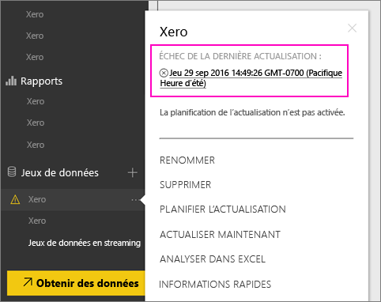
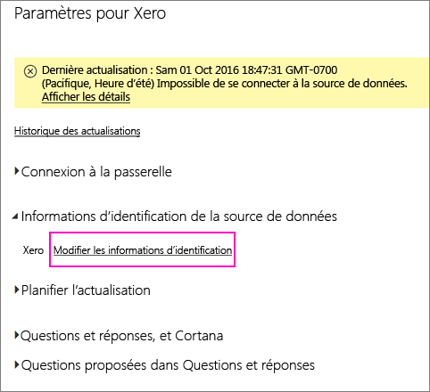

# Comment actualiser vos identifiants du pack de contenu Xerox si l’actualisation a échoué
Si vous utilisez le pack de contenu Xero Power BI, vous avez peut-être rencontré des problèmes relatifs à l’actualisation quotidienne du pack de contenu en raison d’un incident récent du service Power BI.

Pour voir si votre pack de contenu a été correctement actualisé, vérifiez le dernier état d’actualisation de votre jeu de données Xero, comme illustré dans la capture d’écran ci-dessous.

Si vous voyez que l’actualisation a échoué comme indiqué ci-dessus, suivez ces étapes pour renouveler les informations d’identification de votre pack de contenu.

1. Cliquez sur **Autres options** (...) en regard de votre jeu de données Xero, puis cliquez sur **Planifier l’actualisation**. Cela ouvre la page de paramètres du pack de contenu Xero.
   
    
2. Dans la page **Paramètres pour Xero**, sélectionnez **Informations d’identification de la source de données** > **Modifier les informations d’identification**.
   
    
3. Entrez le nom de votre organisation, puis sélectionnez **Suivant**.
   
    
4. Connectez-vous avec votre compte Xero.
   
    
5. Maintenant que vos informations d’identification sont mises à jour, vérifiez que la planification de l’actualisation est définie sur une exécution quotidienne. Pour ce faire, cliquez sur **Autres options** (...) à côté de votre jeu de données Xero, puis recliquez sur **Planifier l’actualisation**.
   
    
6. Vous pouvez également choisir d’actualiser le jeu de données immédiatement. Cliquez sur **Autres options** (...) à côté de votre jeu de données Xero, puis cliquez sur **Actualiser maintenant**.
   
    

Si vous rencontrez encore des problèmes d’actualisation, n’hésitez pas à nous contacter à l’adresse [https://support.powerbi.com](https://support.powerbi.com) 

Pour en savoir plus sur le pack de contenu Xero pour Power BI, consultez la [page d’aide sur le pack de contenu Xero](service-connect-to-xero.md).

### Étapes suivantes
* D’autres questions ? [Posez vos questions à la communauté Power BI](https://community.powerbi.com/)

