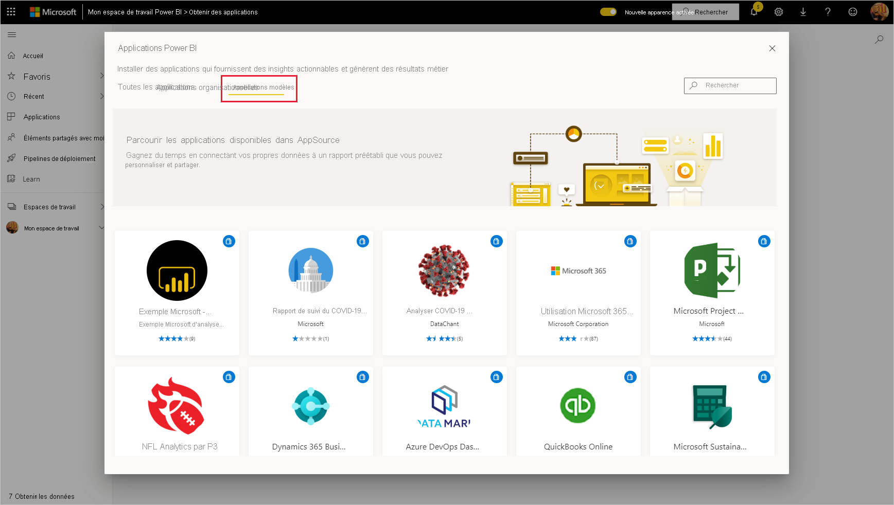
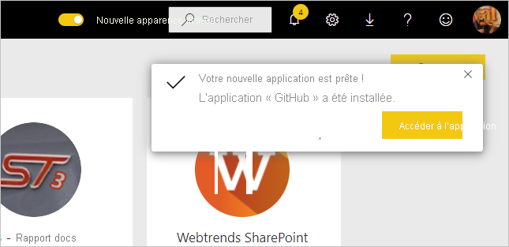
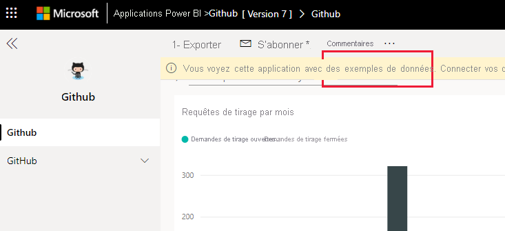
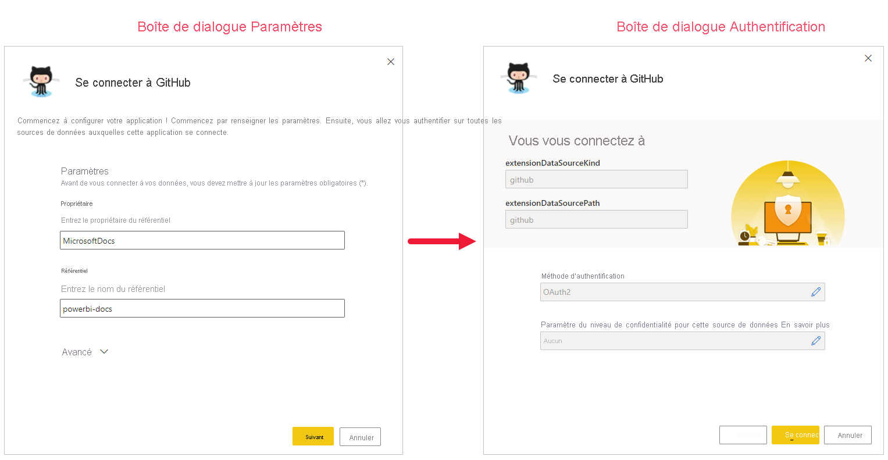
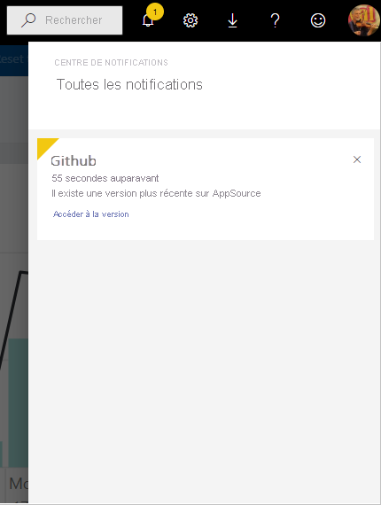
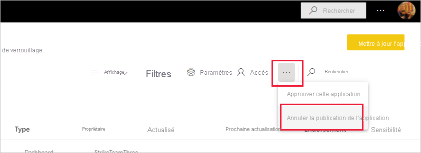

# Installer et distribuer des applications modèles dans votre organisation

Vous êtes analyste Power BI ? Si oui, cet article explique comment vous pouvez installer des [applications modèles](service-template-apps-overview.md) à connecter aux nombreux services que vous utilisez pour gérer votre entreprise, tels que Salesforce, Microsoft Dynamics et Google Analytics. Vous pouvez alors modifier le tableau de bord et les rapports prédéfinis pour répondre aux besoins de votre organisation, et les distribuer à vos collègues en tant qu’[applications](../consumer/end-user-apps.md). 

Si vous souhaitez créer vous-même des applications modèles pour les distribuer en dehors de votre organisation, consultez [Créer une application modèle dans Power BI](service-template-apps-create.md). Avec peu ou pas de codage, les partenaires Power BI peuvent créer des applications Power BI et les mettre à la disposition des clients Power BI. 

## Prérequis  

Pour installer, personnaliser et distribuer une application modèle, vous avez besoin des éléments suivants : 

* Une [licence Power BI Pro](../fundamentals/service-self-service-signup-for-power-bi.md).
* Les autorisations d’installation d’applications modèles dans votre locataire.
* Un lien d’installation valide pour l’application, que vous pouvez obtenir à partir d’AppSource ou auprès du créateur de l’application.
* Une bonne connaissance des [concepts de base de Power BI](../fundamentals/service-basic-concepts.md).

## Installer une application modèle

1. Dans le volet de navigation du service Power BI, sélectionnez **Applications** > **Obtenir des applications**.

    

1. Dans la Place de marché des applications Power BI qui s’affiche, sélectionnez **Applications modèles**. Toutes les applications modèles disponibles dans AppSource sont affichées. Recherchez l’application modèle que vous recherchez, ou obtenez une sélection filtrée à l’aide de la zone de recherche. Le fait de saisir une partie du nom de l’application modèle, ou d’une catégorie comme Finance, Analytique, Marketing, etc., facilite la recherche de l’élément que vous recherchez.

    

1. Lorsque vous trouvez l’application modèle que vous recherchez, cliquez dessus. L’offre de l’application modèle s’affiche. Cliquez sur **OBTENIR MAINTENANT**.

   

1. Dans la boîte de dialogue qui s’affiche, sélectionnez **Installer**.

    
    
    L’application est installée, ainsi qu’un espace de travail portant le même nom que tous les artefacts nécessaires pour une [personnalisation](#customize-and-share-the-app) plus poussée.

    > [!NOTE]
    > Si vous utilisez un lien d’installation pour une application qui n’est pas listée sur AppSource, une boîte de dialogue de validation vous invite à confirmer votre choix.
    >
    >Pour pouvoir installer une application modèle qui n’est pas listée sur AppSource, vous devez demander les autorisations appropriées à votre administrateur. Consultez [Paramètres d’application modèle](../admin/service-admin-portal.md#template-apps-settings) dans le portail d’administration Power BI pour plus d’informations.

    Une fois l’installation terminée, une notification vous indique que votre nouvelle application est prête.

    

## Se connecter aux données

1. Sélectionnez **Accéder à l’application**.

   L’application s’ouvre et présente des exemples de données.

1. Sélectionnez le lien **Connecter vos données** dans la bannière en haut de la page.

   

    La boîte de dialogue Paramètres s’ouvre. Vous pouvez y modifier la source de données en remplaçant l’exemple de données par votre propre source de données (cf. [limitations connues](service-template-apps-overview.md#known-limitations)). Ensuite vient la boîte de dialogue Méthode d’authentification. Vous devrez peut-être redéfinir les valeurs indiquées dans ces boîtes de dialogue. Pour plus d’informations, consultez la documentation de l’application modèle que vous installez.

   

    Une fois que vous avez fini de renseigner les boîtes de dialogue de connexion, le processus de connexion démarre. Une bannière vous informe que les données sont en cours d’actualisation et qu’en attendant, vous voyez des exemples de données.

    

   Les données de votre rapport sont actualisées automatiquement une fois par jour, sauf si vous avez désactivé cela lors du processus de connexion. Vous pouvez également [configurer votre propre planification de l’actualisation](./refresh-scheduled-refresh.md) pour mettre à jour les données du rapport comme vous le souhaitez.

## Personnaliser et partager l’application

Une fois que vous êtes connecté à vos données et que l’actualisation des données est terminée, vous pouvez personnaliser les rapports et les tableaux de bord inclus dans les applications ainsi que partager l’application avec vos collègues. Rappelez-vous cependant que toutes les modifications que vous apportez seront remplacées quand vous mettrez à jour l’application avec une nouvelle version, sauf si vous enregistrez les éléments modifiés sous des noms différents. [Consultez des détails sur le remplacement](#overwrite-behavior).

Pour personnaliser et partager votre application, sélectionnez l’icône de crayon dans le coin supérieur droit de la page.

Pour obtenir des informations sur la modification des artefacts dans l’espace de travail, consultez
* [Visite guidée de l’éditeur de rapport dans Power BI](../create-reports/service-the-report-editor-take-a-tour.md)
* [Fondamentaux pour les concepteurs dans le service Power BI](../fundamentals/service-basic-concepts.md)

Une fois que vous avez apporté toutes les modifications souhaitées aux artefacts dans l’espace de travail, vous êtes prêt à publier et à partager l’application. Consultez [Publier votre application](../collaborate-share/service-create-distribute-apps.md#publish-your-app) pour voir comment procéder.

## Mettre à jour une application modèle

De temps à autre, les créateurs d’applications modèles publient de nouvelles versions améliorées de leurs applications modèles, via AppSource, un lien direct ou les deux.

Si vous avez initialement téléchargé l’application à partir d’AppSource, quand une nouvelle version de l’application de modèle devient disponible, vous êtes informé de deux façons :
* Une bannière de mise à jour apparaît dans le service Power BI et vous informe qu’une nouvelle version de l’application est disponible.
  
* Vous recevez une notification dans le volet de notification de Power BI.

  

>[!NOTE]
>Si vous avez initialement obtenu l’application via un lien direct plutôt que via AppSource, le seul moyen de savoir quand une nouvelle version est disponible est de contacter le créateur de l’application modèle.

  Pour installer la mise à jour, cliquez sur **Obtenir** dans la bannière de notification ou dans le centre de notification, ou recherchez de nouveau l’application dans AppSource et choisissez **Obtenir maintenant**. Si vous avez obtenu un lien direct du créateur de l’application modèle pour la mise à jour, cliquez simplement sur ce lien.
  
  Vous serez invité à indiquer si vous souhaitez remplacer la version actuelle ou installer la nouvelle version dans un nouvel espace de travail. Par défaut, « remplacer » est sélectionné.

  

- **Remplacer une version existante :** Remplace l’espace de travail existant par la version mise à jour de l’application modèle. [Consultez des détails sur le remplacement](#overwrite-behavior).

- **Installer dans un nouvel espace de travail :** Installe une nouvelle version de l’espace de travail et de l’application que vous devez reconfigurer (à savoir, connexion aux données et définition de la navigation et des autorisations).

### Comportement du remplacement

* Le remplacement met à jour les rapports, les tableaux de bord et le jeu de données au sein de l’espace de travail, mais pas l’application. Le remplacement ne modifie pas la navigation, la configuration ni les autorisations de l’application.
* Après avoir mis à jour l’espace de travail, **vous devez mettre à jour l’application pour appliquer les modifications de l’espace de travail à l’application**.
* Le remplacement conserve l’authentification et les paramètres configurés. Après la mise à jour, une actualisation automatique du jeu de données démarre. **Au cours de cette actualisation, l’application, les rapports et les tableaux de bord présentent des exemples de données**.

  

* Le remplacement présente toujours l’exemple de données jusqu’à ce que l’actualisation soit terminée. Si l’auteur de l’application modèle a apporté des modifications au jeu de données ou aux paramètres, les utilisateurs de l’espace de travail et de l’application ne verront pas les nouvelles données tant que l’actualisation ne sera pas terminée. Au lieu de cela, ils continueront de voir des exemples de données pendant cette période.
* Le remplacement ne supprime jamais les nouveaux rapports ou tableaux de bord que vous avez ajoutés à l’espace de travail. Il remplace uniquement les rapports et les tableaux de bord d’origine par les modifications de l’auteur d’origine.

>[!IMPORTANT]
>N’oubliez pas de [mettre à jour l’application](#customize-and-share-the-app) après le remplacement afin d’appliquer les modifications apportées aux rapports et aux tableaux de bord pour les utilisateurs de votre application d’organisation.

## Supprimer une application modèle

Une application modèle installée se compose de l’application et de l’espace de travail qui lui est associé. Si vous souhaitez supprimer l’application modèle, vous avez deux options :
* **Supprimer complètement l’application et l’espace de travail qui lui est associé** : pour supprimer complètement l’application modèle et l’espace de travail qui lui est associé, accédez à la vignette de l’application dans la page Applications, sélectionnez l’icône de la corbeille, puis cliquez sur **Supprimer** dans la boîte de dialogue qui s’affiche.
* **Annuler la publication de l’application** : Cette option supprime l’application, mais conserve l’espace de travail qui lui est associé. Cette option est utile si, par exemple, il existe des personnalisations que vous souhaitez conserver.

    Pour annuler la publication de l’application :
    1. Ouvrez l’application.
    1. Cliquez sur l’icône en forme de crayon permettant de modifier l’application afin d’ouvrir l’espace de travail de l’application modèle.
    1. Dans l’espace de travail de l’application modèle, sélectionnez **Autre option (...)** , puis choisissez **Annuler la publication de l’application**.

        

## Étapes suivantes

[Créer des espaces de travail avec vos collègues dans Power BI](../collaborate-share/service-create-the-new-workspaces.md)
