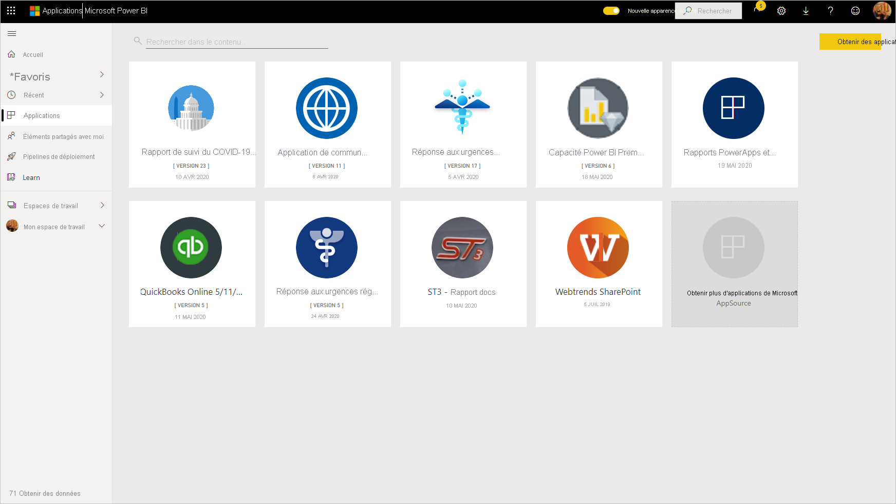
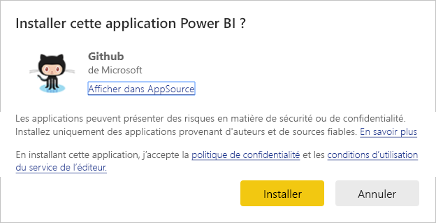
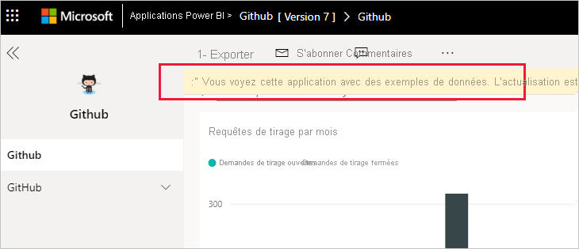

# Installer et distribuer des applications modèles dans votre organisation

Vous êtes analyste Power BI ? Si oui, cet article explique comment vous pouvez installer des [applications modèles](service-template-apps-overview.md) à connecter aux nombreux services que vous utilisez pour gérer votre entreprise, tels que Salesforce, Microsoft Dynamics et Google Analytics. Vous pouvez alors modifier le tableau de bord et les rapports prédéfinis pour répondre aux besoins de votre organisation, et les distribuer à vos collègues en tant qu’[applications](../consumer/end-user-apps.md). 

Si vous souhaitez créer vous-même des applications modèles pour les distribuer en dehors de votre organisation, consultez [Créer une application modèle dans Power BI](service-template-apps-create.md). Avec peu ou pas de codage, les partenaires Power BI peuvent créer des applications Power BI et les mettre à la disposition des clients Power BI. 

## Prérequis  

Pour installer, personnaliser et distribuer une application modèle, vous avez besoin des éléments suivants : 

* Une [licence Power BI Pro](../fundamentals/service-self-service-signup-for-power-bi.md).
* Les autorisations d’installation d’applications modèles dans votre locataire.
* Un lien d’installation valide pour l’application, que vous pouvez obtenir à partir d’AppSource ou auprès du créateur de l’application.
* Une bonne connaissance des [concepts de base de Power BI](../fundamentals/service-basic-concepts.md).

## Installer une application modèle

1. Dans le volet de navigation du service Power BI, sélectionnez **Applications** > **Obtenir des applications**.

    

1. Dans la fenêtre AppSource qui s’affiche, sélectionnez **Applications**. Parcourez les applications ou recherchez l’application souhaitée, puis sélectionnez **Obtenir maintenant**.

    

1. Dans la boîte de dialogue qui s’affiche, sélectionnez **Installer**.

    
    
    L’application est installée avec un espace de travail associé. **Si vous décidez de personnaliser l’application, vous pouvez le faire dans cet espace de travail associé**.

    > [!NOTE]
    > Si vous utilisez un lien d’installation pour une application qui n’est pas listée sur AppSource, une boîte de dialogue de validation vous invite à confirmer votre choix.
    >
    >Pour pouvoir installer une application modèle qui n’est pas listée sur AppSource, vous devez demander les autorisations appropriées à votre administrateur. Consultez [Paramètres d’application modèle](../admin/service-admin-portal.md#template-apps-settings) dans le portail d’administration Power BI pour plus d’informations.

    Une fois l’installation terminée, une notification vous indique que votre nouvelle application est prête.

    

## Se connecter aux données

1. Sélectionnez **Accéder à l’application**. La fenêtre **Démarrer avec votre nouvelle application** apparaît.

   

1. Cliquez sur **Se connecter**.
    
    Cette opération ouvre une boîte de dialogue ou une série de boîtes de dialogue vous permettant de modifier la source de données de l’exemple de données en spécifiant votre propre source de données. Cela revient généralement à redéfinir les paramètres du jeu de données et les informations d’identification de la source de données. Consultez [Limitations connues](service-template-apps-overview.md#known-limitations).
    
    Dans l’exemple ci-dessous, la connexion aux données implique deux boîtes de dialogue.

   

    Une fois que vous avez fini de renseigner les boîtes de dialogue de connexion, le processus de connexion démarre. Une bannière vous informe que vous affichez un exemple de données.

    

    Attendez la fin de la connexion et de la mise à jour des données. Pour savoir quand ce processus s’est terminé, regardez l’indicateur de progression sur la ligne du jeu de données (nouvelle apparence) ou sur le curseur (ancienne apparence).

   Lorsque l’actualisation des données et de la connexion est terminée, actualisez votre navigateur. La bannière vous informe à présent que vous devez mettre à jour l’application pour appliquer les modifications que vous apportez à l’application et les partager.

    

## Personnaliser et partager l’application

Une fois que vous avez actualisé le navigateur après l’actualisation des données et la connexion aux données, vous voyez maintenant l’espace de travail associé à l’application. À ce stade, vous pouvez modifier tous les artefacts ici, comme vous le feriez dans n’importe quel espace de travail. Toutefois, sachez que toutes les modifications que vous apportez seront remplacées lorsque vous mettrez à jour l’application avec une nouvelle version, sauf si vous enregistrez les éléments modifiés sous des noms différents. [Consultez des détails sur le remplacement](#overwrite-behavior).

Pour obtenir des informations sur la modification des artefacts dans l’espace de travail, consultez
* [Visite guidée de l’éditeur de rapport dans Power BI](../create-reports/service-the-report-editor-take-a-tour.md)
* [Fondamentaux pour les concepteurs dans le service Power BI](../fundamentals/service-basic-concepts.md)

Une fois que vous avez apporté toutes les modifications souhaitées aux artefacts dans l’espace de travail, vous êtes prêt à publier et à partager l’application. Consultez [Publier votre application](../collaborate-share/service-create-distribute-apps.md#publish-your-app) pour voir comment procéder.

## Mettre à jour une application modèle

De temps à autre, les créateurs d’applications modèles publient de nouvelles versions améliorées de leurs applications modèles, via AppSource, un lien direct ou les deux.

Si vous avez initialement téléchargé l’application à partir d’AppSource, quand une nouvelle version de l’application de modèle devient disponible, vous êtes informé de deux façons :
* Une bannière de mise à jour apparaît dans le service Power BI et vous informe qu’une nouvelle version de l’application est disponible.
  
* Vous recevez une notification dans le volet de notification de Power BI.

  

>[!NOTE]
>Si vous avez initialement obtenu l’application via un lien direct plutôt que via AppSource, le seul moyen de savoir quand une nouvelle version est disponible est de contacter le créateur de l’application modèle.

  Pour installer la mise à jour, cliquez sur **Obtenir** dans la bannière de notification ou dans le centre de notification, ou recherchez de nouveau l’application dans AppSource et choisissez **Obtenir maintenant**. Si vous avez obtenu un lien direct du créateur de l’application modèle pour la mise à jour, cliquez simplement sur ce lien.
  
  Vous serez invité à indiquer si vous souhaitez remplacer la version actuelle ou installer la nouvelle version dans un nouvel espace de travail. Par défaut, « remplacer » est sélectionné.

  

- **Remplacer une version existante :** Remplace l’espace de travail existant par la version mise à jour de l’application modèle. [Consultez des détails sur le remplacement](#overwrite-behavior).

- **Installer dans un nouvel espace de travail :** Installe une nouvelle version de l’espace de travail et de l’application que vous devez reconfigurer (à savoir, connexion aux données et définition de la navigation et des autorisations).

### Comportement du remplacement

* Le remplacement met à jour les rapports, les tableaux de bord et le jeu de données au sein de l’espace de travail, mais pas l’application. Le remplacement ne modifie pas la navigation, la configuration ni les autorisations de l’application.
* Après avoir mis à jour l’espace de travail, **vous devez mettre à jour l’application pour appliquer les modifications de l’espace de travail à l’application**.
* Le remplacement conserve l’authentification et les paramètres configurés. Après la mise à jour, une actualisation automatique du jeu de données démarre. **Au cours de cette actualisation, l’application, les rapports et les tableaux de bord présentent des exemples de données**.

  

* Le remplacement présente toujours l’exemple de données jusqu’à ce que l’actualisation soit terminée. Si l’auteur de l’application modèle a apporté des modifications au jeu de données ou aux paramètres, les utilisateurs de l’espace de travail et de l’application ne verront pas les nouvelles données tant que l’actualisation ne sera pas terminée. Au lieu de cela, ils continueront de voir des exemples de données pendant cette période.
* Le remplacement ne supprime jamais les nouveaux rapports ou tableaux de bord que vous avez ajoutés à l’espace de travail. Il remplace uniquement les rapports et les tableaux de bord d’origine par les modifications de l’auteur d’origine.

>[!IMPORTANT]
>N’oubliez pas de [mettre à jour l’application](#customize-and-share-the-app) après le remplacement afin d’appliquer les modifications apportées aux rapports et aux tableaux de bord pour les utilisateurs de votre application d’organisation.

## Étapes suivantes

[Créer des espaces de travail avec vos collègues dans Power BI](../collaborate-share/service-create-workspaces.md)
