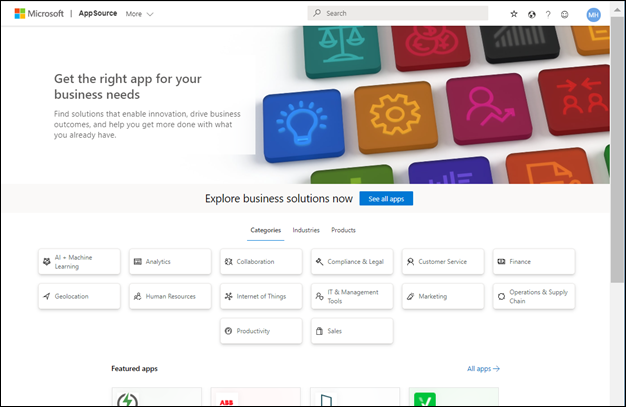
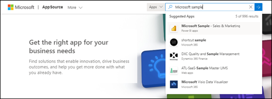

# Installer et utiliser l’exemple d’application Vente et marketing dans le service Power BI

[!INCLUDE[consumer-appliesto-yyny](../includes/consumer-appliesto-yyny.md)]

Maintenant que nous avons vu dans les grandes lignes [comment obtenir du contenu Power BI](end-user-app-view.md), utilisons Microsoft AppSource pour télécharger l’application modèle Ventes et marketing. Cette application contient des exemples de données dont vous pouvez vous servir pour explorer le service Power BI. Elle comporte un tableau de bord et plusieurs pages de rapport. 

> [!IMPORTANT]
> Pour pouvoir installer cette application à partir de Microsoft AppSource, vous devez disposer d’une licence **Power BI Pro**.  Pour plus d’informations, consultez [Licences](end-user-license.md).

## Obtenir l’application à partir de Microsoft AppSource

1. Ouvrez [https://appsource.microsoft.com](https://appsource.microsoft.com).

   

1. Dans la zone de recherche, entrez **Exemple Microsoft** et sélectionnez **Exemple Microsoft – Ventes et marketing**. 

    

1. Vous pouvez éventuellement consulter la vue d’ensemble et les révisions et examiner les images.  Sélectionnez ensuite **Obtenir maintenant**.

   

1. Confirmez que vous voulez installer cette application.

   

5. Le service Power BI affiche un message de réussite une fois l’application installée. Sélectionnez **Accéder à l’application**. Vous pouvez également sélectionner l’application proprement dite dans votre canevas **Applications**. Selon la façon dont le concepteur a créé l’application, le tableau de bord ou le rapport de l’application s’affiche.

    

7.  Cette application modèle est configurée pour s’ouvrir sur le tableau de bord. Le *concepteur* de l’application aurait pu la paramétrer pour qu’elle s’ouvre plutôt sur l’une des pages de rapport.  

    

## Interagir avec les tableaux de bord et rapports dans l’application
Prenez le temps d’explorer les données dans les tableaux de bord et les rapports qui composent l’application. Vous avez accès à toutes les interactions Power BI standard, comme le filtrage, la mise en évidence, le tri et l’exploration.  Vous ne voyez pas encore très bien la différence entre les tableaux de bord et les rapports ?  Lisez l’[article sur les tableaux de bord](end-user-dashboards.md) et l’[article sur les rapports](end-user-reports.md).  

## Étapes suivantes
* [Revenir à la vue d’ensemble des applications](end-user-apps.md)    
* [Voir un rapport Power BI](end-user-report-open.md)    
* [Autres moyens de partager du contenu avec vous](end-user-shared-with-me.md)
