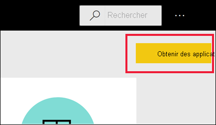
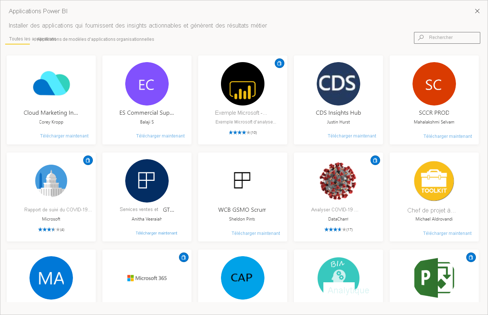

# Applications dans Power BI

[!INCLUDE[consumer-appliesto-ynny](../includes/consumer-appliesto-ynny.md)]

## Qu’est-ce qu’une application Power BI ?
Une *application* est un type de contenu Power BI qui regroupe dans un même endroit des tableaux de bord et des rapports connexes. Une application peut ainsi rassembler un ou plusieurs tableaux de bord et un ou plusieurs rapports. Les applications sont créées par des *concepteurs* Power BI qui distribuent et partagent leurs applications avec leurs collègues. Un *concepteur* peut partager une application de nombreuses façons différentes. Pour plus d’informations, consultez la section **Obtenir une nouvelle application**, ci-dessous. 

## *Concepteurs* et *utilisateurs* d’applications
Selon votre rôle, vous pouvez être quelqu’un qui crée des applications (un *concepteur*) pour votre usage personnel ou pour les partager avec des collègues. Vous pouvez aussi être quelqu’un qui reçoit et télécharge des applications (un *utilisateur des activités*) créées par d’autres personnes. Cet article est destiné aux *utilisateurs des activités*.

L’affichage et l’ouverture d’une application nécessitent certaines autorisations. Le destinataire doit disposer d’une licence Power BI Pro ou l’application doit être partagée avec le destinataire dans un type spécial de stockage cloud appelé **capacité Premium**. Pour plus d’informations sur les licences et la capacité Premium, consultez [Gestion des licences pour le service Power BI](end-user-license.md).

## Avantages des applications
Les applications sont un moyen facile pour les *concepteurs* de partager différents types de contenu en même temps. Les *concepteurs* d’applications créent les tableaux de bord et les rapports, et les regroupent dans une application. Les *concepteurs* partagent ou publient ensuite l’application à un emplacement où vous, en tant qu’*utilisateur des activités*, pouvez y accéder. Étant donné que les rapports et les tableaux de bord associés sont regroupés, il est plus facile de les trouver et de les installer dans le service Power BI ([https://powerbi.com](https://powerbi.com)) et sur votre appareil mobile. Une fois que vous avez installé une application, vous ne devez plus mémoriser les noms d’un grand nombre de tableaux de bord ou de rapports différents, car ils sont rassemblés dans une même application, dans votre navigateur ou sur votre appareil mobile.

Avec les applications, chaque fois que l’auteur de l’application publie des mises à jour, vous recevez une notification ou vous voyez automatiquement les modifications. L’auteur contrôle également la fréquence à laquelle l’actualisation des données est planifiée. Vous n’avez pas besoin de vous soucier de la mise à jour. 

<!-- add conceptual art -->
## Obtenir une nouvelle application
Il existe plusieurs façons d’obtenir une nouvelle application. Vous pouvez rechercher, trouver et installer des applications et les créateurs d’applications peuvent en partager avec vous. 

### Trouver et installer des applications sur la Place de marché des applications Power BI
L’une des façons de trouver des applications consiste à sélectionner **Obtenir l’application** à partir de l’écran **Applications** Power BI. 

Parcourez la liste des applications de la Place de marché des applications Power BI jusqu’à ce que vous en trouviez une à installer. Vous avez le choix entre les **applications d’organisation**, uniquement disponibles pour les personnes de votre entreprise, ou les **applications modèles**, publiées par Microsoft et la communauté et que tout utilisateur Power BI peut installer. 

Il existe plusieurs autres façons d’obtenir des applications. Quelques-unes sont listées ci-dessous. Pour obtenir des instructions détaillées sur l’obtention et l’exploration d’une application, consultez [Ouvrir et interagir avec une application](end-user-app-view.md).

* Le concepteur de l’application peut installer automatiquement l’application dans votre compte Power BI : la prochaine fois que vous ouvrez le service Power BI, vous la verrez dans votre liste de contenu **Applications**. 
* Le concepteur de l’application peut vous envoyer par e-mail un lien direct vers celle-ci. La sélection du lien ouvre l’application dans le service Power BI.
* Dans Power BI sur votre appareil mobile, vous pouvez uniquement installer une application à partir d’un lien direct, et non à partir de la Place de marché des applications. Si l’auteur de l’application installe l’application automatiquement, vous voyez celle-ci dans votre liste d’applications. 

Vos applications sont organisées dans la liste de contenu **Applications**. Sélectionnez simplement **Applications** pour afficher vos applications. Pointez sur une application pour voir la date de la dernière mise à jour et le propriétaire. 

## Étapes suivantes
* [Ouvrir et utiliser une application](end-user-app-view.md)
* [Autres façons de partager du contenu](end-user-shared-with-me.md)

