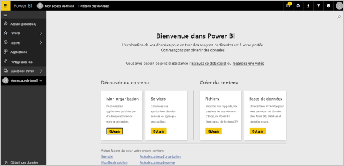
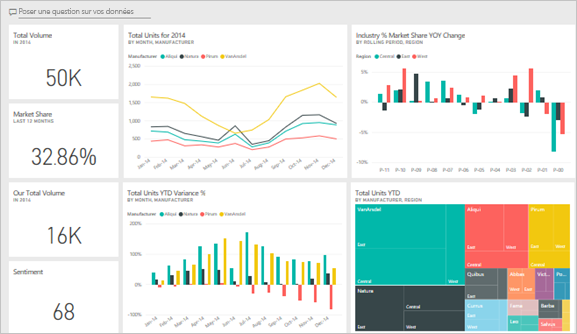
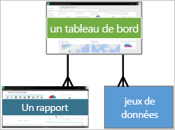
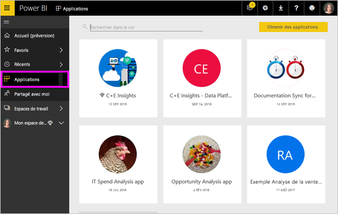

# Concepts de base pour les ***consommateurs*** du service Power BI

## *Consommateurs* et *concepteurs* Power BI
Cet article suppose que vous avez déjà lu la [Vue d’ensemble de Power BI](../power-bi-overview.md) et que vous vous êtes identifié comme ***consommateur*** Power BI. Les consommateurs reçoivent du contenu Power BI, comme des tableaux de bord et des rapports, de leurs collègues. Les consommateurs utilisent le service Power BI, qui est la version basée sur un site web de Power BI. 

Vous entendrez sans doute le terme « Power BI Desktop » ou simplement « Desktop ». Il s’agit d’un outil autonome utilisé par les *concepteurs* qui génèrent et partagent des tableaux de bord et des rapports avec vous. Il est important de savoir qu’il existe d’autres outils Power BI, mais tant que vous serez consommateur, vous utiliserez uniquement le service Power BI. Par ailleurs, cet article s’applique uniquement au service Power BI. 

## Terminologie et concepts
Cet article n’est pas une visite guidée visuelle de Power BI, ni un tutoriel pratique. Il s’agit plutôt d’une vue d’ensemble qui, nous l’espérons, vous aidera à vous familiariser avec la terminologie et les concepts de Power BI. C’est une façon de vous présenter le jargon et la configuration du terrain. Pour obtenir une visite guidée du service Power BI et de sa navigation, consultez la [Visite guidée](end-user-experience.md).

## Ouvrir le service Power BI pour la première fois
La plupart des consommateurs de Power BI obtiennent le service Power BI car 1) leur entreprise achète des licences et 2) un administrateur affecte ces licences à des employés comme vous. 

Pour commencer, ouvrez juste un navigateur et tapez **app.powerbi.com**. La première fois que vous ouvrez le service Power BI, vous voyez un contenu semblable à ceci.

Quand vous utiliserez Power BI, vous personnaliserez ce que vous voyez chaque fois que vous ouvrirez le site web.  Par exemple, certaines personnes aiment que Power BI s’ouvre sur la page d’accueil, tandis que d’autres ont un tableau de bord favori qu’ils veulent voir en premier. Ne vous inquiétez pas, nous allons vous apprendre comment procéder. 
- [Accueil en préversion](https://powerbi.microsoft.com/en-us/blog/introducing-power-bi-home-and-global-search)    
- [Définir du contenu comme étant **par défaut**](end-user-featured.md) 

Mais avant d’aller plus loin, revenons en arrière et parlons des modules qui composent le service Power BI.

## ***Contenu*** Power BI
### Introduction aux modules
Pour un consommateur de Power BI, les 5 modules sont disponibles : ***visualisations***,  ***tableaux de bord***, ***rapports***, ***applications*** et  ***jeux de données***. Ces modules sont parfois appelés ***contenu*** *Power BI*. Et le *contenu* existe dans des ***espaces de travail***. Un workflow type implique tous ces blocs de construction :  un *concepteur* Power BI (en jaune dans le diagramme ci-dessous) collecte des données à partir de *jeux de données*, les apporte dans Power BI pour qu’elles soient analysées, crée des *rapports* remplis de *visualisations* qui mettent en évidence les faits et les insights intéressants, qui épinglent des visualisations des rapports dans un tableau de bord, et qui partagent les rapports et les tableaux de bord avec des *consommateurs* , comme vous (en noir dans le diagramme ci-dessous), sous la forme d’*applications* ou autres types de contenu partagé. 

Dans sa version la plus basique. 
*  Une ***visualisation*** (ou un *visuel*) est un type de graphique créé par des *concepteurs* Power BI à l’aide de données présentes dans des *rapports* et des *jeux de données*. En général, les *concepteurs* génèrent les visuels dans Power BI Desktop. 

    Pour plus d’informations, consultez [Visualisations pour les *consommateurs* Power BI](end-user-visualizations.md).

*  Un *jeu de données* est un conteneur de données. Par exemple, ce peut être un fichier Excel de l’Organisation mondiale de la santé, une base de données de clients appartenant à l’entreprise ou un fichier Salesforce.  

*  Un *tableau de bord* est un écran unique présentant des visuels interactifs, du texte et des graphiques. Un tableau de bord collecte vos métriques les plus importantes, sur un seul écran, pour raconter une histoire ou répondre à une question. Le contenu d’un tableau de bord provient d’un ou de plusieurs rapports et d’un ou de plusieurs jeux de données.

    Pour plus d’informations, consultez [Tableaux de bord pour les *consommateurs* Power BI](end-user-dashboards.md).

*  Un *rapport* est constitué d’une ou de plusieurs pages de visuels interactifs, de texte et de graphiques qui constituent un rapport unique. Un rapport est basé sur un seul jeu de données. Les pages de rapport sont souvent organisées pour que chacune traite d’un domaine d’intérêt principal ou réponde à une question unique.

    Pour plus d’informations, consultez [Rapports pour les *consommateurs* Power BI](end-user-reports.md).

*  Une *application* est un moyen pour les *concepteurs* de regrouper et de partager des rapports et des tableaux de bord associés. Les *consommateurs* reçoivent automatiquement certaines applications, mais ils peuvent rechercher d’autres applications créées par des collègues ou par la communauté. Par exemple, des services externes que vous utilisez peut-être déjà, comme Google Analytics et Microsoft Dynamics CRM, offrent des applications Power BI.

Autrement dit, si vous êtes un tout nouvel utilisateur et que vous vous êtes connecté à Power BI pour la première fois, vous n’avez pas encore de tableau de bord, d’application ou de rapport. 
_______________________________________________________

## Jeux de données
Un *jeu de données* est une collection de données que des *concepteurs* importent ou à laquelle ils se connectent, puis qu’ils utilisent pour générer des rapports et des tableaux de bord. En tant que consommateur, vous n’interagirez pas directement avec les jeux de données, mais il est toutefois intéressant de comprendre comment ils s’intègrent dans une perspective plus globale.  

Chaque jeu de données représente une source de données unique, par exemple un classeur Excel sur OneDrive, un jeu de données tabulaire SSAS local ou un jeu de données Salesforce. De nombreuses sources de données différentes sont prises en charge.

Quand un concepteur partage une application avec vous, vous pouvez voir quels jeux de données s’y trouvent. 

**UN** jeu de données…

* peut être utilisé plusieurs fois
* peut être utilisé dans de nombreux rapports différents
* peut comprendre différentes visualisations qui peuvent être affichées dans de nombreux tableaux de bord différents
  
  

Le module suivant : les visualisations.
__________________________________________________________

## Visualisations
Les visualisations (également appelées visuels) affichent des insights qui ont été détectés dans les données. Les visualisations facilitent l’interprétation de l’insight, car votre cerveau peut comprendre une image plus rapidement qu’une feuille de calcul de nombres, par exemple.

Voici quelques unes des visualisations que vous rencontrerez dans Power BI : cascade, ruban, treemap, secteurs, entonnoir, carte, nuage de points et jauge. Consultez la [liste complète des visualisations incluses dans Power BI](../power-bi-visualization-types-for-reports-and-q-and-a.md).

   

Des visualisations appelées *visuels personnalisés* sont également disponibles à partir de la communauté. Si vous recevez un rapport comprenant un visuel que vous ne reconnaissez pas, il s’agit probablement d’un visuel personnalisé. Si vous avez besoin d’aide pour interpréter le visuel personnalisé, <!--[look up the name of the report or dashboard *designer*](end-user-owner.md)-->recherchez le nom du *concepteur* du rapport ou du tableau de bord, puis contactez-le.

**UNE** visualisation dans un rapport...

* peut être utilisée plusieurs fois dans le même rapport à l’aide de l’opération Copier/coller
* peut être utilisée dans de nombreux tableaux de bord différents
__________________________________________________
## Rapports
Un rapport Power BI se compose d’une ou de plusieurs pages de visualisations, de graphiques et de texte. Toutes les visualisations dans un rapport proviennent d’un seul jeu de données. Les *concepteurs* partagent des rapports avec des *consommateurs* qui [interagissent avec les rapports en *mode Lecture*](end-user-reading-view.md).

**UN** rapport…

* peut être associé à plusieurs tableaux de bord (les vignettes épinglées à partir de ce rapport peuvent apparaître sur plusieurs tableaux de bord).
* sont créés à l’aide de données provenant d’un seul jeu de données.  
* peut faire partie de plusieurs applications.
  
  

________________________________________________

## Tableaux de bord
Un tableau de bord représente une vue personnalisée d’une partie d’un ou de plusieurs jeux de données sous-jacents. Les *concepteurs* génèrent des tableaux de bord et les partagent avec des *consommateurs*, soit individuellement soit comme partie d’une application. Un tableau de bord est un canevas unique qui contient des *vignettes*, des graphiques et du texte. 

  

Une vignette est un rendu d’un visuel qu’un *concepteur* *épingle*, par exemple d’un rapport sur un tableau de bord.  Chaque vignette épinglée affiche une [visualisation](end-user-visualizations.md) qui a été créée à partir d’un jeu de données et épinglée sur ce tableau de bord. Une vignette peut également contenir une page de rapport entière, ainsi que des données de streaming en direct ou une vidéo. Pour les *concepteurs*, il existe différentes façons d’ajouter des vignettes à des tableaux de bord, mais elles sont bien trop nombreuses pour être traitées dans cette vue d’ensemble. Pour plus d’informations, consultez [Vignettes de tableau de bord dans Power BI](end-user-tiles.md). 

Les consommateurs ne peuvent pas modifier les tableaux de bord. Vous pouvez toutefois ajouter des commentaires, afficher des données associées, les mettre en favori, vous y abonner, et bien plus encore. 

Quels sont les objectifs des tableaux de bord ?  En voici juste quelques-uns :

* Pour voir, en un coup d’œil, toutes les informations requises pour prendre des décisions.
* Pour surveiller les informations les plus importantes concernant votre activité.
* Pour vous assurer que tous vos collègues accèdent à la même page, et qu’ils consultent et utilisent les mêmes informations que vous.
* Pour surveiller la santé d’une entreprise, d’un produit, d’une unité organisationnelle, d’une campagne marketing, etc.
* Pour créer une vue personnalisée d’un tableau de bord plus large en affichant les métriques qui vous intéressent.

**UN** tableau de bord…

* peut afficher des visualisations à partir de nombreux jeux de données différents ;
* peut afficher des visualisations à partir de nombreux rapports différents
* peut afficher des visualisations épinglées à partir d’autres outils (par exemple Excel)
  
  

________________________________________________

## Applications
Ces collections de tableaux de bord et de rapports organisent du contenu associé dans un seul et même package. Les *concepteurs* Power BI les génèrent et les partagent avec des personnes, des groupes, toute une organisation ou tout le monde. En tant que consommateur, vous pouvez être certain que vous et vos collègues travaillez avec les mêmes données, car il existe une seule version approuvée. 

Les applications sont faciles à trouver et à installer dans le service Power BI (https://powerbi.com)) et sur votre appareil mobile. Une fois que vous avez installé une application, vous n’êtes pas obligé de mémoriser les noms d’un grand nombre de tableaux de bord, car ces derniers sont rassemblés dans une même application, dans votre navigateur ou sur votre appareil mobile. 

Cette application comprend trois tableaux de bord associés et trois rapports associés qui constituent une application unique.

Chaque fois que l’auteur de l’application publie des mises à jour, vous voyez automatiquement les modifications. L’auteur contrôle également la fréquence à laquelle l’actualisation des données est planifiée. Vous n’avez pas besoin de vous soucier de la mise à jour.

Vous pouvez obtenir des applications de différentes manières. Le concepteur de l’application peut l’installer automatiquement dans votre compte Power BI ou vous envoyer un lien direct vers cette application. Vous pouvez aussi la rechercher dans Microsoft AppSource, où apparaissent toutes les applications auxquelles vous avez accès. Dans Power BI sur votre appareil mobile, vous pouvez installer des applications uniquement à partir d’un lien direct, et non à partir d’AppSource. Si le concepteur de l’application installe l’application automatiquement, celle-ci apparaît dans votre liste d’applications.

Une fois l’application installée, sélectionnez-la simplement dans votre liste d’applications, puis sélectionnez le tableau de bord ou le rapport à ouvrir et à explorer en premier.   

J’espère que cet article vous a donné une bonne connaissance des modules qui constituent le service Power BI pour les consommateurs. 

## Étapes suivantes
- Consulter le [glossaire](end-user-glossary.md) et l’ajouter aux favoris    
- Effectuer une [visite guidée du service Power BI](end-user-experience.md)
- Lire la [vue d’ensemble de Power BI rédigée spécialement pour les consommateurs](end-user-consumer.md)    
- Regarder une vidéo dans laquelle Will passe en revue les concepts de base et propose une visite guidée du service Power BI. <iframe width="560" height="315" src="https://www.youtube.com/embed/B2vd4MQrz4M" frameborder="0" allowfullscreen></iframe>