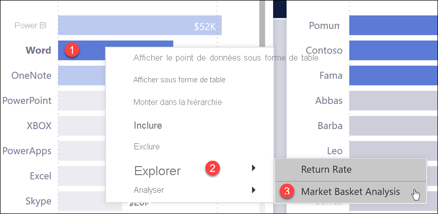
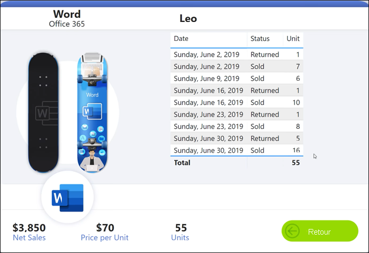
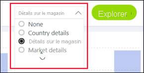
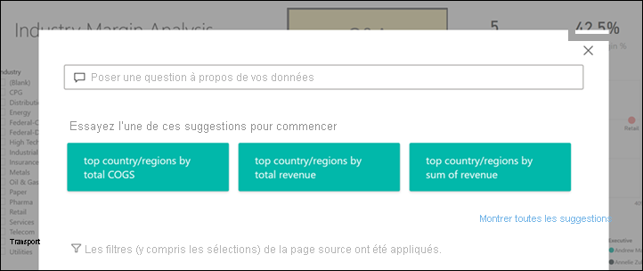

# Boutons dans le service Power BI
Dans les rapports que vous recevez de vos collègues, vous avez peut-être remarqué des boutons et vous vous demandez comment les utiliser. Certains comportent des mots, d’autres des flèches, des graphiques et même des menus déroulants. Cet article va vous apprendre à reconnaître un bouton et à déterminer comment l’utiliser.

## Comment reconnaître un bouton
Il arrive parfois que des boutons ressemblent beaucoup aux formes, aux images ou aux icônes d’une page de rapport. Toutefois, si une action se produit quand vous le sélectionnez (cliquez dessus), il s’agit probablement d’un bouton.

## Types de boutons
Les créateurs de rapports ajoutent des boutons aux rapports pour faciliter la navigation et l’exploration. Il existe plusieurs types de boutons : **Précédent**, **Signet**, **Extraire**, **Navigation entre les pages**, **Questions et réponses** et **URL web**. 

### Boutons Précédent 
Un bouton Précédent peut comporter une icône représentant une flèche. Quand vous sélectionnez ce bouton, Power BI vous ramène à la page précédente.  Les boutons Précédent sont souvent utilisés dans le cadre d’une extraction. Voici un exemple de bouton Précédent utilisé durant une extraction.

1. Sélectionnez **Word** dans le graphique à barres.
1. Sélectionnez **Extraire**, puis choisissez **Analyse du panier d’achat**.

    

    Quand vous choisissez **Analyse du panier d’achat**, Power BI ouvre la page de rapport *Analyse du panier d’achat* et utilise les sélections effectuées dans la page source pour filtrer ce qui est affiché dans la page de destination.

    

    Vous êtes maintenant dans la page du rapport **Analyse du panier d’achat**, qui est filtrée pour Word. Pour revenir à la page précédente, sélectionnez le bouton Précédent. 

## Boutons Signet
Les concepteurs de rapports incluent souvent des signets dans leurs rapports. Pour afficher la liste des signets d’un rapport, sélectionnez **Afficher** > **Signets** dans l’angle supérieur droit. Quand un concepteur de rapports ajoute un *bouton* Signet, vous disposez d’une autre méthode pour accéder à la page de rapport spécifique associée à ce signet. Les filtres et les paramètres capturés par le signet sont appliqués à la page. [Découvrez-en plus sur les signets dans Power BI](end-user-bookmarks.md). 

Dans cet exemple, le bouton contient une icône en forme de signet et le nom du signet (*Urban*). 

Quand vous choisissez le bouton Signet, Power BI vous amène à l’emplacement et aux paramètres définis pour ce signet.  Dans ce cas, le signet se trouve sur la page de rapport *Growth opportunities* et cette page fait l’objet d’un filtrage croisé (**Urban**).

## Boutons d’extraction
Il existe deux façons d’effectuer une extraction dans le service Power BI. L’extraction vous amène à une autre page de rapport. Dans cette page de destination, les données sont présentées en fonction des filtres et des sélections en place dans la page source.

Pour effectuer une extraction dans un rapport, vous pouvez cliquer avec le bouton droit sur un point de données dans un visuel, sélectionner **Extraire** et choisir la destination. Cette méthode est décrite ci-dessus dans la section intitulée **Bouton Précédent**. Mais parfois, les concepteurs de rapports peuvent utiliser un *bouton* d’extraction à la place pour rendre l’action plus évidente et attirer l’attention sur des insights importants.  

Les boutons d’extraction peuvent avoir plusieurs prérequis. Pour qu’un bouton fonctionne, tous les prérequis doivent être respectés. Examinons un exemple.

Voici un bouton d’extraction qui nous permet d’accéder à la page *Store details*. Quand nous pointons sur le bouton, une info-bulle nous indique que nous devons sélectionner un magasin et un produit. Vous devez alors sélectionner un magasin et un produit pour que le bouton devienne actif.

Maintenant que nous avons sélectionné un produit (**Word**) et un magasin (**Leo**), le bouton change de couleur pour nous indiquer qu’il est actif.

Sélectionnez le bouton d’extraction pour accéder à la page du rapport *Store*. La page *Store* est filtrée selon nos sélections (**Word** et **Leo**).

Les boutons d’extraction peuvent également avoir des menus déroulants qui vous permettent de choisir parmi plusieurs destinations. Après avoir effectué vos sélections dans page de rapport source, sélectionnez la page de rapport de destination pour l’extraction. Dans l’exemple ci-dessous, nous allons modifier notre sélection pour effectuer l’extraction dans la page de rapport *Market details*. 

## Navigation de page

Les boutons de navigation entre les pages entre les pages vous permettent d’accéder à une page différente dans le même rapport. Les concepteurs de rapports créent souvent des boutons de navigation pour raconter une histoire ou vous guider à travers les insights d’un rapport. Dans l’exemple ci-dessous, le concepteur de rapports a ajouté sur chaque page un bouton vous permettant de revenir à la première page du rapport, c’est-à-dire la page de synthèse de niveau supérieur. Ce bouton de navigation est utile, car le rapport comprend de nombreuses pages.

## Boutons Questions et réponses 
Quand vous sélectionnez un bouton Questions et réponses, la fenêtre Explorateur de questions et réponses Power BI s’ouvre. La fenêtre Questions et réponses apparaît en haut de la page de rapport. Pour la fermer, sélectionnez la croix (X). [Découvrez-en plus sur Questions et réponses](end-user-q-and-a.md).

## Web URL
Les boutons URL web ouvrent une nouvelle fenêtre de navigateur. Les concepteurs de rapports peuvent ajouter ce type de bouton comme source de référence pour proposer un lien vers le site web de l’entreprise ou même vers un autre rapport ou tableau de bord. Dans l’exemple ci-dessous, le bouton URL web vous permet de télécharger le fichier source du rapport. 

Dans la mesure où la page s’ouvre dans une fenêtre distincte, fermez la fenêtre ou sélectionnez votre onglet Power BI pour revenir au rapport Power BI.

## Étapes suivantes
[Signets](end-user-bookmarks.md)    
[Monter/Descendre dans la hiérarchie](end-user-drill.md)
