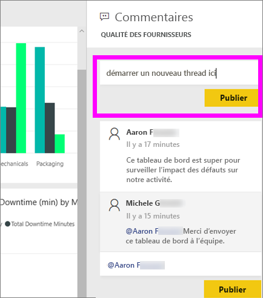

# Ajouter des commentaires à un tableau de bord ou à un rapport
Ajoutez un commentaire personnel ou démarrez une conversation à propos d’un tableau de bord ou d’un rapport avec vos collègues. Les **commentaires** sont une fonctionnalité parmi d’autres qui permet à un *consommateur* de collaborer avec d’autres personnes. 

## Comment utiliser la fonctionnalité Commentaires
Les commentaires peuvent être ajoutés à un tableau de bord entier, à des visuels individuels d’un tableau de bord, à une page de rapport et aux visuels individuels d’une page de rapport. Le commentaire que vous ajoutez peut être général ou cibler certains collègues.  

Lorsque vous ajoutez un commentaire à un rapport, Power BI capture le filtre et les valeurs de segment actuels. Cela signifie que lorsque vous sélectionnez un commentaire ou y répondez, la page de rapport ou le visuel du rapport peut changer pour vous montrer les sélections de filtre et de segment qui étaient actives lorsque le commentaire a été ajouté pour la première fois.  

Pourquoi est-ce important ? Prenons l’exemple d’un collègue ayant appliqué un filtre qui a révélé une information intéressante qu’il souhaite partager avec l’équipe. Si ce filtre n’était pas sélectionné, le commentaire serait probablement moins pertinent. 

### Ajouter un commentaire général à un tableau de bord ou à un rapport
Les processus d’ajout de commentaires à un tableau de bord ou à un rapport sont similaires. Dans cet exemple, nous utilisons un tableau de bord. 

1. Ouvrez un tableau de bord ou un rapport Power BI et sélectionnez l’icône **Commentaires**. La boîte de dialogue Commentaires s’ouvre.

    

    Vous pouvez constater ici que le créateur du tableau de bord a déjà ajouté un commentaire général.  Toute personne ayant accès à ce tableau de bord peut voir ce commentaire.

    

2. Pour répondre, sélectionnez **Répondre**, tapez votre réponse, puis sélectionnez **Poster**.  

    

    Par défaut, Power BI envoie votre réponse au collègue à l’origine du thread de commentaires (dans ce cas, Aaron F). 

    

 3. Si vous souhaitez ajouter un commentaire qui ne fait pas partie d’un thread existant, entrez votre commentaire dans le champ de texte situé dans la partie supérieure.

    

    Les commentaires pour ce tableau de bord ressemblent maintenant à ceci.

    

### Ajouter un commentaire à un visuel de tableau de bord ou de rapport spécifique
Vous pouvez également ajouter des commentaires à des vignettes de tableau de bord individuelles et à des visuels de rapport individuels. Les processus sont similaires et, dans cet exemple, nous utilisons un rapport.

1. Pointez sur le visuel, puis sélectionnez les points de suspension (...).    
2. Dans la liste déroulante, sélectionnez **Ajouter un commentaire**.

      

3.  La boîte de dialogue **Commentaires** s’ouvre, et les autres visuels de la page sont grisés. Ce visuel n’a pas encore de commentaires. 

      

4. Tapez votre commentaire, puis sélectionnez **Poster**.

      

    - Dans une page de rapport, la sélection d’un commentaire effectué sur un visuel met en surbrillance ce visuel (voir ci-dessus).

    - Dans un tableau de bord, l’icône représentant un graphique  indique qu’un commentaire est lié à un visuel spécifique. Les commentaires qui s’appliquent à l’intégralité du tableau de bord n’ont pas d’icône spéciale. La sélection de l’icône représentant un graphique permet de mettre en surbrillance le visuel associé dans le tableau de bord.

        

5. Sélectionnez **Fermer** pour revenir au tableau de bord ou au rapport.

### Attirer l’attention de vos collègues à l’aide du symbole @
Que vous ajoutiez des commentaires à un tableau de bord, un rapport, une vignette ou un visuel, vous pouvez utiliser le symbole « \@ » pour attirer l’attention de vos collègues.  Quand vous tapez le symbole « \@ », Power BI ouvre une liste déroulante dans laquelle vous pouvez rechercher des personnes de votre organisation et les sélectionner. Tout nom vérifié commençant par le symbole « \@ » s’affiche en bleu. 

Voici une conversation avec le *concepteur* d’une visualisation. Il utilise le symbole @ pour que je voie le commentaire. Je sais que ce commentaire m’est destiné. Quand j’ouvre le tableau de bord de cette application dans Power BI, je sélectionne **Commentaires** dans l’en-tête. Le volet **Commentaires** affiche notre conversation.

  

## Étapes suivantes
Revenir aux [visualisations pour les consommateurs](end-user-visualizations.md)    
<!--[Select a visualization to open a report](end-user-open-report.md)-->
