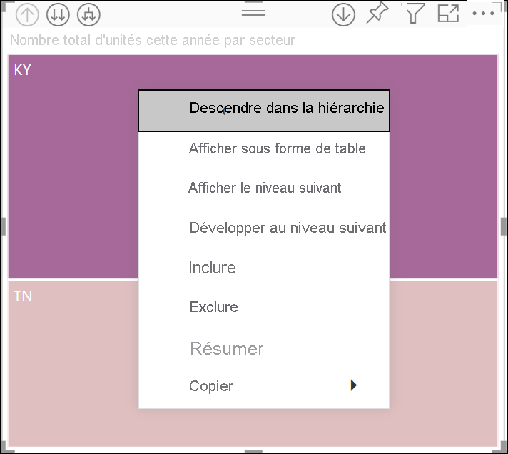
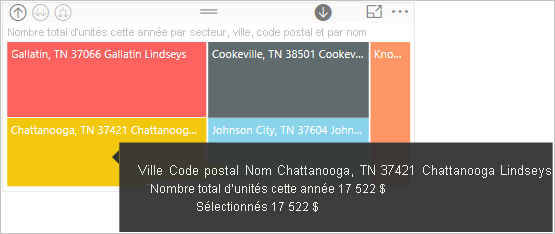

# Mode d’exploration d’un visuel dans Power BI

[!INCLUDE[consumer-appliesto-yyny](../includes/consumer-appliesto-yyny.md)]

[!INCLUDE [power-bi-service-new-look-include](../includes/power-bi-service-new-look-include.md)]

Cet article montre comment descendre dans la hiérarchie d’un visuel dans le service Microsoft Power BI. En descendant et en montant dans la hiérarchie de vos points de données, vous pouvez explorer en profondeur les détails de vos données. 

## L’exploration nécessite une hiérarchie

Quand un visuel a une hiérarchie, vous pouvez l’explorer pour révéler des détails supplémentaires. Par exemple, imaginez que vous avez un visuel qui montre le nombre de médailles olympiques selon une hiérarchie de sports, de disciplines et d’événements. Par défaut, le visuel indique le nombre de médailles olympiques par sport : gymnastique, ski, sports aquatiques, etc. Toutefois, comme il a une structure hiérarchique, si vous sélectionnez l’un de ses éléments (par exemple, une barre, une ligne ou une bulle), des insights encore plus détaillés s’affichent. Si vous sélectionnez l’élément **aquatics** (sports aquatiques), vous voyez les données pour la natation, la plongée et le water-polo.  Si vous sélectionnez ensuite l’élément **diving** (plongée), vous voyez les détails relatifs aux événements de plongeon tremplin, haut vol et synchronisé.

Les dates sont un type unique de hiérarchie.  Les *concepteurs* de rapports ajoutent souvent des hiérarchies de dates aux visuels. Une hiérarchie de dates courante est une hiérarchie qui contient l’année, le trimestre, le mois et le jour. 

## Identifier les visuels explorables
Vous ne savez pas quels visuels Power BI contiennent une hiérarchie ? Pointez sur un visuel. Si vous voyez une combinaison de ces contrôles d’exploration en haut, c’est que votre visuel a une hiérarchie.

  

## Découvrir comment descendre et monter dans la hiérarchie

Dans cet exemple, nous utilisons une arborescence qui a une hiérarchie composée du territoire, de la ville, du code postal et du nom du magasin. L’arborescence, avant l’exploration, affiche le nombre total d’unités vendues cette année par territoire. Territory est le niveau supérieur de la hiérarchie.

  

### Deux façons d’accéder aux fonctionnalités d’exploration

Vous avez deux façons d’accéder aux fonctionnalités d’exploration et de développement pour les visuels qui ont des hiérarchies. Essayez-les toutes les deux et utilisez celle que vous préférez.

- Première façon : pointez sur un visuel pour voir et utiliser les icônes. Activez d’abord la descente dans la hiérarchie en sélectionnant la flèche vers le bas. L’arrière-plan gris vous indique que l’exploration est active.   

    

- Deuxième façon : cliquez avec le bouton droit sur un visuel pour afficher et utiliser le menu.

    

## Parcours d’exploration

### Descendre dans la hiérarchie de tous les champs en même temps

Vous pouvez descendre dans la hiérarchie de votre visuel de plusieurs manières. La sélection de l’ vous amène au niveau suivant dans la hiérarchie. Si vous examinez le niveau **Territory** (Territoire) pour le Kentucky et le Tennessee, vous pouvez descendre au niveau de la ville pour les deux États, puis au niveau du code postal pour les deux États et, enfin, au niveau du nom de magasin pour les deux États. Chaque étape de ce parcours vous montre de nouvelles informations.

Sélectionnez l’icône Monter dans la hiérarchie  jusqu’à revenir au niveau « Total units this year by territory » (Unités totales pour cette année par territoire).

### Développer tous les champs en même temps

**Développer** ajoute un niveau de hiérarchie supplémentaire à la vue actuelle. Par conséquent, si vous examinez le niveau **Territory**, vous pouvez développer toutes les feuilles de l’arborescence en même temps.  Votre première analyse ajoute des données de ville pour **KY** et **TN**. L’exploration suivante ajoute des données de code postal pour **KY** et **TN**, et conserve également les données de ville. Chaque étape du parcours vous montre les mêmes informations et ajoute un niveau de nouvelles informations.

### Descendre dans la hiérarchie pour un champ à la fois

1. Sélectionnez l’icône Descendre dans la hiérarchie pour l’activer .

    Vous avez maintenant la possibilité de descendre dans la hiérarchie d’**un champ à la fois** en sélectionnant un élément du visuel. Les éléments d’un visuel peuvent être une barre, une bulle ou une feuille, par exemple.

    

    Si vous n’activez pas Descendre dans la hiérarchie, la sélection d’un élément du visuel (par exemple, une barre, une bulle ou une feuille) n’entraîne pas l’affichage du niveau en dessous dans la hiérarchie. Au lieu de cela, il y aura un filtrage croisé des autres sur la page de rapport.

1. Sélectionnez la feuille pour **TN**. Votre arborescence montre maintenant toutes les villes et territoires du Tennessee où il y a un magasin.

    

1. À ce stade, vous pouvez effectuer les opérations suivantes :

    1. Continuer Descendre dans la hiérarchie pour le Tennessee.

    1. Descendre dans la hiérarchie pour une ville spécifique du Tennessee.

    1. Développer à la place.

    Continuons à descendre dans la hiérarchie pour un champ à la fois.  Sélectionnez **Knoxville, TN**. Votre treemap montre maintenant le code postal de votre magasin de Knoxville.

    

    Notez que le titre change à mesure que vous explorez puis revenez en arrière.

    Et explorez un champ supplémentaire. Sélectionnez le code postal **37919** et explorez jusqu’au nom du magasin. 

        

    Pour ces données particulières, l’exploration de tous les niveaux à la fois peut ne pas être intéressante. Essayons plutôt d’étendre.

### Développer tout et développer un champ à la fois

Un treemap qui nous montre uniquement un code postal ou un nom de magasin n’apporte pas beaucoup d’informations.  Nous allons donc *développer* un niveau de la hiérarchie.  

1. Tout d’abord, remontez jusqu’au niveau du code postal.     
1. Avec la treemap active, sélectionnez l’icône *Développer vers le bas* . Votre treemap montre maintenant les deux niveaux de la hiérarchie : le code postal et le nom du magasin.

    

1. Pour voir l’ensemble des quatre niveaux de hiérarchie des données pour Tennessee, sélectionnez la flèche Monter dans la hiérarchie jusqu’à atteindre le deuxième niveau, **Total units this year by territory and city**.

    

1. Vérifiez que l’icône Descendre dans la hiérarchie est toujours activée,  et sélectionnez l’icône *Développer vers le bas* . Votre arborescence montre maintenant le même nombre de feuilles (cases), mais chaque feuille affiche des détails supplémentaires. Au lieu de montrer seulement la ville et l’état, elle montre maintenant également le code postal.

    

1. Sélectionnez une fois de plus l’icône *Développer vers le bas* pour afficher les quatre niveaux de la hiérarchie des détails pour le Tennessee sur votre treemap. Pointez sur une feuille pour voir davantage de détails.

    

## Afficher les données pendant l’exploration
Utilisez **Afficher sous forme de table** pour voir ce qui se passe en arrière-plan. Pour chaque exploration ou développement que vous effectuez, l’option **Afficher sous forme de table** montre les données utilisées pour générer le visuel. Cela peut vous aider à comprendre comment les hiérarchies, l’exploration et le développement fonctionnent ensemble pour créer des visuels. 

En haut à droite, sélectionnez **Autres actions** (...), puis sélectionnez **Afficher sous forme de table**. 

Power BI ouvre le treemap afin qu’il remplisse le canevas. Les données qui composent le treemap s’affichent sous le visuel. 

Avec le visuel seul dans le canevas, continuez l’exploration. Observez les données dans la table changer pour refléter les données utilisées pour créer le treemap. Le tableau suivant présente les résultats de l’exploration de tous les champs à la fois, du territoire au nom de magasin. La première table représente le niveau supérieur de la hiérarchie, le treemap présentant deux feuilles, une pour **KY** et une pour **TN**. Les trois tables suivantes représentent les données du treemap à mesure que vous explorez tous les niveaux à la fois, territoire puis ville, code postal et enfin nom de magasin.

Notez que les totaux sont les mêmes pour les champs **City** (Ville), **PostalCode** (Code postal) et **Name** (Nom). Les totaux ne correspondront pas toujours.  mais dans cet exemple de données, il n’y a qu’un seul magasin pour chaque code postal et dans chaque ville.  

## Observations et limitations
- Par défaut, l’exploration ne filtre pas les autres visuels d’un rapport. Le concepteur de rapports peut toutefois changer ce comportement par défaut. Au fur et à mesure de l’exploration, regardez s’il y a des interactions de filtrage croisé ou de sélection croisée sur les autres visuels de la page.

- L’affichage d’un rapport qui a été partagé avec vous requiert une licence Power BI Pro ou Premium, ou que le rapport soit stocké dans une capacité Power BI Premium. [Quelle est ma licence ?](end-user-license.md)

## Étapes suivantes

[Visuels dans les rapports Power BI](../visuals/power-bi-report-visualizations.md)

[Rapports Power BI](end-user-reports.md)

[Power BI – Concepts de base](end-user-basic-concepts.md)

D’autres questions ? [Posez vos questions à la communauté Power BI](https://community.powerbi.com/)
