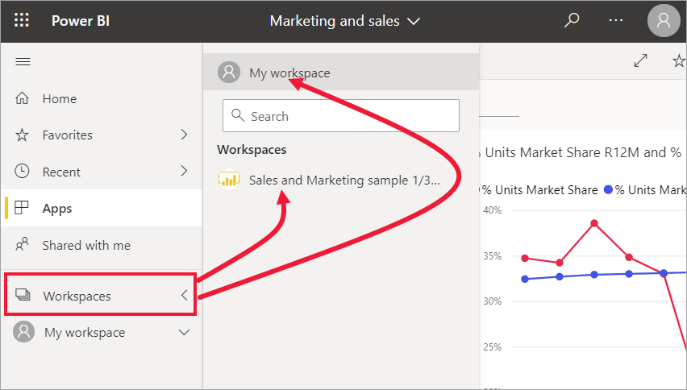
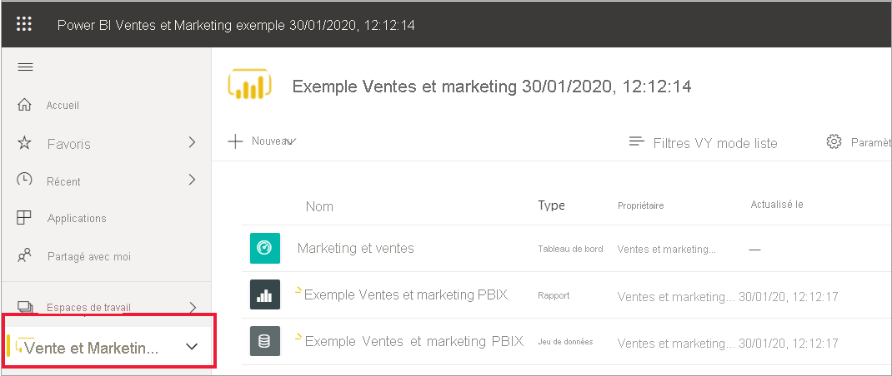
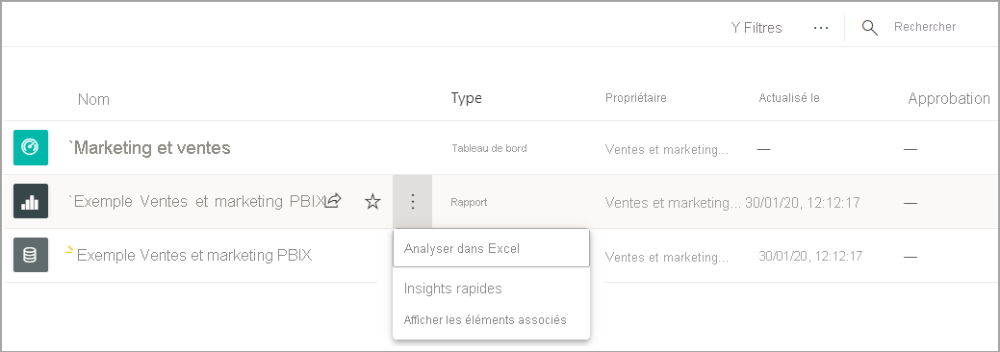

# Démarrage rapide - Découverte du service Power BI

[!INCLUDE [power-bi-service-new-look-include](../includes/power-bi-service-new-look-include.md)]

Maintenant que vous connaissez les concepts de base de Power BI, vous êtes prêt à découvrir le **service Power BI**. Comme mentionné précédemment, une personne de votre équipe peut passer tout son temps à travailler dans **Power BI Desktop**, afin de combiner les données et créer des rapports pour d’autres. De votre côté, vous passez peut-être tout votre temps à travailler dans le service Power BI pour afficher et exploiter du contenu créé par d’autres personnes (expérience de **consommation**). Dans ce guide de démarrage rapide, vous allez importer des exemples de données et vous en servir pour apprendre à utiliser le service Power BI. 
 
## Prérequis

- Si vous n’êtes pas inscrit à Power BI, [inscrivez-vous à un essai gratuit](https://app.powerbi.com/signupredirect?pbi_source=web) avant de commencer.

- Prenez connaissance des [concepts de base du service Power BI](end-user-basic-concepts.md)

## Ouvrir le service Power BI

Pour commencer, ouvrez le service Power BI (app.powerbi.com) et accédez à **Accueil**. 
1. Si le volet de navigation gauche est réduit, sélectionnez l’icône du volet de navigation  pour le développer. 

1. Sélectionnez **Accueil** si ce n’est pas déjà fait. 

1. Procurez-vous des exemples de données. Vous allez récupérer quelques exemples de données qui vous serviront pendant la visite guidée du service Power BI. Parmi tous les types d’exemples de données à votre disposition pour explorer le service, vous allez utiliser les données sur le marketing et les ventes. 

    Pour continuer, suivez ces instructions afin d’installer l’[exemple d’application Ventes et marketing](end-user-app-marketing.md).

1. Une fois l’application installée, dans le volet de navigation, sélectionnez **Applications**. 

   

2. Dans l’écran **Applications**, sélectionnez **Exemple Ventes et marketing**.

    

2. Sélectionnez **Explorer l’application**.

    

3. Le service Power BI ouvre le tableau de bord de l’application. Les tableaux de bord sont différents dans le service Power BI et dans Power BI Desktop. L’exemple inclut également un rapport et un jeu de données. 

    

    En tant que *consommateur*, la plupart des applications que vous recevez ne proposent pas un accès direct aux jeux de données sous-jacents. Dans la mesure où les exemples Power BI sont créés pour tous les clients Power BI, les jeux de données sont inclus. Les *concepteurs* avec qui vous travaillez utilisent les jeux de données pour apprendre à créer des tableaux de bord et des rapports. 

## Afficher du contenu (tableaux de bord et rapports)
Commençons par examiner comment le contenu de base (tableaux de bord, rapports, applications) est organisé. Le contenu s’affiche dans le contexte d’un espace de travail. Tout consommateur dispose au moins d’un espace de travail appelé **Mon espace de travail**. Chaque fois que vous installez une application, un espace de travail est créé pour cette application.  Comme nous avons installé l’exemple d’application Ventes et marketing, nous disposons désormais de deux espaces de travail. 

Sélectionnez **Espaces de travail** dans le volet de navigation gauche pour le constater par vous-même. 

**Mon espace de travail** stocke tout le contenu qui vous appartient et que vous créez. Considérez-le comme votre zone de travail ou bac à sable personnel pour votre propre contenu. Pour de nombreux *consommateurs* Power BI, **Mon espace de travail** reste vide car votre travail n’implique pas la création de contenu.  Les *consommateurs*, par définition, consomment les données créées par d’autres personnes et utilisent ces données pour prendre des décisions commerciales. Si vous êtes amené à créer du contenu, lisez les [articles Power BI destinés aux *créateurs de rapports*](../index.yml).

Un **espace de travail d’application** regroupe tout le contenu d’une application spécifique.  Quand un *concepteur* crée une application, il rassemble tout le contenu nécessaire à l’utilisation de cette application.  Sélectionnez l’espace de travail Ventes et marketing pour voir ce que le *concepteur* a inclus dans l’application. 

L’espace de travail de l’application Ventes et marketing contient un tableau de bord, un rapport et un jeu de données. Chaque application n’est pas forcément configurée de la sorte. Une application peut contenir un seul tableau de bord, trois éléments de chaque type ou même vingt rapports. Tout dépend de ce que le *concepteur* décide d’inclure dans l’application. Dans la mesure où les données de ventes et de marketing sont un exemple, elles incluent un jeu de données. Mais, de manière générale, les espaces de travail d’application pour les *consommateurs* n’incluent aucun jeu de données. 

Un espace de travail est bien plus qu’une simple liste de contenus. Cette page fournit de nombreuses informations sur les tableaux de bord et les rapports de l’espace de travail. Prenez quelques minutes pour identifier le propriétaire du contenu, la date de la dernière actualisation, le contenu associé et les approbations. Si l’espace de travail contient une description, celle-ci peut vous aider à mieux comprendre les objectifs de l’espace de travail et à décider comment l’exploiter à des fins professionnelles. De plus, si l’espace de travail est riche en contenu, utilisez les options de recherche et de tri pour trouver rapidement ce dont vous avez besoin.

Un espace de travail est également l’un des chemins d’accès à vos données. Sélectionnez un tableau de bord ou un rapport dans la liste pour l’ouvrir.  Pointez sur un tableau de bord ou un rapport et sélectionnez l’icône en forme d’étoile pour l’ajouter aux favoris. Si le *concepteur* vous a donné des [autorisations de partage](end-user-shared-with-me.md), cette action apparaît également quand vous pointez sur un élément. 

Ouvrez le tableau de bord en sélectionnant son nom.

## Ajouter un rapport et un tableau de bord aux favoris
Les**Favoris** vous permettent d’accéder rapidement au contenu dont vous avez le plus besoin. Vous venez d’apprendre à ajouter un tableau de bord aux favoris à partir d’un espace de travail. Vous pouvez également créer des favoris directement à partir d’un tableau de bord ou d’un rapport.

1. Lorsque le tableau de bord est ouvert, sélectionnez **Ajouter un favori** dans la barre de menus.
   
   
   
   **Ajouter un favori** devient **Retirer des favoris** et l’étoile devient jaune.
   
   

2. Pour afficher la liste de tous les contenus que vous avez ajoutés aux favoris, dans le volet de navigation, sélectionnez la flèche à droite de **Favoris**. Étant donné que le volet de navigation est une fonctionnalité permanente du service Power BI, vous avez accès à cette liste quel que soit l’endroit où vous vous trouvez dans ce service.
   
    
   
    Cet utilisateur Power BI a quatre favoris. Les favoris peuvent désigner des tableaux de bord, des rapports ou des applications.  

Pour en savoir plus, consultez [Favoris](end-user-favorite.md).

## Rechercher votre contenu le plus récent

1. Comme avec les favoris, vous pouvez afficher rapidement le contenu le plus récemment consulté n’importe où dans le service Power BI en sélectionnant la flèche à côté de **Récent** dans le volet de navigation.

   

    Dans le menu volant, sélectionnez le contenu à ouvrir.

2. Parfois, vous ne voulez pas juste ouvrir du contenu récent, mais afficher des informations ou effectuer une autre action, comme afficher des insights ou exporter du contenu dans Excel. Pour effectuer ces actions, ouvrez le volet **Récents** en sélectionnant **Récent** ou son icône dans le volet de navigation. Dans cet exemple, l’utilisateur Power BI a plusieurs espaces de travail. Cette liste peut donc inclure le contenu de tous ses espaces de travail.

   

Pour en savoir plus, consultez [Récents dans Power BI](end-user-recent.md)

### Rechercher et trier du contenu
Si vous utilisez le service Power BI depuis peu, vous n’avez pas beaucoup de contenu. Mais, si vos collègues en partagent avec vous et que vous téléchargez des applications, vous pouvez vous retrouver avec de longues listes de contenus. C’est à ce moment-là que vous trouverez la recherche et le tri extrêmement utiles.

La recherche est disponible presque partout dans le service Power BI. Repérez simplement la zone de recherche ou l’icône en forme de loupe.    

Dans le champ Rechercher, tapez tout ou partie du nom d’un tableau de bord, d’un rapport, d’un classeur, d’une application ou d’un propriétaire. Power BI effectue une recherche sur l’ensemble de votre contenu.

Vous pouvez également trier du contenu de nombreuses façons. Pointez sur les en-têtes de colonnes et recherchez les flèches indiquant que la colonne peut être triée. Toutes les colonnes ne peuvent pas être triées. 

Vous pouvez également rechercher le contrôle de tri dans l’angle supérieur droit de votre canevas. Indiquez si vous souhaitez effectuer un tri croissant ou décroissant par date, nom ou propriétaire.  

Pour en savoir plus, consultez [Navigation dans Power BI : rechercher et trier](end-user-search-sort.md).

## Accueil Power BI
Nous allons conclure ce guide de démarrage rapide en revenant à notre point de départ : la page **Accueil** de Power BI. 

La page Accueil rassemble les outils de recherche et de tri, le volet de navigation et un canevas composé de *cartes* que vous pouvez sélectionner pour ouvrir vos tableaux de bord, rapports et applications. Au début, votre canevas Accueil peut ne pas avoir beaucoup de cartes. Toutefois, cela changera dès que vous commencerez à utiliser Power BI avec vos collègues. Votre canevas d’accueil est également mis à jour avec le contenu et les ressources de formation recommandés.

Pour plus d’informations, consultez [Accueil Power BI](end-user-home.md).

## Nettoyer les ressources
Maintenant que vous avez terminé ce guide de démarrage rapide, vous pouvez, si vous le souhaitez, supprimer le tableau de bord, le rapport et le jeu de données de l’exemple.

1. Ouvrez le service Power BI (app.powerbi.com) et connectez-vous.    
2. Ouvrez la page Accueil Power BI, faites-la défiler jusqu’à **Espaces de travail**, puis sélectionnez *Ventes et marketing*.      

3. Pointez sur le tableau de bord, le rapport ou le jeu de données, puis sélectionnez **Plus d’options (...)**  > **Supprimer**. Répétez l’opération jusqu’à ce que les trois éléments soient supprimés.

    

## Étapes suivantes

> [!div class="nextstepaction"]
> [Mode Lecture dans le service Power BI](end-user-reading-view.md)
