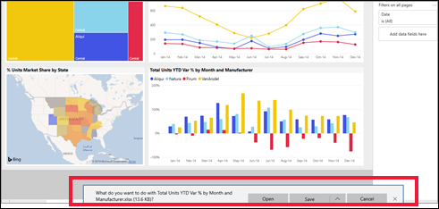

# Exporter des données à partir d’un élément visuel

[!INCLUDE[consumer-appliesto-yyny](../includes/consumer-appliesto-yyny.md)]

[!INCLUDE [power-bi-service-new-look-include](../includes/power-bi-service-new-look-include.md)]

Si vous souhaitez afficher les données qui sont utilisées pour créer un élément visuel, vous pouvez [le faire dans Power BI](end-user-show-data.md) ou exporter ces données vers Excel. L’option permettant d’exporter les données requiert un certain type de licence et les autorisations de modification sur le contenu. Si vous ne pouvez pas exporter, contactez votre administrateur Power BI ou votre support technique. 

L’exportation de données requiert une licence Power BI Pro, ou que le tableau de bord ou le rapport soit partagé avec vous à l’aide de la capacité Premium. Pour plus d’informations, consultez [Quelle est ma licence ?](end-user-license.md).

## À partir d’un élément visuel dans un tableau de bord Power BI

1. Démarrer un tableau de bord Power BI. Ici, nous utilisons le tableau de bord de l’application ***Exemple Marketing et ventes***. Vous pouvez [télécharger cette application sur AppSource.com](https://appsource.microsoft.com/en-us/product/power-bi/microsoft-retail-analysis-sample.salesandmarketingsample
).

    

2. Placez le curseur sur un élément visuel pour afficher **Plus d’options** (...), et cliquez pour afficher le menu Action.

    

3. Sélectionnez **Exporter au format .csv**.

4. Ce qui se passe ensuite dépend du navigateur que vous utilisez. Vous pouvez être invité à enregistrer le fichier ou vous pouvez voir un lien vers le fichier exporté en bas du navigateur. 

    

5. Ouvrez le fichier dans Excel. 

    > [!NOTE]
    > Si vous n’avez pas d’autorisations sur les données, vous ne pouvez pas les exporter ou les ouvrir dans Excel.  

    

## À partir d’un élément visuel dans un rapport
Vous pouvez exporter des données à partir d’un élément visuel dans un rapport au format. csv ou. xlsx (Excel). 

1. Dans un tableau de bord, sélectionnez une vignette pour ouvrir le rapport sous-jacent.  Dans cet exemple, nous sélectionnons le même élément visuel que ci-dessus, *Total Units YTD Var %*. 

    

    Étant donné que cette vignette a été créée à partir de *l’exemple de rapport Marketing et ventes*, c’est ce rapport qui s’ouvre. Il s’ouvre sur la page qui contient l’élément visuel de la vignette sélectionnée. 

2. Sélectionnez le visuel dans le rapport. Remarquez le volet **Filtres** à droite. Des filtres sont appliqués à cet élément visuel. Pour en savoir plus sur les filtres, consultez [Utiliser les filtres dans un rapport](end-user-report-filter.md).

    

3. Sélectionnez **Plus d’options (...)** dans le coin supérieur droit de la visualisation. Choisissez **Exporter des données**.

    

4. Vous verrez des options pour exporter les données résumées ou les données sous-jacentes. Si vous utilisez *l’exemple d’application Marketing et ventes*, les **Données sous-jacentes** sont désactivées. Toutefois, vous pouvez rencontrer des rapports où les deux options sont activées. Voici une explication de la différence.

    **Données résumées** : sélectionnez cette option si vous voulez exporter les données pour ce que vous voyez actuellement dans le visuel.  Ce type d’exportation contient seulement les données qui ont été utilisées pour créer l’état actuel du visuel. Si des filtres sont appliqués à l’élément visuel, les données que vous exportez sont également filtrées. Par exemple, pour cet élément visuel, votre exportation inclura uniquement les données pour 2014 et la région centrale, et uniquement les données pour quatre des fabricants : VanArsdel, Natura, Aliqui et Pirum. Si votre visuel comporte des agrégats (somme, moyenne, etc.), l’exportation est également agrégée. 
  

    **Données sous-jacentes** : sélectionnez cette option si vous souhaitez exporter les données de ce que vous voyez dans l’élément visuel **plus** les données supplémentaires du jeu de données sous-jacent.  Cela peut inclure des données contenues dans le jeu de données, mais qui ne sont pas utilisées dans l’élément visuel. Si des filtres sont appliqués à l’élément visuel, les données que vous exportez sont également filtrées.  Si votre visuel comporte des agrégats (somme, moyenne, etc.), l’exportation supprime l’agrégation, essentiellement en mettant à plat les données. 

    

5. Ce qui se passe ensuite dépend du navigateur que vous utilisez. Vous pouvez être invité à enregistrer le fichier ou vous pouvez voir un lien vers le fichier exporté en bas du navigateur. 

    

    > [!NOTE]
    > Si vous n’avez pas d’autorisations sur les données, vous ne pouvez pas les exporter ou les ouvrir dans Excel.  

6. Ouvrez le fichier dans Excel. Comparez la quantité de données exportées aux données que nous avons exportées à partir du même élément visuel sur le tableau de bord. La différence est que cette exportation comprend les **Données sous-jacentes**. 

    

## Étapes suivantes

[Afficher les données utilisées pour créer un visuel](end-user-show-data.md)