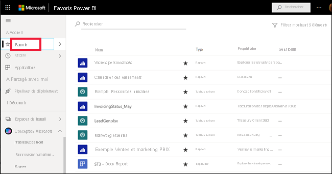

# Tableaux de bord, rapports et applications favoris dans le service Power BI
Quand vous ajoutez du contenu à vos *favoris*, vous pouvez y accéder rapidement à partir de la liste de contenu **Favoris**, ainsi qu’en accédant à **Accueil Power BI** > **Favoris et fréquents**.  Les favoris sont généralement le contenu que vous consultez le plus souvent et qui est signalé par une étoile.

   

   

Dans le service Power BI, vous pouvez également sélectionner un tableau de bord comme étant le [tableau de bord par défaut](end-user-featured.md).

## Ajouter un tableau de bord ou un rapport aux *favoris*

1. Ouvrez un tableau de bord ou un rapport que vous utilisez souvent. Chaque contenu partagé avec vous peut être un *favori*.

2. Dans le ruban supérieur du service Power BI, sélectionnez **Favori** ou l’icône en forme d’étoile .
   
   
   
   Vous pouvez également afficher un tableau de bord ou un rapport à partir de n’importe quel emplacement signalé par une étoile (Accueil, Récents, Applications et Partagé avec moi). 
   
   

## Ajouter une application aux *favoris*

1. Dans le volet de navigation, sélectionnez **Applications**.

   

2. Pointez sur une application pour afficher plus de détails.  Sélectionnez l’icône en forme d’étoile   pour l’ajouter aux favoris.
   
   

## Utilisation de *Favoris*
1. Pour accéder aux favoris, sélectionnez la flèche de menu volant située à droite de **Favoris**.  Vous pouvez sélectionner ici un favori pour l’ouvrir. Seuls cinq favoris sont répertoriés (par ordre alphabétique). Si vous en avez plus de cinq, sélectionnez  **Tout afficher** pour ouvrir la liste de contenu Favoris (voir le point 2 ci-dessous). 
   
   
2. Pour voir **tout** le contenu que vous avez ajouté aux favoris, dans le volet de navigation, sélectionnez **Favoris** ou l’icône Favoris .  
   
    
   
   À ce stade, vous pouvez effectuer une action : ouvrir, identifier les propriétaires et même partager avec vos collègues.

## Retirer du contenu des favoris
Vous n’utilisez plus souvent un rapport ?  Vous pouvez le retirer des favoris. Quand vous retirez du contenu de la liste des favoris, il est retiré de vos favoris mais pas de Power BI.

1. Dans le volet de navigation de gauche, sélectionnez **Favoris** pour ouvrir l’écran **Favoris**.
   
   
2. Sélectionnez l’étoile jaune en regard du contenu à retirer des favoris.

> [!NOTE]
> Vous pouvez également retirer un tableau de bord, un rapport ou une application des favoris. Pour cela, il vous suffit d’ouvrir l’élément en question et de désélectionner l’icône jaune.   
> 
> 
## Considérations et limitations
À l’heure actuelle, vous pouvez marquer une application comme favorite et permettre à tous les rapports et tableaux de bord qu’elle contient de devenir eux aussi des favoris. Il n’est pas possible de mettre dans les favoris un seul rapport ou un seul tableau de bord d’une application. 

## Étapes suivantes
[Power BI – Concepts de base](end-user-basic-concepts.md)

D’autres questions ? [Posez vos questions à la communauté Power BI](http://community.powerbi.com/)

