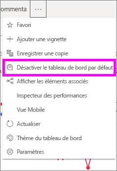

# Tableaux de bord par défaut dans le service Power BI

[!INCLUDE [power-bi-service-new-look-include](../includes/power-bi-service-new-look-include.md)]

La plupart d’entre nous ont un tableau de bord que nous consultons plus souvent que tous les autres. C’est peut-être le tableau de bord que nous utilisons pour piloter notre activité. Il peut aussi s’agir d’un tableau de bord contenant un groupement de vignettes de différents tableaux de bord et rapports.

## Créer un tableau de bord par défaut
Quand vous sélectionnez un tableau de bord comme tableau de bord *par défaut*, chaque fois que vous ouvrez le service Power BI, celui-ci s’ouvre en affichant ce tableau de bord. 

Vous pouvez également sélectionner quelques tableaux de bord et les définir comme favoris. Consultez [Tableau de bord favoris](end-user-favorite.md).

Si vous n’avez pas encore de tableau de bord par défaut, Power BI s’ouvre sur le dernier tableau de bord que vous avez utilisé ou sur l’**Accueil** de Power BI. 

### Définir un tableau de bord par défaut
Regardez Amanda créer un tableau de bord par défaut dans la vidéo. Ensuite, effectuez les étapes pour essayer vous-même cette fonctionnalité.

<iframe width="560" height="315" src="https://www.youtube.com/embed/G26dr2PsEpk" frameborder="0" allowfullscreen></iframe>

1. Ouvrez le tableau de bord que vous voulez définir comme tableau de bord par défaut. 
2. Dans la barre de menus du haut, sélectionnez **Plus d’options** (...), puis sélectionnez **Définir comme tableau de bord par défaut**. 
   
    
3. Confirmez votre sélection.
   
    

## Modifier le tableau de bord par défaut
Si vous changez d’avis par la suite, vous pouvez définir un nouveau tableau de bord comme tableau de bord par défaut.

1. Suivez les étapes 1 et 2 ci-dessus.
   
    
2. Sélectionnez **Définir comme tableau de bord par défaut**. Annuler la définition d’un tableau de bord comme tableau de bord par défaut ne le supprime pas de Power BI. 
   
    

## Supprimer le tableau de bord par défaut
Si vous ne voulez pas qu’un tableau de bord s’affiche par défaut, voici comment annuler la sélection d’un tableau de bord par défaut.

1. Ouvrez le tableau de bord qui est actuellement le tableau de bord par défaut.
2. Dans la barre de menus du haut, sélectionnez **Plus d’options** (...), puis sélectionnez **Désactiver le tableau de bord par défaut**.

    
   
## Étapes suivantes
- [Ajouter un tableau de bord aux favoris](end-user-favorite.md)
- D’autres questions ? Essayez la [communauté Power BI](https://community.powerbi.com/).

