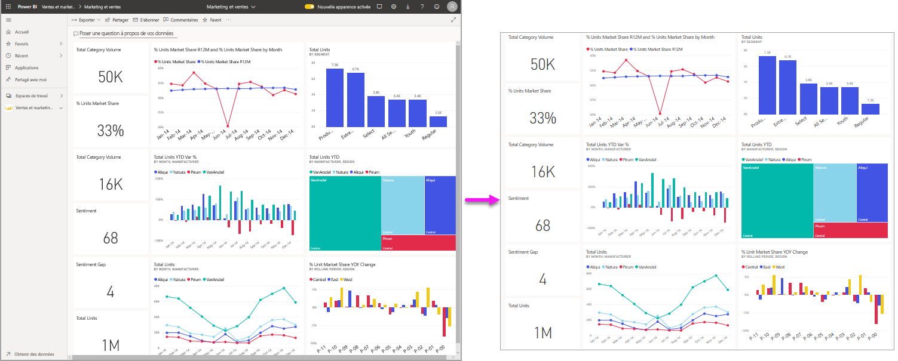
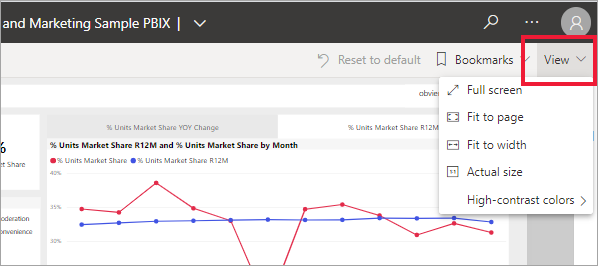

# Afficher du contenu plus en détail : mode Focus et plein écran

[!INCLUDE [power-bi-service-new-look-include](../includes/power-bi-service-new-look-include.md)]    

<iframe width="560" height="315" src="https://www.youtube.com/embed/dtdLul6otYE" frameborder="0" allowfullscreen></iframe>

Le mode Focus et le mode plein écran sont deux façons de voir plus de détails de vos visuels, rapports et tableaux de bord.  La principale différence est que le plein écran supprime tous les volets autour de votre contenu, tandis que le mode Focus vous permet de continuer à interagir avec vos visuels. Examinons plus en détail les similitudes et les différences.  

|Contenu    | Mode focus  |Mode plein écran  |
|---------|---------|----------------------|
|Tableau de bord     |   Impossible     | oui |
|Page du rapport   | Impossible  | oui|
|Visuel de rapport | oui    | oui |
|Mosaïque de tableau de bord | oui    | Impossible |
|Windows 10 mobile | Impossible | Oui |

## Qu’est-ce que le mode plein écran ?

Affichez le contenu de votre service Power BI (tableaux de bord, pages de rapport, vignettes et visuels) sans vous laisser distraire par les menus et les volets de navigation.  Vous disposez en permanence d’une vue instantanée complète, et sans fioritures, de votre contenu. Elle est parfois appelée mode TV.   

Si vous utilisez Power BI mobile, [le plein écran est disponible pour les applications mobiles Windows 10](./mobile/mobile-windows-10-app-presentation-mode.md). 

Le mode plein écran peut être utile pour les utilisations suivantes :

* Présentation de vos tableaux de bord, visuels ou rapports lors d’une réunion ou d’une conférence
* Affichage dans un bureau, à l’aide d’un grand écran dédié ou d’un projecteur
* Affichage sur un petit écran
* Consultation en mode verrouillé ; vous pouvez toucher l’écran ou passer le curseur de la souris sur les vignettes sans ouvrir le rapport ou le tableau de bord sous-jacent

## Qu’est-ce que le mode Focus ?

Le mode ***Focus*** permet de développer (dans une nouvelle fenêtre) un visuel ou une mosaïque pour afficher plus de détails.  Vous disposez peut-être d’un tableau de bord ou d’un rapport légèrement chargé et vous souhaitez faire un zoom sur un seul élément visuel.  C’est une utilisation parfaite du mode Focus.  

En mode Focus, un *consommateur* Power BI peut interagir avec tous les filtres qui ont été appliqués lors de la création de ce visuel.  Dans le service Power BI, vous pouvez utiliser le mode Focus sur une mosaïque de tableau de bord ou un visuel de rapport.

## Utilisation en mode plein écran

Le mode Plein écran est disponible pour les tableaux de bord, les pages de rapport et les visuels de rapport. 

- Pour ouvrir un tableau de bord en mode plein écran, sélectionnez l’icône Plein écran  dans la barre de menus du haut. 

- Pour ouvrir une page de rapport en mode plein écran, **Affichage** > **Plein écran**.

    

- Pour afficher un visuel en mode plein écran, ouvrez-le d’abord en mode Focus, puis sélectionnez **Affichage** > **Plein écran**.  

Votre contenu sélectionné occupe tout l’écran.    En mode plein écran, un menu contextuel s’affiche lorsque vous déplacez votre souris ou votre curseur. Étant donné que le mode plein écran est disponible pour un large éventail de contenu, les options du menu contextuel sont chacune un peu différentes, mais assez explicites.  Pointez simplement sur une icône pour avoir une définition.

Menu pour les tableaux de bord    
    

Menu pour les pages de rapport et les visuels de rapport    
    

  *     
  Utilisez le bouton **Précédent** pour accéder à la page précédente de votre navigateur. Si la page précédente était une page Power BI, elle s’affiche en mode plein écran.  Le mode plein écran est conservé jusqu’à ce que vous le fermiez.

  *     
  Utilisez ce bouton pour imprimer votre page de rapport ou tableau de bord en mode plein écran.

  *     
    Utilisez le bouton **Ajuster à l’écran** pour afficher votre tableau de bord à la taille maximale possible sans avoir recours à des barres de défilement.  

    

  * Icône        
    Il arrive que les barres de défilement ne vous soient pas utiles mais que vous souhaitiez que le tableau de bord remplisse toute la largeur disponible. Sélectionnez le bouton **Ajuster à la largeur**.    

    

  *        
    Dans les rapports en mode plein écran, utilisez ces flèches pour vous déplacer entre les pages du rapport.    
  *      
  Pour quitter le mode plein écran, sélectionnez l’icône **Quitter le plein écran**.

      

## Utilisation en mode Focus

Le mode Focus est disponible pour les vignettes de tableau de bord et les visuels de rapport. 

- Pour ouvrir une vignette de tableau de bord en mode Focus, pointez sur une vignette de tableau de bord ou un visuel de rapport, sélectionnez **Plus d’options** (...) et choisissez **Ouvrir en mode Focus**.

    . 

- Pour ouvrir un visuel de rapport en mode Focus, pointez sur le visuel, puis sélectionnez l’icône **Mode Focus**.  

   

Le visuel s’ouvre et remplit la totalité du canevas. Notez que vous disposez toujours d’un volet **Filtres** que vous pouvez utiliser pour interagir avec le visuel. Le volet **Filtres** et le volet de navigation peuvent être réduits.

   

     

Explorez davantage en [modifiant les filtres](end-user-report-filter.md) et en recherchant des découvertes intéressantes dans vos données.  

Explorez les données à la recherche de nouvelles idées et de réponses à des questions. En tant que *consommateur*, vous ne pouvez pas ajouter de nouveaux filtres, modifier les champs utilisés dans les visuels ou créer des visuels.  Vous pouvez cependant interagir avec les filtres existants. 

Pour une vignette de tableau de bord, vos modifications ne peuvent pas être enregistrées. Pour un visuel de rapport, les modifications que vous apportez aux filtres existants sont enregistrées quand vous quittez Power BI. Si vous ne souhaitez pas que Power BI se souvienne de vos modifications, sélectionnez **Rétablir les valeurs par défaut**.   

Quittez le mode Focus et revenez au tableau de bord en sélectionnant **Quitter le mode Focus** ou **Retour au rapport** (en haut à gauche du visuel).

    

  

## Considérations et résolution des problèmes

* Quand vous utilisez le mode focus avec un visuel dans un rapport, vous pouvez voir tous les filtres et interagir avec eux : au niveau du visuel, de la page, de l’extraction et du rapport.    
* Quand vous utilisez le mode focus avec un visuel sur un tableau de bord, vous pouvez voir et interagir seulement avec le filtre au niveau du visuel.

## Étapes suivantes

[Afficher les paramètres des rapports](end-user-report-view.md)