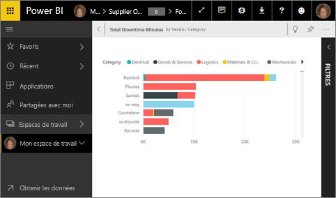
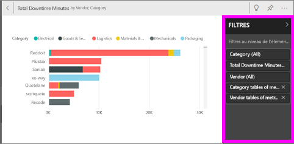
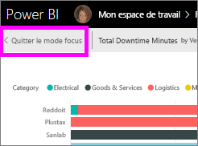
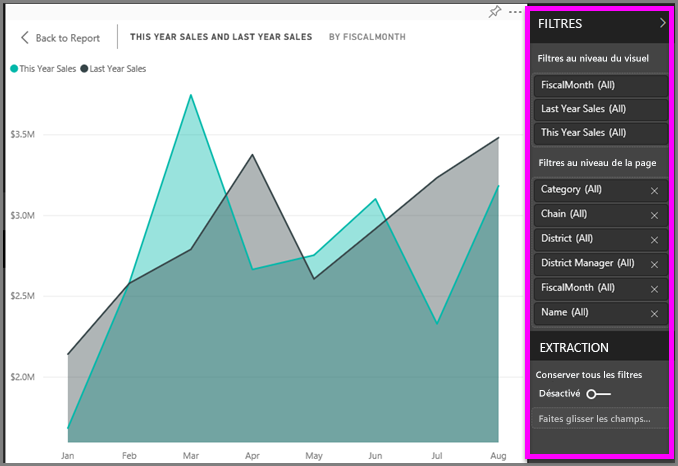

# Afficher du contenu plus en détail : mode Focus et plein écran

<iframe width="560" height="315" src="https://www.youtube.com/embed/dtdLul6otYE" frameborder="0" allowfullscreen></iframe>

Le mode Focus et le mode plein écran sont deux façons de voir plus de détails de vos visuels, rapports et tableaux de bord.  La principale différence est que le plein écran supprime tous les volets autour de votre contenu, tandis que le mode Focus vous permet de continuer à interagir avec vos visuels. Examinons plus en détail les similitudes et les différences.  

|Contenu    | Mode focus  |Mode plein écran  |
|---------|---------|----------------------|
|Tableau de bord     |   Impossible     | oui |
|Page du rapport   | Impossible  | oui|
|Visualisation des rapports | oui    | oui |
|Mosaïque de tableau de bord | oui    | oui |
|Windows 10 mobile | Impossible | Oui |

## Qu’est-ce que le mode plein écran ?

Affichez le contenu de votre service Power BI (tableaux de bord, pages de rapport, mosaïques et visualisations) sans vous laisser distraire par les menus et barres de navigation.  Vous disposez en permanence d’une vue instantanée complète, et sans fioritures, de votre contenu. Elle est parfois appelée mode TV.   

Pour ouvrir le mode plein écran, sélectionnez l’icône **plein écran**  dans la barre de menus du service Power BI au-dessus de votre tableau de bord, rapport, mosaïque en mode Focus ou visuel en mode Focus.  Votre contenu sélectionné occupe tout l’écran.
Si vous utilisez Power BI mobile, [le plein écran est disponible pour les applications mobiles Windows 10](./mobile/mobile-windows-10-app-presentation-mode.md). 

Le mode plein écran peut être utile pour les utilisations suivantes :

* Présentation de vos tableaux de bord, vignettes, éléments visuels ou rapports lors d’une réunion ou d’une conférence
* Affichage dans un bureau, à l’aide d’un grand écran dédié ou d’un projecteur
* Affichage sur un petit écran
* Consultation en mode verrouillé ; vous pouvez toucher l’écran ou passer le curseur de la souris sur les vignettes sans ouvrir le rapport ou le tableau de bord sous-jacent

## Qu’est-ce que le mode Focus ?
Le mode ***Focus*** permet de développer (dans une nouvelle fenêtre) un visuel ou une mosaïque pour afficher plus de détails.  Vous disposez peut-être d’un tableau de bord ou d’un rapport légèrement chargé et vous souhaitez faire un zoom sur un seul élément visuel.  C’est une utilisation parfaite du mode Focus.  

En mode Focus, un *consommateur* Power BI peut interagir avec tous les filtres qui ont été appliqués lors de la création de ce visuel.  Dans le service Power BI, vous pouvez utiliser le mode Focus sur une mosaïque de tableau de bord ou un visuel de rapport.

## Utilisation en mode plein écran
Pour ouvrir un tableau de bord ou une page de rapport en mode plein écran, sélectionnez l’icône plein écran  dans la barre de navigation supérieure. En mode plein écran, un menu contextuel s’affiche lorsque vous déplacez votre souris ou votre curseur. Étant donné que le mode plein écran est disponible pour un large éventail de contenu, les options du menu contextuel sont chacune un peu différentes, mais assez explicites.  Pointez simplement sur une icône pour avoir une définition.

Menu pour les tableaux de bord    
    

Menu pour les pages de rapport    
    

  *     
  Utilisez le bouton **Précédent** pour accéder à la page précédente de votre navigateur. Si la page précédente était une page Power BI, elle s’affiche en mode plein écran.  Le mode plein écran est conservé jusqu’à ce que vous le fermiez.

  *     
  Utilisez ce bouton pour imprimer votre page de rapport ou tableau de bord en mode plein écran.

  *     
    Utilisez le bouton **Ajuster à l’écran** pour afficher votre tableau de bord à la taille maximale possible sans avoir recours à des barres de défilement.  

    

  * Icône        
    Il arrive que les barres de défilement ne vous soient pas utiles mais que vous souhaitiez que le tableau de bord remplisse toute la largeur disponible. Sélectionnez le bouton **Ajuster à la largeur**.    

    

  *        
    Dans les rapports en mode plein écran, utilisez ces flèches pour vous déplacer entre les pages du rapport.    
  * Pour quitter le mode plein écran, sélectionnez l’icône **Quitter le plein écran**.

      

## Utilisation en mode Focus
Il y deux façons d’ouvrir le mode Focus : une pour les mosaïques de tableau de bord et une autre pour les visualisations de rapports.

### Mode Focus dans les tableaux de bord
1. Ouvrez un tableau de bord dans le service Power BI.

2. Pointez sur la mosaïque du tableau de bord, sélectionnez les points de suspension (...) et choisissez **Ouvrir en mode Focus**.

    .

2. La vignette s’ouvre et remplit la totalité du canevas de rapport.

   

3. Développez le volet des filtres pour afficher tous les filtres appliqués à cet élément visuel.

   

4. Explorez davantage en [modifiant les filtres](end-user-report-filter.md) et en recherchant des découvertes intéressantes dans vos données.  

5. Fermez le mode Focus et revenez au tableau de bord en sélectionnant **Quitter le mode focus** (dans le coin supérieur gauche du visuel).

        

## Mode Focus pour les visualisations de rapports
1. Afficher un rapport dans le service Power BI.  Dans cet exemple, nous allons faire la démonstration de l’utilisation de l’échantillon d’analyse de la vente au détail.

1. Après l’ouverture du rapport, sélectionnez l’**onglet de ventes mensuelles du district**.

2. Déplacez le curseur sur le diagramme de zone en bas à gauche et sélectionnez l’icône **mode Focus** .  

   
2. La visualisation s’ouvre et remplit la totalité du canevas.

   
3. Si nécessaire, développez le volet Filtres pour interagir avec les filtres appliqués à ce visuel. Explorez les données à la recherche de nouvelles idées et de réponses à des questions. En tant que *consommateur*, vous ne pouvez pas ajouter de nouveaux filtres, modifier les champs utilisés dans les visualisations ou créer des visualisations.  Cependant, toutes les modifications que vous apportez aux filtres existants sont enregistrées lorsque vous quittez Power BI. Si vous ne souhaitez pas que Power BI se souvienne de vos modifications, sélectionnez **Rétablir les valeurs par défaut**.   

   

5. Fermez le mode Focus et revenez au rapport en sélectionnant **Revenir au rapport** (dans le coin supérieur gauche du visuel).

      

## Considérations et résolution des problèmes
* Lorsque vous utilisez le mode Focus avec une visualisation dans un rapport, vous pouvez afficher tous les filtres et interagir avec eux : au niveau du visuel, de la page, de l’extraction et du rapport.    
* Lorsque vous utilisez le mode Focus avec une visualisation sur un tableau de bord, vous pouvez afficher uniquement le filtre au niveau du visuel, qui est le seul avec lequel vous pouvez interagir.

## Étapes suivantes
[Afficher les paramètres des rapports](end-user-report-view.md)