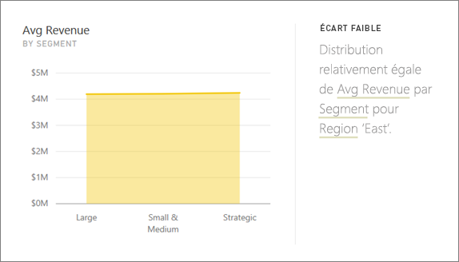

# Types d’informations pris en charge par Power BI
## Comment fonctionnent les informations ?
Power BI effectue des recherches rapides dans différents sous-ensembles de votre jeu de données tout en appliquant un jeu d’algorithmes sophistiqués pour détecter les informations potentiellement intéressantes. Power BI analyse autant que possible le jeu de données dans le délai imparti.

Vous pouvez exécuter des informations sur un jeu de données ou une vignette de tableau de bord.   

## Quels types d’informations pouvons-nous trouver ?
Voici certains des algorithmes que nous utilisons :

## Valeurs hors norme de catégorie (de haut en bas)
Met en évidence les cas où, pour une mesure dans le modèle, un ou deux membres d’une dimension ont des valeurs beaucoup plus grandes que d’autres membres de la dimension.  

## Points de changement dans une série chronologique
Met en surbrillance les cas où il existe des modifications significatives dans les tendances d’une série chronologique de données.

## Corrélation
Détecte les cas où plusieurs mesures montrent une corrélation les unes avec les autres lorsqu’elles sont représentées par rapport à une dimension du jeu de données.

## Écart faible
Détecte les cas où des points de données ne sont pas éloigné de la moyenne.

## Majorité (facteurs majeurs)
Recherche les cas où une majorité d’une valeur totale peut être attribuée à un facteur unique en cas de répartition par une autre dimension.  

## Tendances générales dans une série chronologique
Détecte les tendances vers le haut ou vers le bas dans les données d’une série chronologique.

## Caractère saisonnier d’une série chronologique
Recherche des modèles récurrents dans les données d’une série chronologiques, comme un caractère saisonnier (hebdomadaire, mensuel ou annuel).

## Partage stable
Met en évidence les cas où il existe une corrélation parent-enfant entre le partage d’une valeur enfant par rapport à la valeur globale du parent dans une variable continue.

## Valeurs hors norme d’une série chronologique
Pour les données d’une série chronologique, détecte les cas où il existe des dates ou heures avec des valeurs fondamentalement différentes des autres valeurs de date et d’heure.

## Étapes suivantes
[Informations Power BI](end-user-insights.md)

Si vous possédez un jeu de données, [optimisez-le pour la fonction Informations](../service-insights-optimize.md).

D’autres questions ? [Posez vos questions à la communauté Power BI](http://community.powerbi.com/)

