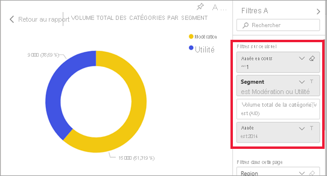

# Comment les visuels s’entrefiltrent dans un rapport Power BI
Une des grandes fonctionnalités de Power BI est la façon dont tous les éléments visuels sur une page de rapport sont interconnectés. Si vous sélectionnez un point de données sur l’un des éléments visuels, tous les autres éléments visuels de la page qui contiennent ces données changent en fonction de cette sélection. 

## Interactions entre les visuels

Par défaut, quand vous sélectionnez un point de données dans un visuel d’une page de rapport, cela entraîne un filtrage croisé ou une sélection croisée dans les autres visuels de la page. L’interaction exacte des éléments visuels sur une page est définie par le *concepteur* du rapport. Les *concepteurs* disposent d’options qui permettent d’activer et de désactiver les interactions visuelles, et de modifier le comportement par défaut du filtrage croisé, de la sélection croisée et de l’[exploration](end-user-drill.md). 

Si vous débutez avec les hiérarchies ou l’exploration, vous pouvez consulter des informations complètes à ce sujet dans cet article sur l’[exploration dans Power BI](end-user-drill.md). 

### Filtrage croisé et sélection croisée

Le filtrage croisé et la sélection croisée peuvent être utiles pour savoir comment une valeur dans vos données impacte une autre valeur. Les termes *filtrage croisé* et *sélection croisée* permettent de distinguer le comportement décrit ici de celui qui résulte de l’utilisation du volet **Filtres** pour filtrer et mettre en évidence des visuels.  

Nous allons définir ces termes en examinant les pages du rapport ci-dessous. Le graphique en anneau « Total category volume by segment » (Volume total des catégories par segment) comprend deux valeurs : « Moderation » (Modération) et « Convenience » (Commodité). 

1. Voyons ce qui se passe lorsque vous sélectionnez **Moderation**.

    

2. Le **filtrage croisé** supprime les données non applicables. Le fait de sélectionner **Moderation** dans le graphique en anneau a pour effet d’effectuer un filtrage croisé du graphique en courbes. Le graphique en courbes affiche alors uniquement les points de données concernant le segment Moderation. 

3. La **sélection croisée** conserve tous les points de données d’origine, mais grise ceux qui ne s’appliquent pas à votre sélection. Le fait de sélectionner **Moderation** dans le graphique en anneau a pour effet d’effectuer une sélection croisée de l’histogramme. L’histogramme grise toutes les données qui ne concernent pas le segment Convenience et sélectionne toutes les données qui concernent le segment Moderation. 

## Considérations et résolution des problèmes
- Si votre rapport comprend un visuel qui prend en charge l’[exploration](end-user-drill.md), par défaut, le fait d’explorer un visuel n’a aucun effet sur les autres visuels de la page du rapport. Toutefois, le *Concepteur* de rapports peut modifier ce comportement. Vérifiez donc sur vos visuels explorables si les **filtres d’exploration – Autres visuels** ont été activés par le *Concepteur* de rapports.
    
- Les filtres appliqués au niveau des visuels sont conservés lors du filtrage croisé et lors de la sélection croisée des autres visuels de la page du rapport. Ainsi, si des filtres ont été appliqués au niveau du visuel A par le concepteur de rapports ou par vous-même, et si vous utilisez le visuel A pour interagir avec le visuel B, les filtres appliqués au niveau du visuel A seront appliqués au visuel B.

    

## Étapes suivantes
[Utilisation des filtres de rapport](../power-bi-how-to-report-filter.md)    

[À propos du filtrage et de la sélection](end-user-report-filter.md) 
