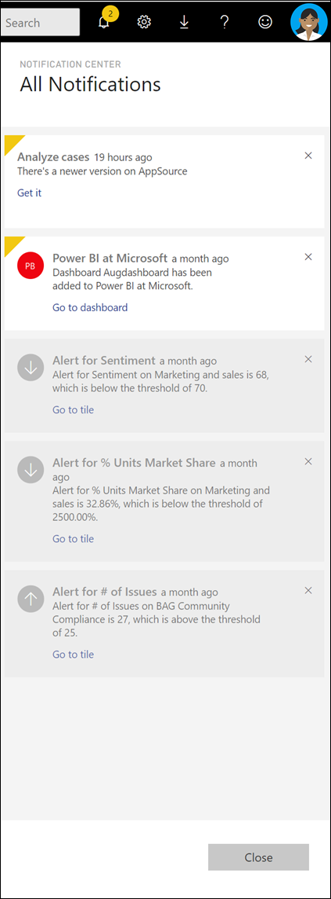

# Afficher les notifications Power BI

[!INCLUDE[consumer-appliesto-yynn](../includes/consumer-appliesto-yynn.md)]

Le centre de notifications est un flux séquentiel d’informations sur votre expérience Power BI. Ouvrez-le pour voir les messages sur les nouveaux tableaux de bord partagés avec vous, les informations sur les événements et réunions Power BI, les alertes que vous avez définies, etc. Vous pouvez [définir des alertes dans le service Power BI](end-user-alerts.md), ainsi que dans les applications mobiles Power BI.

Regardez Amanda examiner et gérer des notifications, et y répondre. Suivez ensuite les instructions sous la vidéo pour essayer par vous-même.    

> [!NOTE]
> Cette vidéo montre une version plus ancienne du service Power BI. 

<iframe width="560" height="315" src="https://www.youtube.com/embed/bZMSv5KAlcE" frameborder="0" allowfullscreen></iframe>

## Afficher vos notifications
1. Quand vous vous connectez à Power BI, les nouvelles notifications qui ont été envoyées hors ligne sont ajoutées à votre flux. En l’absence de nouvelles notifications, Power BI affiche une bulle jaune avec le nombre de nouveaux éléments.
   
   
2. Dans la barre de menus Power BI, sélectionnez l’icône **Notifications**.
   
   
3. Les notifications sont affichées avec les plus récentes en haut et les messages non lus en surbrillance. Elles sont conservées pendant 90 jours, sauf si vous les supprimez plus tôt ou atteignez la limite maximale de 100.
   
   
4. Pour faire disparaître une notification, sélectionnez l’icône X.

## Étapes suivantes
* [Alertes de données dans le service Power BI](end-user-alerts.md)
* [Définir des alertes de données dans l’application iPhone (Power BI pour iOS)](mobile/mobile-set-data-alerts-in-the-mobile-apps.md)
* [Définir des alertes dans l’application mobile Power BI pour Windows 10](mobile/mobile-set-data-alerts-in-the-mobile-apps.md)
* D’autres questions ? [Posez vos questions à la communauté Power BI](https://community.powerbi.com/)

