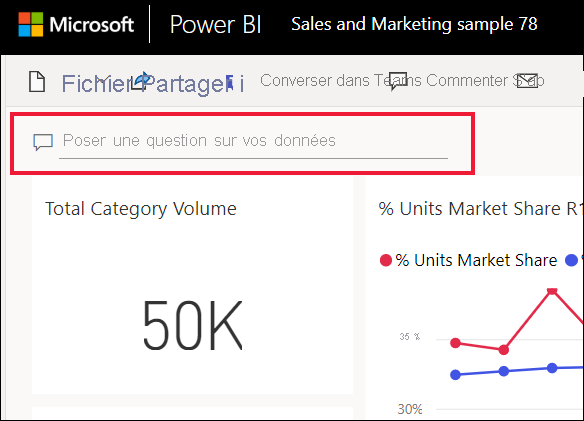

# Questions et réponses pour les **consommateurs** Power BI
## Qu’est-ce que Questions et réponses ?
Il est parfois plus rapide d’obtenir des informations à partir de vos données en posant une question dans un langage naturel. Par exemple, « quel était le total des ventes l’année dernière ».  
Utilisez Questions et réponses pour explorer vos données à l’aide des fonctionnalités intuitives du langage naturel et recevez des réponses sous la forme de graphiques et de graphes. Questions et réponses diffère d’un moteur de recherche, car il ne fournit que des résultats sur les données de Power BI.

**Questions et réponses de Power BI** prend uniquement en charge les réponses aux questions en langage naturel formulées en anglais. Votre administrateur Power BI peut activer une préversion disponible en espagnol.

La fonction **Questions et réponses Power BI** est disponible avec une licence Pro ou Premium. 
>

Les questions ne sont qu’un début.  Amusez-vous à explorer vos données, affinez ou développez vos questions, découvrez de nouvelles informations fiables et obtenez une vue d’ensemble de vos données. Vous serez ravi des informations précieuses que vous allez découvrir.

Cet outil est réellement interactif et surtout très rapide ! Grâce à son stockage en mémoire, il fournit des réponses de manière quasi instantanée.

## Où puis-je utiliser Questions et réponses ?
Vous trouverez Questions et réponses sur les tableaux de bord dans le service Power BI, en bas du tableau de bord dans Power BI Mobile et au-dessus de la visualisation dans Power BI Embedded. À moins que le concepteur vous ait donné des autorisations de modification, vous pouvez utiliser Questions et réponses pour explorer les données, mais vous ne pouvez pas enregistrer les visualisations créées avec cette fonctionnalité.

## Comment la fonctionnalité Questions et réponses sait répondre aux questions ?
Questions et réponses recherche des réponses dans tous les jeux de données associés au tableau de bord. Si un jeu de données a une vignette sur le tableau de bord, Questions et réponses recherche des réponses dans ce jeu de données. 

## Comment commencer ?
Tout d’abord, familiarisez-vous avec le contenu. Examinez les visualisations sur le tableau de bord et dans le rapport. Familiarisez-vous avec le type et la plage de données qui sont à votre disposition. Retournez ensuite au tableau de bord et placez votre curseur dans la zone de question. Cette opération ouvre l’écran Questions et réponses.

 

* Si les étiquettes et les valeurs d’axe des visualisations comprennent les mots « ventes », « compte », « mois » et « opportunités », vous pouvez poser des questions telles que : « quel *compte* possède le nombre le plus élevé d’*opportunités*? » ou « afficher les *ventes* par mois sous la forme d’un graphique à barres ».

* Si vous disposez de données de performances de site web dans Google Analytics, vous pouvez interroger Questions et réponses concernant le temps passé sur une page web, le nombre de visites uniques et les taux d’engagement utilisateur. Si vous interrogez des données démographiques, vous pourriez poser des questions sur l’âge et sur les revenus par zone géographique.

D’autres éléments utiles sont affichés en bas de l’écran. Pour chaque jeu de données, Questions et réponses vous montre des mots clés, et parfois même des exemples ou des suggestions de questions. Sélectionnez l’un d’eux pour les ajouter à la zone de question. 

Questions et réponses peut aussi vous aider à poser des questions avec des invites, une saisie semi-automatique et des signaux visuels. 

 

### Quelles visualisations la fonctionnalité Questions et réponses utilise ?
Questions et réponses choisit la meilleure visualisation en fonction des données affichées. Parfois les données du jeu sous-jacent sont définies en tant que type ou catégorie, ce qui aide Questions et réponses à savoir comment les afficher. Par exemple, si les données sont définies en tant que date, elles seront davantage susceptibles de s’afficher sous la forme d’un graphique en courbes. Les données appartenant à la catégorie « Ville » seront davantage susceptibles de s’afficher sous forme de carte.

Vous pouvez également indiquer à Questions et réponses quelle visualisation utiliser en l’ajoutant à votre question. Gardez toutefois à l’esprit qu’il n’est pas toujours possible pour Questions et réponses d’afficher les données avec la visualisation demandée. Questions et réponses vous fournit une liste de types de visualisations applicables.

## Considérations et résolution des problèmes
**Question** : Je ne vois pas Questions et réponses sur ce tableau de bord.    
**Réponse 1** : Si vous ne voyez pas de zone de question, commencez par vérifier vos paramètres. Pour ce faire, sélectionnez l’icône d’engrenage en haut à droit de votre barre d’outils Power BI.   

Choisissez ensuite **Paramètres** > **Tableaux de bord**. Vérifiez qu’il y a une coche à côté de l’option **Afficher la zone de recherche de Questions et réponses dans ce tableau de bord**.
  

**Réponse 2** : Parfois, le *concepteur* du tableau de bord ou votre administrateur désactive Questions et réponses. Vérifiez auprès d’eux s’il est possible de le réactiver.   

**Question** : Je n’obtiens pas les résultats attendus quand je tape une question.    
**Réponse** : Contactez le *concepteur* du tableau de bord. Il y a beaucoup de choses que le concepteur peut faire pour améliorer les résultats de Questions et réponses. Par exemple, il peut renommer des colonnes dans le jeu de données pour utiliser des termes qui sont faciles à comprendre (`CustomerFirstName` au lieu de `CustFN`). Étant donné que le concepteur connaît parfaitement le jeu de données, il peut également trouver des questions utiles et les ajouter au canevas Questions et réponses.

## Étapes suivantes

