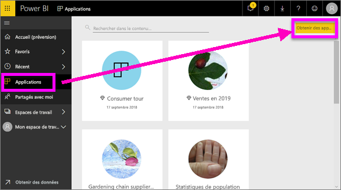
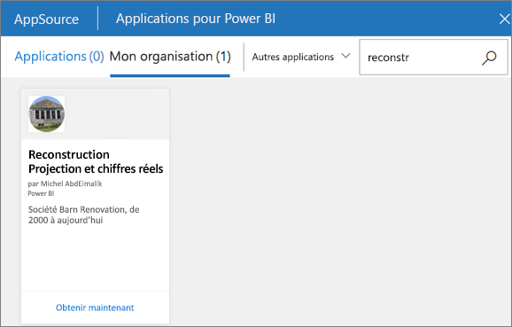
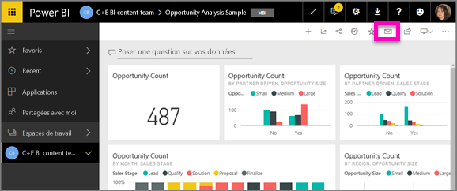
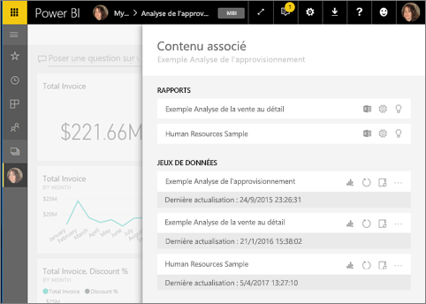

<!-- once the sample aps are live, change this so consumers can follow along -->
# Démarrage rapide : Découvrir les fonctionnalités de Power BI pour les ***consommateurs***
Dans ce démarrage rapide, vous allez apprendre à interagir avec Power BI pour découvrir des insights d’entreprise pilotés par les données. Cet article n’est pas destiné à aller au fond des choses. Il brosse en revanche un tableau rapide de la plupart des actions accessibles aux **consommateurs** de Power BI.

Si vous n’êtes pas inscrit à Power BI, [inscrivez-vous à un essai gratuit](https://app.powerbi.com/signupredirect?pbi_source=web) avant de commencer.

## Conditions préalables
- Service Power BI (app.powerbi.com) <!-- app from AppSource -->

## Mode Lecture
Le Mode Lecture est accessible dans le service Power BI aux *utilisateurs* de rapports. Quand un collègue partage un rapport avec vous, le Mode Lecture vous permet d’explorer et d’interagir avec ce rapport. 

Le service Power BI comporte un autre mode lié aux rapports : le [Mode Édition](../service-interact-with-a-report-in-editing-view.md), accessible aux *concepteurs* de rapports.  

Le Mode Lecture est un moyen puissant et sécurisé d’explorer des tableaux de bord et des rapports. Lorsque vous segmentez et décortiquez les tableaux de bord et les rapports partagés avec vous, les jeux de données sous-jacents restent intacts et inchangés. 

En mode Lecture, vous pouvez notamment mettre en surbrillance et filtrer plusieurs éléments visuels sur une page.  Il vous suffit de mettre en surbrillance ou de sélectionner une valeur dans l’un des visuels pour voir instantanément son impact sur les autres. Utilisez le volet Filtre pour ajouter et modifier des filtres sur une page de rapport et modifier la manière dont les valeurs sont triées dans une visualisation. Ce ne sont que quelques exemples des fonctionnalités de Power BI pour les *consommateurs*.  Lisez la suite pour en savoir plus à leur sujet et découvrir d’autres fonctionnalités de ce type.

 
### Afficher une application
Dans Power BI, les *applications* groupent les rapports et tableaux de bord associés dans un même emplacement.

1. Sélectionnez **Applications**  > **Obtenir des applications**. 
   
     
2. Dans AppSource, cherchez sous **Mon organisation** pour affiner les résultats et trouver l’application souhaitée.
   
     
3. Sélectionnez **Obtenir maintenant** pour l’ajouter à votre conteneur Applications. 

### Afficher un tableau de bord
Cette application s’ouvre sur un tableau de bord. Un ***tableau de bord*** Power BI est une page unique, souvent appelée canevas, qui utilise des visualisations pour raconter une histoire. Comme il est limité à une seule page, un tableau de bord bien conçu contient uniquement les éléments les plus importantes de cette histoire.

Les visualisations que vous voyez dans le tableau de bord sont appelées *vignettes* et sont *épinglées* au tableau de bord à partir de rapports.

### S’abonner à un tableau de bord (ou à un rapport)
Il n’est pas nécessaire d’ouvrir Power BI pour analyser un tableau de bord.  Vous pouvez vous abonner pour que Power BI vous envoie par e-mail un instantané de ce tableau de bord à la fréquence de votre choix. 

.

1. Dans la barre de menus supérieure, sélectionnez **S’abonner** ou l’icône en forme d’enveloppe .
   
   

3. Utilisez le curseur jaune pour activer ou désactiver l’abonnement.  Facultativement, vous pouvez ajouter les détails du message. 

    Les captures d’écran ci-dessous montrent que, quand vous vous abonnez à un rapport, vous vous abonnez en fait à une *page* de rapport.  Pour vous abonner à plusieurs pages d’un rapport, sélectionnez **Ajouter un autre abonnement** et sélectionnez une autre page. 
      
   
   
    L’actualisation de la page de rapport n’actualise pas le jeu de données. Seul le propriétaire du jeu de données peut actualiser manuellement un jeu de données. Pour rechercher le nom du ou des jeux de données sous-jacents, sélectionnez **Afficher les éléments associés** à partir de la barre de menus supérieure.

### Afficher le contenu associé
Le volet **Contenu associé** montre les interconnexions entre les éléments de contenu du service Power BI (tableaux de bord, rapports et jeux de données). En plus d’afficher le contenu associé, ce volet permet d’agir sur celui-ci et de naviguer aisément entre ses éléments.

Dans un tableau de bord ou un rapport, sélectionnez **Afficher les éléments associés** sur la barre de menus supérieure.

### Utilisez Questions et réponses pour poser des questions en langage naturel
Il est parfois plus rapide d’obtenir des informations à partir de vos données en posant une question dans un langage naturel. La zone de questions Questions et réponses se trouve en haut de votre tableau de bord. Exemple : « Montre-moi le nombre d’opportunités importantes par étape de vente sous forme d’entonnoir ». 

### Ajouter un tableau de bord aux favoris
Une fois que vous avez ajouté un contenu aux *favoris*, vous pouvez y accéder avec la barre de navigation de gauche, visible presque partout dans Power BI. Les favoris sont généralement les tableaux de bord, les pages de rapport et les applications que vous consultez le plus souvent.

1. Quittez Questions et réponses pour revenir à un tableau de bord.    
2. En haut à droite du service Power BI, sélectionnez **Favori** ou l’icône en forme d’étoile .
   
   

### Ouvrir et afficher un rapport et des pages de rapport
Un rapport est constitué d’une ou de plusieurs pages d’éléments visuels. Les rapports sont créés par des *concepteurs de rapports* Power BI et [partagés avec des *consommateurs* directement](end-user-shared-with-me.md) ou dans le cadre d’une [application](end-user-apps.md). 

Les rapports peuvent être ouverts à partir d’un tableau de bord. La plupart des vignettes de tableau de bord sont *épinglées* à partir de rapports. Si une vignette est sélectionnée, le rapport utilisé pour la créer s’ouvre. 

1. À partir d’un tableau de bord, sélectionnez une vignette. Dans cet exemple, nous avons sélectionné la vignette d’histogramme « Revenue ».

    

2.  Le rapport associé s’ouvre. Comme vous pouvez le voir, nous sommes sur la page « Revenue overview » (« Vue d’ensemble du chiffre d’affaires »). Il s’agit de la page de rapport qui contient l’histogramme que nous avons sélectionné à partir du tableau de bord.

    

### Ajuster les dimensions d’affichage
Les rapports peuvent être affichés sur différents appareils dont les tailles d’écran et les proportions peuvent varier.  Le rendu par défaut peut ne pas vous convenir sur certains appareils.  

1. Pour l’ajuster, sélectionnez **Affichage** dans la barre de menus supérieure.

    

2.  Choisissez l'une des options d’affichage. Dans cet exemple, nous avons choisi **Ajuster à la page**.

        

### Utiliser le volet Filtres d’un rapport
Si l’auteur d’un rapport a ajouté des filtres à une page du rapport, vous pouvez interagir avec ces filtres et enregistrer vos modifications avec le rapport.

1. Sélectionnez l’icône **Filtres** située dans l’angle supérieur droit.
   
     

2. Sélectionnez un élément visuel pour l’activer. Tous les filtres appliqués à cet élément visuel (filtres au niveau de l’élément visuel), à l’ensemble de la page de rapport (filtres au niveau de la page) et à l’ensemble du rapport (filtres au niveau du rapport) apparaissent.
   
   

3. Pointez sur un filtre et développez-le en sélectionnant la flèche bas.
   
   

4. Modifiez les filtres et constatez l’impact sur les visuels.  
   
     
     

### Voir les interconnexions entre tous les éléments visuels d’une page
Mettez en surbrillance et filtrez les visualisations connexes sur une page. Les visualisations situées sur une même page de rapport sont toutes « connectées » les unes aux autres.  Par conséquent, si vous sélectionnez une ou plusieurs valeurs dans une visualisation, les autres visualisations qui utilisent les mêmes valeurs changent en fonction de votre sélection.

> 
### Afficher des détails sur une visualisation
Pointez la souris sur les éléments visuels pour afficher les détails les concernant

### Trier une visualisation
Il est possible de trier les éléments visuels d’une page de rapport et de les enregistrer une fois les modifications appliquées. 

1. Placez le curseur sur un élément visuel pour l’activer.    
2. Sélectionnez les points de suspension (…) pour ouvrir les options de tri.

     

###  Ouvrez le volet **Sélection**.
Naviguez facilement entre les visualisations d’une page de rapport. 

1. Sélectionnez **Affichage > Volet Sélection** pour ouvrir le volet Sélection. Activez le **Volet Sélection**.

    

2. Le volet Sélection s’ouvre sur votre canevas de rapport. Sélectionnez un élément visuel dans la liste pour l’activer.

    

### Zoom avant sur des éléments visuels individuels
Pointez sur l’élément visuel, puis sélectionnez l’icône du **Mode Focus** . Lorsque vous ouvrez une visualisation en mode Focus, celle-ci se développe de manière à occuper entièrement la zone de dessin du rapport, comme illustré ci-dessous.

Pour afficher cette même visualisation sans les barres de menus, le volet des filtres et autres éléments superflus, sélectionnez l’icône **Plein écran** dans la barre de menus supérieure .

### Afficher les données utilisées pour créer une visualisation
Une visualisation Power BI se construit à l’aide des données des jeux de données sous-jacents. Si vous voulez voir les calculs sous-jacents, Power BI vous permet d’*afficher* les données utilisées pour créer le visuel. Lorsque vous sélectionnez **Afficher les données**, Power BI affiche les données sous (ou à côté de) la visualisation.

1. Dans le service Power BI, ouvrez un rapport, puis sélectionnez un visuel.  
2. Pour afficher les données sous-jacentes du visuel, sélectionnez les points de suspension (…), puis choisissez **Afficher les données**.
   
   

Nous vous avons présenté une vue d’ensemble rapide de certaines des fonctionnalités du service Power BI que peuvent utiliser les **consommateurs**.  

## Nettoyer les ressources
- Si vous avez établi une connexion avec une application, sélectionnez **Applications** dans la barre de navigation de gauche pour ouvrir la liste de contenu des applications. Placez le curseur sur l’application à supprimer, puis sélectionnez l’icône de la corbeille.

- Si vous avez établi une connexion ou importé un exemple de rapport Power BI, ouvrez **Mon espace de travail** dans la barre de navigation de gauche. Avec les onglets situés en haut, recherchez le tableau de bord, le rapport et le jeu de données, puis sélectionnez pour chacun l’icône de la corbeille.

## Étapes suivantes

