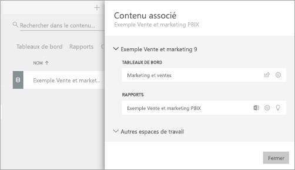

# Afficher un contenu associé dans le service Power BI

[!INCLUDE[consumer-appliesto-ynny](../includes/consumer-appliesto-ynny.md)]

[!INCLUDE [power-bi-service-new-look-include](../includes/power-bi-service-new-look-include.md)]

Le volet **Contenu associé** montre les interconnexions entre les éléments de contenu du service Power BI (tableaux de bord, rapports et jeux de données). Le volet **Contenu associé** est également une plateforme de lancement pour prendre des mesures. À partir de là, vous pouvez effectuer des opérations telles que l’ouverture d’un tableau de bord, l’ouverture d’un rapport, la génération d’insights, l’analyse des données dans Excel et bien plus encore.  

Dans Power BI, les rapports sont générés à partir de jeux de données, leurs visuels sont ensuite épinglés aux tableaux de bord, puis les visuels des tableaux de bord sont reliés aux rapports. Mais comment savoir quels tableaux de bord hébergent les visuels de votre rapport Marketing ? Et comment localiser ces tableaux de bord ? Votre tableau de bord d’approvisionnement utilise-t-il des visuels de plusieurs jeux de données ? Si tel est le cas, quels sont leur noms et comment les ouvrir et les modifier ? Votre jeu de données HR est-il utilisé dans des rapports ou des tableaux de bord ? Ou peut-il être déplacé sans provoquer des liens rompus ? Le volet **Contenu associé** répond à toutes ces questions.  En plus d’afficher le contenu associé, ce volet permet d’agir sur celui-ci et de naviguer aisément entre ses éléments.

> [!NOTE]
> La fonctionnalité Contenu associé ne fonctionne pas pour les jeux de données de streaming.
> 
> 

## Afficher le contenu associé d’un tableau de bord ou rapport
Regardez Will pendant qu’il affiche le contenu associé d’un tableau de bord. Suivez ensuite les instructions détaillées sous la vidéo pour essayer par vous-même en utilisant l’exemple de jeu de données Analyse de l’approvisionnement.

<iframe width="560" height="315" src="https://www.youtube.com/embed/B2vd4MQrz4M#t=3m05s" frameborder="0" allowfullscreen></iframe>

Une fois le tableau de bord ou le rapport ouvert, sélectionnez **Plus d’options** (...) dans la barre de menus, puis choisissez **Afficher les éléments associés** dans la liste déroulante.

Le volet **Contenu associé** s’ouvre. Pour un tableau de bord, il affiche tous les rapports dont des visualisations sont épinglées au tableau de bord ainsi que les jeux de données associés. Pour ce tableau de bord, il existe des visualisations épinglées à partir d’un seul rapport, et ce rapport est basé sur un seul jeu de données. 

À ce stade, vous pouvez agir directement sur le contenu associé.  Par exemple, sélectionnez un nom de rapport ou tableau de bord pour ouvrir celui-ci.  Pour un rapport répertorié, sélectionnez une icône pour [analyser dans Excel](../service-analyze-in-excel.md) ou [obtenir des insights](end-user-insights.md). Pour un jeu de données, vous pouvez voir la date et l’heure de la dernière actualisation, [analyser dans Excel](../service-analyze-in-excel.md) et [obtenir des insights](end-user-insights.md).  

## Afficher le contenu associé d’un jeu de données
Pour pouvoir ouvrir le volet *Contenu associé*, vous devez disposer au minimum de l’autorisation d’**Affichage** sur le jeu de données concerné. Pour illustrer notre propos, nous utilisons l’[exemple Analyse de l’approvisionnement](../sample-procurement.md).

À partir du volet de navigation, recherchez le titre **Espaces de travail** et sélectionnez un espace de travail dans la liste. Si vous disposez d’un contenu dans un espace de travail, il s’affiche dans le canevas à droite. 

Dans un espace de travail, sélectionnez l’onglet **Jeux de données**, puis recherchez l’icône **Afficher les éléments associés**.

Sélectionnez l’icône pour ouvrir le volet **Contenu associé**.

À ce stade, vous pouvez agir directement sur le contenu associé. Par exemple, sélectionnez un nom de tableau de bord ou de rapport à ouvrir.  Pour un tableau de bord quelconque répertorié dans la liste, sélectionnez une icône pour [partager le tableau de bord](../service-share-dashboards.md) ou ouvrir la fenêtre **Paramètres** du tableau de bord. Pour un rapport, sélectionnez une icône pour [analyser dans Excel](../service-analyze-in-excel.md), [renommer](../service-rename.md) ou [obtenir des informations](end-user-insights.md).  

## Limitations et résolution des problèmes
* Si vous ne voyez pas « Afficher les éléments associés », recherchez cette icône au lieu de l’. Sélectionnez l’icône pour ouvrir le volet **Contenu associé**.
* Pour ouvrir le contenu associé d’un rapport, vous devez être en [Mode lecture](end-user-reading-view.md).
* La fonctionnalité Contenu associé ne fonctionne pas pour les jeux de données de streaming.

## Étapes suivantes
* [Prise en main du service Power BI](../service-get-started.md)
* D’autres questions ? [Posez vos questions à la communauté Power BI](https://community.powerbi.com/)

