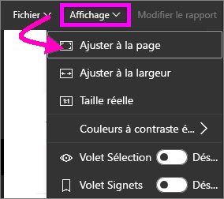
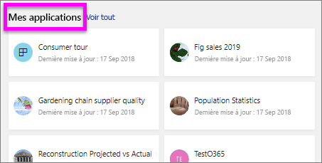

# Afficher un rapport dans le service Power BI pour les *consommateurs*
Un rapport est constitué d’une ou de plusieurs pages d’éléments visuels. Les rapports sont créés par des *concepteurs de rapports* Power BI et [partagés avec des *consommateurs* directement](end-user-shared-with-me.md) ou dans le cadre d’une [application](end-user-apps.md). 

Il existe différentes manières d’ouvrir un rapport et nous vous en montrerons deux : ouvrir à partir de la page d’accueil et ouvrir à partir d’un tableau de bord. 

<!-- add art-->

## Ouvrir un rapport à partir de votre page d’accueil
Nous allons ouvrir un rapport qui a été partagé avec vous directement, puis un rapport qui a été partagé comme partie d’une application.

   

### Ouvrir un rapport qui a été partagé avec vous
Les *concepteurs* Power BI peuvent partager un rapport directement avec vous en cliquant sur un bouton **Partager** sur la barre de menus supérieure. Le contenu qui est partagé de cette façon s’affiche dans le conteneur **Partagé avec moi** sur votre barre de navigation gauche et dans la section **Partagé avec moi** de votre page d’accueil.

1. Ouvrir le service Power BI (app.powerbi.com).

2. Dans la barre de navigation de gauche, sélectionnez **Accueil (version préliminaire)** pour ouvrir votre page d’accueil.  

   
   
3. Faites défiler vers le bas jusqu'à ce que vous voyiez **Partagé avec moi**. Recherchez l’icône de rapport . Dans cette capture d’écran, nous avons deux rapports : *Financial* et *Northwind*. 
   
   

4. Il suffit de sélectionner l’une des *cartes* de rapport pour ouvrir le rapport.

   

5. Notez la présence d’onglets en bas. Chaque onglet représente une *page* du rapport. Ici, la page *Tendance de dépenses informatiques* est ouverte. Sélectionnez un autre onglet pour ouvrir cette page du rapport. 

   

6. Pour l’instant, nous pouvons voir uniquement une partie de la page du rapport. Pour modifier l’affichage (zoom) de la page, sélectionnez **Affichage** > **Ajuster à la page**.

   

   

### Ouvrez un rapport qui fait partie d’une application
Si vous avez reçu des applications de collègues ou d’AppSource, ces applications sont disponibles à partir de votre page d’accueil et du conteneur **Applications** dans votre barre de navigation de gauche. Une [application](end-user-apps.md) est un ensemble de tableaux de bord et de rapports.

1. Revenez à votre page d’accueil en sélectionnant **Accueil (préversion)** dans la barre de navigation de gauche.

7. Faites défiler vers le bas jusqu'à ce que vous voyiez **Mes applications**.

   

8. Sélectionnez une des applications pour l’ouvrir. Selon les options définies par le *concepteur* de l’application, celle-ci ouvrira un tableau de bord, un rapport ou une liste de contenu d’application. Si vous sélectionnez l’application :
    - le rapport s’ouvre, c’est parti.
    - un tableau de bord s’ouvre, consultez [Ouvrir un rapport à partir d’un tableau de bord](#Open-a-report-from-a-dashboard) ci-dessous.
    - la liste de contenu d’application s’ouvre sous **Rapports**, sélectionnez le rapport pour l’ouvrir.

## Ouvrir un rapport à partir d’un tableau de bord
Les rapports peuvent être ouverts à partir d’un tableau de bord. La plupart des vignettes de tableau de bord sont *épinglées* à partir de rapports. Si une vignette est sélectionnée, le rapport utilisé pour la créer s’ouvre. 

1. À partir d’un tableau de bord, sélectionnez une vignette. Dans cet exemple, nous avons sélectionné la vignette d’histogramme « Total Units YTD... ».

    

2.  Le rapport associé s’ouvre. Notez que nous sommes sur la page « YTD Category ». Il s’agit de la page de rapport qui contient l’histogramme que nous avons sélectionné à partir du tableau de bord.

    

> [!NOTE]
> Toutes les vignettes ne conduisent pas à un rapport. Si vous sélectionnez une vignette [créée avec Questions et réponses](end-user-q-and-a.md), l’écran Questions et réponses s’ouvre. Si vous sélectionnez une vignette [créée à l’aide du widget **Ajouter une vignette** du tableau de bord](../service-dashboard-add-widget.md), plusieurs événements différents peuvent se produire.  

##  Autres moyens pour ouvrir un rapport
Une fois que vous serez familiarisé avec la navigation dans le service Power BI, vous pourrez déterminer le flux de travail qui vous convient le mieux. Voici d’autres façons d’accéder aux rapports :
- À partir du volet de navigation gauche, à l’aide de **Favoris** et de **Récent**    
- À l’aide de [Afficher les éléments associés](end-user-related.md)    
- Dans un e-mail quand un utilisateur [partage avec vous](../service-share-reports.md) ou que vous [définissez une alerte](end-user-alerts.md)    
- À partir du [Centre de notifications](end-user-notification-center.md)    
- Et plus encore

## Étapes suivantes
Il y a de [très nombreuses façons d’interagir avec un rapport](end-user-reading-view.md).  Commencez par les explorer en sélectionnant chaque onglet en bas du canevas de rapport.

