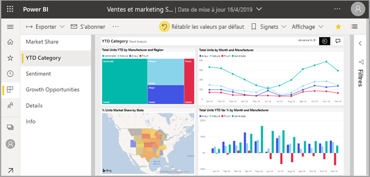
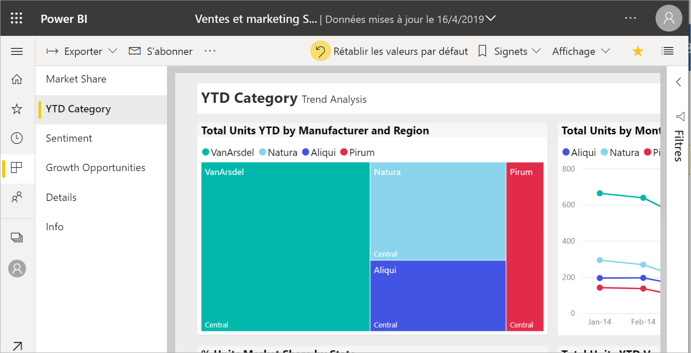
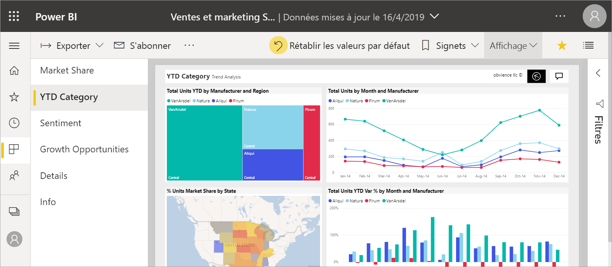
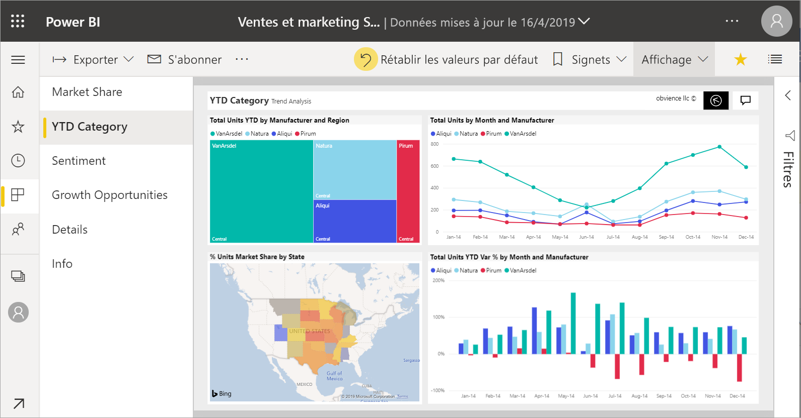
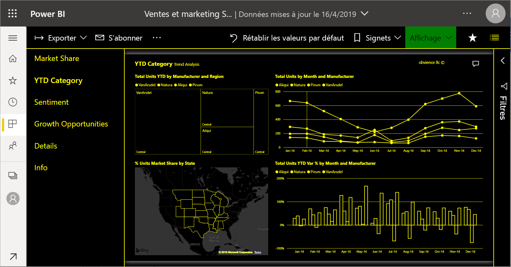
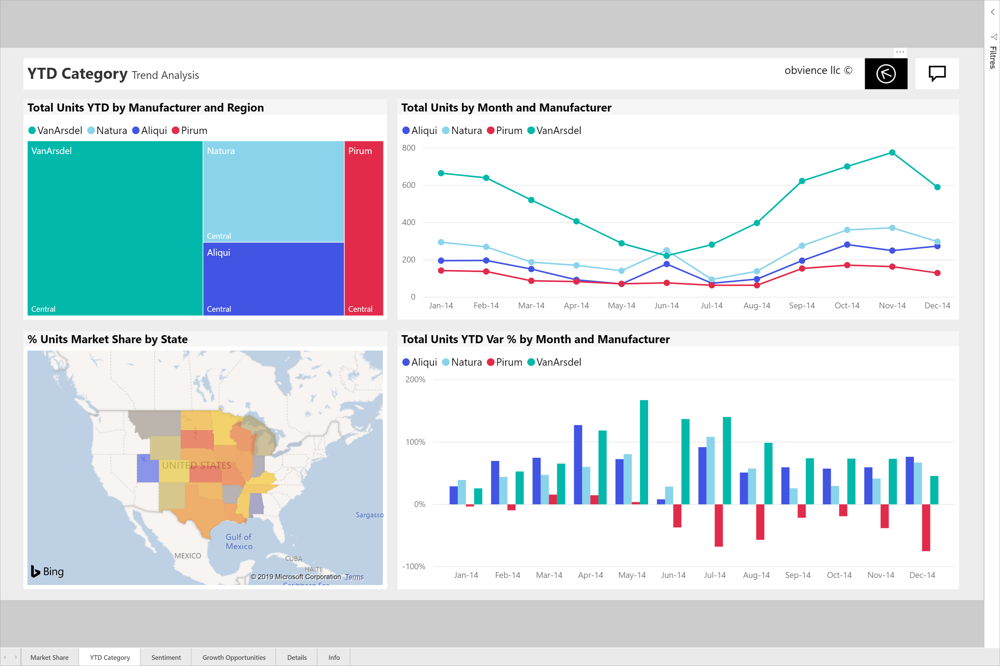

# Changer l’affichage d’une page de rapport

[!INCLUDE [power-bi-service-new-look-include](../includes/power-bi-service-new-look-include.md)]

Vous pouvez afficher les rapports sur différents appareils dont les tailles d’écran et les proportions peuvent varier. Changez le mode d’affichage d’une page de rapport pour répondre à vos besoins.

## Explorer le menu Affichage

Les options du menu **Affichage** vous permettent d’afficher les pages d’un rapport selon la taille et la largeur de votre choix :

- Prenons un exemple : vous visualisez un rapport sur un petit appareil et vous avez du mal à voir les titres et les légendes.  Sélectionnez **Affichage** > **Taille réelle** pour augmenter la taille de la page du rapport. Utilisez les barres de défilement pour vous déplacer dans le rapport.

    

- Une autre option consiste à adapter le rapport à la largeur de votre écran en sélectionnant **Ajuster à la largeur**. Dans la mesure où il s’agit uniquement de la largeur et non de la hauteur, vous devrez peut-être utiliser la barre de défilement verticale.

  

- Si vous ne souhaitez pas de barres de défilement, mais que vous voulez utiliser au mieux la taille de votre écran, sélectionnez **Ajuster à la page**.

   

- Vous pouvez également choisir parmi quatre **Couleurs à contraste élevé** : Contraste élevé n°1, Contraste élevé n°2, Noir à contraste élevé et Blanc à contraste élevé. Vous pouvez utiliser cette fonctionnalité d’accessibilité pour que les personnes malvoyantes puissent mieux voir les rapports. L’exemple ci-dessous est un contraste élevé de 1. 

    

- La dernière option, **Plein écran**, affiche la page de votre rapport sans barres de menus ni en-têtes. Le mode Plein écran peut être un bon choix pour les appareils dotés de petits écrans où les détails sont difficiles à voir.  Il peut également s’avérer utile pour projeter les pages d’un rapport sur de grands écrans (à des fins de visualisation et non d’interaction).  

    

Quand vous quittez le rapport, les **paramètres d’affichage** ne sont pas enregistrés. Les valeurs par défaut sont rétablies. Si vous tenez à enregistrer ces paramètres, utilisez des [signets](end-user-bookmarks.md).

## Étapes suivantes

* [Découvrir le volet Filtres du rapport](end-user-report-filter.md)