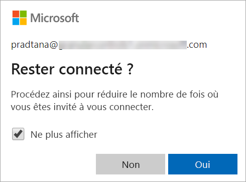

# Se connecter au service Power BI

## Comptes Power BI
Pour pouvoir vous connecter à Power BI, vous avez besoin d’un compte. Deux façons vous permettent d’obtenir un compte Power BI. La première est quand votre entreprise achète des licences Power BI pour ses employés. La seconde est quand des particuliers s’inscrivent à des essais gratuits ou achètent des licences personnelles. Cet article aborde le premier scénario.

## Se connecter pour la première fois

### Étape 1 : Ouvrez un navigateur
Le service Power BI s’exécute dans un navigateur.  Dans la première étape, vous ouvrez donc votre navigateur préféré et tapez **app.powerbi.com**.

### Étape 2 : Entrez votre adresse e-mail
La première fois que vous vous connectez, vous êtes invité à entrer votre adresse e-mail.  Il s’agit de l’adresse e-mail professionnelle ou du compte scolaire que vous avez utilisée pour vous inscrire à Power BI.  

Recherchez dans votre boîte de réception l’e-mail de votre administrateur Power BI. La plupart des administrateurs vous envoient un e-mail de bienvenue qui contient votre mot de passe temporaire. Utilisez ce compte e-mail pour vous connecter. 

 
### Étape 3 : Créez un nouveau mot de passe
Si votre administrateur Power BI vous a envoyé un mot de passe temporaire, entrez-le dans le champ **Mot de passe actuel**. Si vous n’avez pas reçu de mot de passe par e-mail, contactez votre administrateur Power BI.

Si vous souhaitez que Power BI mémorise vos informations d’identification, sélectionnez **Oui**. 

### Étape 4 : Passez en revue votre page d’accueil
Lors de votre première visite, Power BI ouvre votre **page d’accueil**. Si la **Page d’accueil** ne s’ouvre pas, sélectionnez-la dans le volet de navigation. 

Dans la page d’accueil, vous voyez tout le contenu que vous êtes autorisé à utiliser. Au début, votre page peut ne pas avoir beaucoup de contenu, mais ne vous inquiétez pas, ce ne sera plus le cas dès que vous commencerez à utiliser Power BI avec vos collègues. 

Si vous ne voulez pas que Power BI ouvre votre page d’accueil, vous pouvez [définir un tableau de bord ou un rapport **Par défaut**](end-user-featured.md) à ouvrir à la place. 

## Interagir avec le contenu de manière sécurisée
Parce que vous êtes ***consommateur***, d’autres utilisateurs partagent du contenu avec vous et vous interagissez avec ce contenu pour explorer les données et prendre des décisions.  Vous pouvez filtrer, découper, exporter et redimensionner du contenu, ou bien vous abonner à du contenu sans impacter le jeu de données sous-jacent ni le contenu d’origine partagé (tableaux de bord et rapports). Power BI est un espace sécurisé que vous pouvez explorer et tester. Cela ne veut pas dire que vous ne pouvez pas enregistrer vos changements. Mais ces changements affectent uniquement votre **vue** du contenu. Pour revenir à la vue d’origine par défaut, il vous suffit de cliquer sur un bouton.

## Se déconnecter du service Power BI
Quand vous fermez Power BI ou que vous vous déconnectez, vos changements sont enregistrés et vous pouvez reprendre plus tard là où vous en étiez.

Pour fermer Power BI, fermez l’onglet du navigateur dans lequel vous travaillez. 

 

Si vous partagez un ordinateur, nous vous recommandons de vous déconnecter chaque fois que vous fermez Power BI.  Pour vous déconnecter, en haut à droite, sélectionnez votre image de profil et choisissez **Se déconnecter**. Sinon, quand vous avez terminé, fermez l’onglet du navigateur.

 

## Résolution des problèmes et considérations
- Si vous êtes inscrit à Power BI en tant que particulier, connectez-vous avec l’adresse e-mail que vous avez utilisée pour vous inscrire.

- Certaines personnes utilisent Power BI avec plusieurs comptes. Si c’est le cas, lorsque vous vous connectez, vous êtes invité à sélectionner un compte dans une liste. 

## Étapes suivantes
[Voir une application Power BI](end-user-app-view.md)
