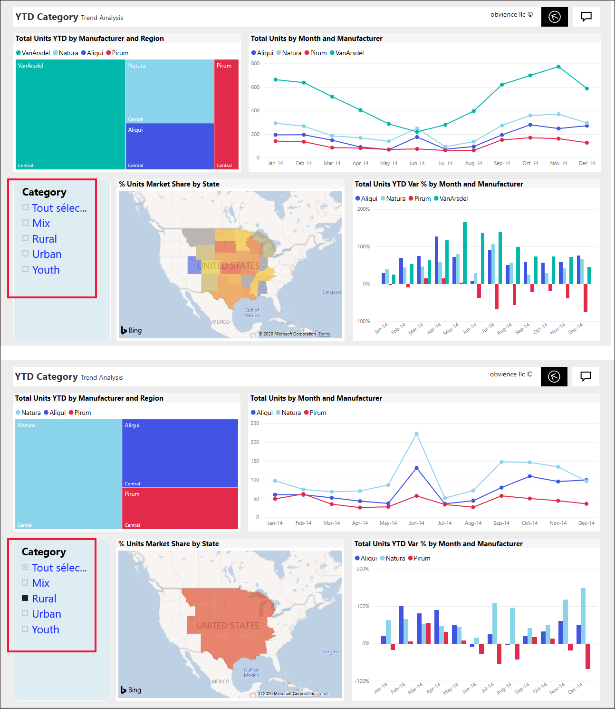
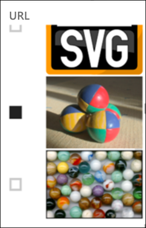
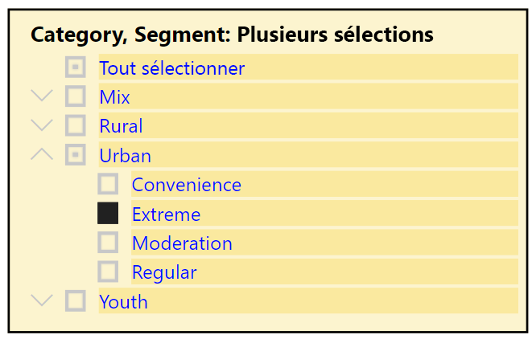
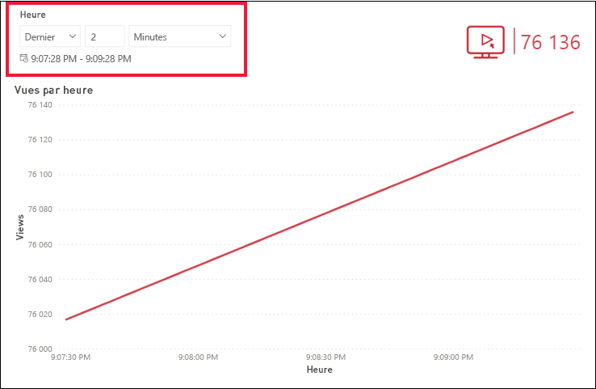

# Segments dans le service Power BI

[!INCLUDE[consumer-appliesto-ynnn](../includes/consumer-appliesto-yynn.md)]

Un segment est un type de visuel qui filtre les autres visuels sur une page de rapport. Vous découvrirez de nombreux types de segments lors de l’utilisation des rapports Power BI. L’image ci-dessus montre le même segment, mais avec des sélections différentes. Notez que chaque sélection filtre les autres visuels de la page.  

## Comment utiliser des segments ?
Lors de la création de rapports, les *concepteurs* ajoutent des segments pour aider à raconter une histoire et vous fournir des outils afin d’explorer vos données.

### Sélecteur de plages numériques
 Le segment de plages numériques, ci-dessus, vous permet d’explorer le total des ventes par géographie, unités en stock et date de commande. Utilisez les poignées pour sélectionner une plage. 

### Segment de case à cocher vertical de base

Dans un segment de case à cocher de base, cochez une ou plusieurs cases pour voir l’impact sur les autres visuels de la page. Pour en cocher plusieurs, utilisez Ctrl-Sélection. Parfois, le *concepteur* de rapports configure le segment pour vous autoriser à sélectionner une seule valeur à la fois. 

### Segments d’image et de forme
Quand les options du segment sont des images ou des formes, vous devez procéder comme avec des cases à cocher. Vous pouvez choisir une ou plusieurs images ou formes pour appliquer le segment aux autres visuels de la page. 

    

    

### Segment de hiérarchie

Dans un segment avec une hiérarchie, utilisez les chevrons pour développer et réduire la hiérarchie. L’en-tête est mis à jour pour afficher vos sélections.

### Segment de temps relatif
Avec les nouveaux scénarios d’actualisation rapide, la capacité à filtrer sur une plus petite fenêtre de temps peut être très utile.
À l’aide du segment de temps relatif, vous pouvez appliquer des filtres basés sur le temps à toutes les données de date ou d’heure de votre rapport. Vous pouvez par exemple utiliser le segment de temps relatif pour montrer uniquement le nombre de vues de vidéos au cours des deux derniers jours, heures ou même minutes. 

## Désactiver un segment
Pour désactiver un segment, sélectionnez l’icône de gomme.

## Étapes suivantes
Pour plus d’informations, consultez les articles suivants :

[Types de visualisation dans Power BI](end-user-visualizations.md)

