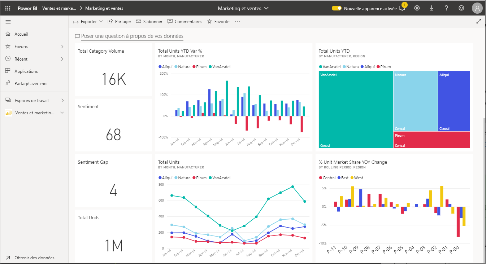

# Interagir avec les visuels dans les rapports, les tableaux de bord et les applications

Dans sa version la plus basique, une ***visualisation*** (ou *élément visuel*), est un type de graphique créé par les *concepteurs* Power BI à l’aide des données dans les rapports et les jeux de données. 

Vous pouvez utiliser les visuels disponibles dans les tableaux de bord et les rapports, ou en créer instantanément à l’aide de la fonctionnalité Questions et réponses de Power BI. Quand un concepteur crée un visuel dans un rapport, il peut *épingler* ce nouveau visuel à un tableau de bord. [Un visuel sur un tableau de bord est appelé *vignette*](end-user-tiles.md). Ce tableau de bord comporte huit vignettes. 

> [!TIP]
> Nous vous recommandons de lire tout d’abord la rubrique de présentation [Concepts de base de Power BI pour les *consommateurs*](end-user-basic-concepts.md) avant de lire ce contenu plus détaillé.

## Que puis-je faire avec les visuels ?

Les visuels sont créés par des *concepteurs* de rapport et de tableau de bord, et partagés avec les *consommateurs*. En tant que consommateur, vous disposez de nombreuses options pour interagir avec des visuels pour découvrir des insights et prendre des décisions métier pilotées par les données. La majorité de ces options sont listées dans le tableau ci-dessous, avec des liens vers des instructions pas à pas.

Pour la plupart de ces options, votre administrateur ou le *concepteur* peut désactiver les fonctionnalités associées afin que vous ne puissiez pas les voir ni les utiliser. Par ailleurs, certaines de ces fonctionnalités sont uniquement utilisables dans des visuels particuliers.  Si vous avez des questions, contactez votre administrateur ou bien le propriétaire du rapport ou du tableau de bord. Pour savoir qui est le propriétaire, ouvrez la liste déroulante du rapport ou du tableau de bord. 

> [!IMPORTANT]
> Mais tout d’abord, parlons de Q&A. Q&A est l’outil de recherche en langage naturel de Power BI. Vous tapez une question à l’aide du langage naturel et Q&A répond à la question sous la forme d’un visuel. Q&A est un moyen pour les consommateurs de créer leurs propres visuels. Toutefois, les visuels que vous créez avec Q&A ne peuvent pas être enregistrés. Mais Q&A constitue une excellente option si vous voulez apprendre quelque chose de spécifique sur les données et que le concepteur n’a pas inclus cet élément dans un rapport ou un tableau de bord. Pour en savoir plus sur Q&A, consultez [Q&A pour les consommateurs](end-user-q-and-a.md).

|Tâche  |Sur un tableau de bord  |Dans un rapport  | Dans Q&A
|---------|---------|---------|--------|
|[Ajouter des commentaires à un visuel pour vous-même ou démarrer une conversation sur le visuel avec des collègues](end-user-comment.md).     |  oui       |   oui      |  non  |
|[Ouvrir et explorer le rapport où le visuel a été créé](end-user-tiles.md).     |    oui     |   N/A      |  non |
|[Afficher la liste des filtres et des segments qui impactent le visuel](end-user-report-filter.md).     |    non     |   oui      |  oui |
|[Ouvrir et explorer un visuel dans Questions et réponses (si le *concepteur* a utilisé Questions et réponses pour créer le visuel)](end-user-q-and-a.md).     |   oui      |   N/A      |  N/A  |
|[Créer un visuel dans Questions et réponses (pour l’exploration, vous ne pourrez pas l’enregistrer)](end-user-q-and-a.md).     |   oui      |   si le concepteur a ajouté Questions et réponses au rapport      |  oui  |
|[Demander à Power BI de rechercher pour vous des faits intéressants ou des tendances](end-user-insights.md) dans les données du visuel.  Ces visuels générés automatiquement sont appelés *insights*.     |    oui     |  pour le rapport entier, pas par visuel       | non   |
|[Afficher un seule visuel à la fois avec le mode *Focus*](end-user-focus.md).     | oui        |   oui      | N/A  |
|[Rechercher la dernière actualisation du visuel](end-user-fresh.md).     |  oui       |    oui     | N/A  |
|[Afficher un seul visuel à la fois, sans bordures ni barres de navigation, à l’aide du mode *plein écran* ou *focus*](end-user-focus.md).     |   oui      |  oui       | par défaut  |
|[Imprimer](end-user-print.md).     |  oui       |   oui      | non  |
|[Explorer le visuel en ajoutant et en modifiant les filtres du visuel.](end-user-report-filter.md)     |    non     |   oui      | non  |
|Pointer sur un visuel pour afficher des info-bulles et des détails supplémentaires.     |    oui     |   oui      | oui  |
|[Filtrer en croisé et mettre en surbrillance croisée d’autres visuels sur la page.](end-user-interactions.md)    |   non      |   oui      | N/A  |
|[Afficher les données utilisées pour créer le visuel](end-user-show-data.md).     |  non       |   oui      | non  |
| [Modifier l’ordre de tri du visuel](end-user-change-sort.md). | non  | oui  | peut modifier le tri en reformulant la question  |
| Ajoutez un projecteur à un visuel. | non  | oui  |  non |
| [Exporter vers Excel.](end-user-export.md) | oui | oui | non|
| [Créer une alerte](end-user-alerts.md) pour vous avertir lorsqu’une valeur dépasse un seuil que vous avez défini.  | oui  | Non  | non |
| [Appliquer un filtrage croisé et une sélection croisée aux autres visuels de la page](end-user-report-filter.md).  | non      | oui  | non  |
| [Explorer un visuel qui a une hiérarchie](end-user-drill.md).  | non  | oui   | non |

## Étapes suivantes
Retour aux [Concepts de base pour les consommateurs](end-user-basic-concepts.md)    
[Sélectionner un visuel pour ouvrir un rapport](end-user-report-open.md)    
[Types de visuels disponibles dans Power BI](end-user-visual-type.md)