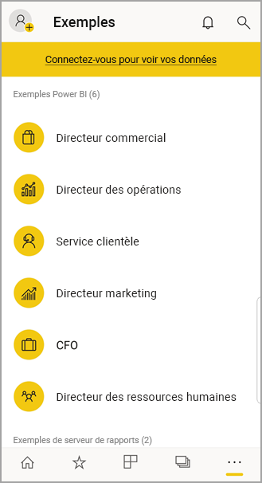
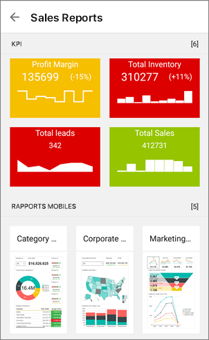
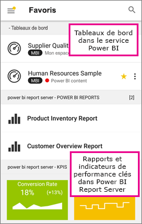

# Bien démarrer avec l’application mobile Power BI sur appareils Android
L’application Android pour Microsoft Power BI permet de vivre l’expérience mobile de Power BI, de Power BI Report Server et de Reporting Services. Consultez les tableaux de bord de votre organisation et interagissez avec eux, localement et dans le cloud, en tout lieu, grâce à un accès mobile en direct via une interface tactile. Explorez les données des tableaux de bord et partagez-les avec vos collègues par e-mail ou SMS. 

Vous créez des rapports Power BI dans Power BI Desktop, puis les publiez :

* [Publiez-les sur le service Power BI](../../fundamentals/power-bi-overview.md) puis créez des tableaux de bord.
* [Publiez-les localement sur Power BI Report Server](../../report-server/quickstart-create-powerbi-report.md).

Ensuite, dans l’application Power BI pour Android, vous pouvez manipuler vos tableaux de bord et rapports, tant en local que dans le cloud.

Découvrez les [nouveautés des applications mobiles Power BI](../../mobile-whats-new-in-the-mobile-apps.md).

## Conditions préalables

### Obtenir l’application

[Téléchargez l’application Power BI pour Android](https://go.microsoft.com/fwlink/?LinkID=544867) sur Google Play.
  
Power BI peut s’exécuter sur différents appareils Android équipés du système d’exploitation Android 5.0 ou d’une version ultérieure. Pour le vérifier sur votre appareil, accédez à **Paramètres** > **À propos de l’appareil** > **Version d’Android**. 

**Commencer à l’ouverture de l’application**    
Sans même vous inscrire ni vous connecter, vous pouvez parcourir les pages de connexion une fois l’application ouverte pour avoir une vue d’ensemble rapide de ce que vous pouvez faire avec l’application Power BI sur votre appareil Android. Appuyez sur **Ignorer** pour afficher et explorer les exemples, et pour acquérir une expérience pratique de l’application. Vous pouvez [revenir aux exemples](mobile-android-app-get-started.md#try-the-power-bi-and-reporting-services-samples) à tout moment à partir de la page d’accueil des tableaux de bord.

Découvrez les [nouveautés des applications mobiles Power BI](../../mobile-whats-new-in-the-mobile-apps.md).

## S’inscrire au service Power BI sur le web
Si vous n’avez pas encore créé de compte, accédez au [service Power BI (https://powerbi.com/)](https://powerbi.com/) pour vous inscrire. Ce compte vous permettra de créer et de stocker des tableaux de bord et des rapports, et de regrouper vos données. Ensuite, connectez-vous à Power BI sur votre appareil Android pour consulter vos tableaux de bord où que vous soyez.

1. Dans le service Power BI, appuyez sur [S’inscrire](https://go.microsoft.com/fwlink/?LinkID=513879) pour créer un compte Power BI.
2. Commencez à [créer vos propres tableaux de bord et rapports](../../service-get-started.md).

## Bien démarrer avec l’application Power BI sur l’appareil
1. Sur l’écran d’accueil de votre appareil Android, ouvrez l’application Power BI pour Android.
   
   
2. Pour afficher vos tableaux de bord et vos rapports Power BI, appuyez sur **Power BI**.  
   
   Si vous recevez un message indiquant que Power BI ne peut pas vous connecter, consultez [Authentification impossible car votre certificat SSL d'entreprise n'est pas approuvé par cet appareil](mobile-android-app-error-corporate-ssl-account-is-untrusted.md) pour plus d’informations sur la façon de résoudre le problème.

   Pour afficher vos rapports et indicateurs de performance clés Power BI Report Server et Reporting Services, appuyez sur **Report Server**.
   
   

## Essayer les exemples Power BI et Reporting Services
Même sans inscription, vous pouvez vous servir des exemples Power BI et Reporting Services. Après avoir téléchargé l’application, vous pouvez afficher les exemples ou vous lancer. Revenez aux exemples quand vous le souhaitez à partir de la page d’accueil des tableaux de bord.

### Exemples de Power BI
Vous pouvez afficher et utiliser les exemples de tableau de bord Power BI, mais vous ne pouvez pas effectuer certaines opérations avec eux. Vous ne pouvez pas ouvrir les rapports associés aux tableaux de bord, partager les exemples ou les définir comme favoris.

1. Appuyez sur le bouton de navigation globale  en haut à gauche.
2. Appuyez sur **Paramètres** > **Découvrez nos exemples**, puis choisissez un rôle et explorez l’exemple de tableau de bord associé.  
   
   

### Exemples de rapports mobiles Reporting Services
1. Appuyez sur le bouton de navigation globale  en haut à gauche.
2. Appuyez sur **Exemples Reporting Services**, puis ouvrez le dossier Retail Reports ou Sales Reports pour explorer les indicateurs de performance clés et les rapports mobiles.
   
   

## Rechercher un rapport ou tableau de bord
* Appuyez sur la loupe dans l’angle supérieur droit , puis tapez le terme à rechercher.
  
    
  
    Par défaut, la recherche cible tous les tableaux de bord et rapports, mais vous pouvez rechercher l’un ou l’autre.

## Trouver votre contenu dans les applications mobiles Power BI
Dans les applications mobiles Power BI, vos tableaux de bord et rapports sont stockés dans des emplacements différents en fonction de leur provenance. En savoir plus sur la [recherche de votre contenu dans les applications mobiles](../../mobile-apps-quickstart-view-dashboard-report.md). Par ailleurs, vous pouvez toujours effectuer une recherche dans tout votre contenu dans les applications mobiles Power BI. 

## Afficher vos tableaux de bord, indicateurs de performances clés et rapports favoris
Sur la page Favoris dans les applications mobiles, vous pouvez voir vos tableaux de bord Power BI favoris, ainsi que les indicateurs de performance clés et rapports Power BI Report Server et Reporting Services. Quand vous mettez un tableau de bord en *favoris* dans l’application mobile Power BI, vous pouvez y accéder à partir de tous les appareils, y compris dans le service Power BI dans votre navigateur. 

* Appuyez sur **Favoris**.
  
   
  
   Vos favoris Power BI et ceux des portails web Power BI Report Server et Reporting Services figurent tous sur cette page.
  
   

Accédez à des informations supplémentaires sur les [favoris dans les applications mobiles Power BI](mobile-apps-favorites.md).

## Prise en charge des applications mobiles Power BI pour les entreprises
Les entreprises peuvent utiliser Microsoft Intune pour gérer les appareils et applications, dont les applications mobiles Power BI pour Android et iOS.

Microsoft Intune permet aux organisations de contrôler divers éléments, comme la nécessité de disposer d’un code confidentiel d’accès, la façon dont l’application traite les données et même le chiffrement des données de l’application quand cette dernière n’est pas utilisée.

> [!NOTE]
> Si vous utilisez l’application mobile Power BI sur un appareil Android et que votre organisation a configuré Microsoft Intune MAM, l’actualisation des données en arrière-plan est désactivée. La prochaine fois que vous ouvrez l’application, Power BI actualise les données à partir du service Power BI sur le web.
> 
> 

En savoir plus sur la [configuration des applications mobiles Power BI pour Android avec Microsoft Intune](../../service-admin-mobile-intune.md). 

## Étapes suivantes
Découvrez ce que vous pouvez faire d’autre dans l’application Power BI pour appareils Android avec les tableaux de bord et les rapports de Power BI, ainsi que les rapports et indicateurs de performance clés du portail web Power BI Report Server ou Reporting Services.

### Tableaux de bord et rapports Power BI
* Affichez [vos applications](../../service-create-distribute-apps.md).
* Affichez vos [tableaux de bord](../../mobile-apps-view-dashboard.md).
* Explorez les [vignettes de vos tableaux de bord](../../mobile-tiles-in-the-mobile-apps.md).
* Ouvrez des [rapports Power BI](../../mobile-reports-in-the-mobile-apps.md).
* Affichez [vos applications](../../service-create-distribute-apps.md).
* [Annotez et partagez des vignettes](mobile-annotate-and-share-a-tile-from-the-mobile-apps.md).
* Partagez des [tableaux de bord](../../mobile-share-dashboard-from-the-mobile-apps.md).
* [Numérisez un code QR Power BI](../../mobile-apps-qr-code.md) avec votre téléphone Android pour ouvrir une vignette de tableau de bord ou un rapport associé. 
* Consultez les [notifications concernant les mises à jour de votre compte Power BI](../../mobile-apps-notification-center.md), telles que les tableaux de bord que les collègues partagent avec vous.

### Rapports et indicateurs de performance clés sur les portails web Power BI Report Server et Reporting Services
* [Consultez les rapports et indicateurs de performance clés sur le portail web](mobile-app-ssrs-kpis-mobile-on-premises-reports.md) dans l’application mobile Power BI pour appareils Android.
* Créez des [indicateurs de performance clés sur le portail web](https://docs.microsoft.com/sql/reporting-services/working-with-kpis-in-reporting-services).
* Créez des [rapports dans Power BI Desktop et publiez-les sur le portail web Power BI Report Server](../../report-server/quickstart-create-powerbi-report.md).

### Voir aussi
* [Téléchargez l’application Android](https://go.microsoft.com/fwlink/?LinkID=544867) à partir du magasin d’applications Android.
* [Qu’est-ce que Power BI ?](../../fundamentals/power-bi-overview.md)
* Vous avez des questions ? [Essayez d’interroger la communauté Power BI](https://community.powerbi.com/)

