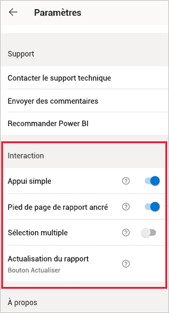
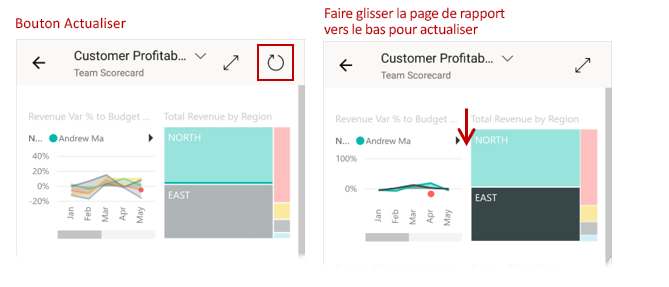

# Configurer les paramètres d’interaction de rapport

## Vue d’ensemble

L’application mobile Power BI a un certain nombre de paramètres « d’interaction » configurables qui vous permettent de contrôler la façon dont vous interagissez avec vos données et de définir la façon dont certains éléments de l’application mobile Power BI se comportent. Il existe actuellement des paramètres pour
* [Interaction de type appui simple ou double sur les visuels de rapport](#single-tap)
* [Pied de page de rapport ancré ou dynamique](#docked-report-footer-android-phones) (Android)
* [Actualisation de rapport lancée via un bouton ou via Balayer pour actualiser](#report-refresh-android-phones) (Android)

Pour accéder aux paramètres d’interaction, appuyez sur l’image de votre profil pour ouvrir le [panneau latéral](./mobile-apps-home-page.md#header), choisissez **Paramètres** et recherchez la section **Interaction**.

>[!NOTE]
>Les paramètres d’interaction pour le bouton d’actualisation et pour l’ancrage du pied de page du rapport n’ont actuellement pas d’effet sur les rapports Report Server. Ceci changera avec la version de Report Server de janvier 2020.

## Paramètres d’interaction

### Appui simple
Quand vous téléchargez l’application mobile Power BI, elle est définie pour une interaction avec appui simple. Cela signifie que quand vous appuyez dans un visuel pour effectuer une action, par exemple la sélection d’un élément d’un sélecteur, la sélection croisée, un clic sur un lien ou un bouton, etc., l’appui sélectionne le visuel et effectue aussi l’action souhaitée.

Si vous préférez, vous pouvez désactiver l’interaction avec appui simple. L’interaction se fait alors via un appui double. Avec l’interaction d’appui double, vous appuyez d’abord sur un visuel pour le sélectionner, puis vous rappuyez dans le visuel pour effectuer l’action souhaitée.

### Pied de page de rapport ancré (téléphones Android)

Le paramètre de pied de page de rapport ancré détermine si le pied de page du rapport reste ancré (c’est-à-dire fixe et toujours visible) au bas du rapport, ou s’il est masqué et réapparaît en fonction de vos actions dans le rapport, comme le défilement.

Sur les téléphones Android, le paramètre de pied de page de rapport ancré est **activé** par défaut, ce qui signifie que le pied de page du rapport est ancré et toujours visible au bas du rapport. Passez le paramètre sur **Désactivé** si vous préférez un pied de page de rapport dynamique qui apparaît et disparaît, en fonction de vos actions sur le rapport.

### Actualisation des rapports (téléphones Android)

Le paramètre d’actualisation des rapports définit la façon dont vous lancez les actualisations des rapports. Vous pouvez choisir d’avoir un bouton d’actualisation sur les en-têtes de tous les rapports ou bien d’utiliser l’action Balayer pour actualiser (en effectuant un léger balayage de haut en bas) sur la page du rapport pour l’actualiser. La figure ci-dessous illustre les deux alternatives. 

Sur les téléphones Android, un bouton d’actualisation est ajouté par défaut.

Pour changer le paramètre d’actualisation des rapports, accédez à l’élément d’actualisation des rapports dans les paramètres d’interaction. La valeur actuelle du paramètre est affichée. Appuyez sur la valeur pour ouvrir une fenêtre contextuelle où vous pouvez choisir une nouvelle valeur.

## Configuration distante

Les interactions peuvent également être configurées à distance par un administrateur via un outil MDM avec un fichier de configuration d’application. De cette façon, il est possible de standardiser l’expérience d’interaction des rapports au sein de l’organisation ou pour des groupes spécifiques d’utilisateurs de l’organisation. Pour plus d’informations, consultez [Configurer l’interaction avec la gestion des appareils mobiles](./mobile-app-configuration.md).

## Étapes suivantes
* [Interaction avec les rapports](./mobile-reports-in-the-mobile-apps.md#interact-with-reports)
* [Configurer l’interaction avec la gestion des appareils mobiles](./mobile-app-configuration.md)
