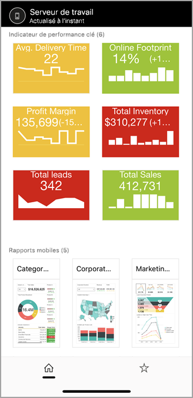
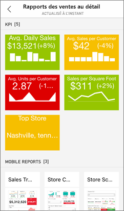
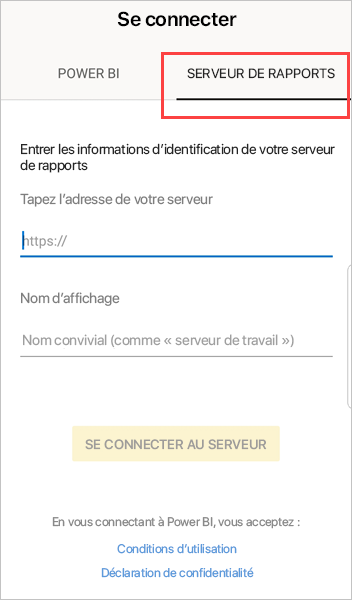
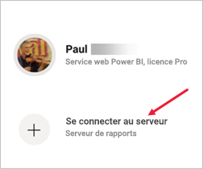
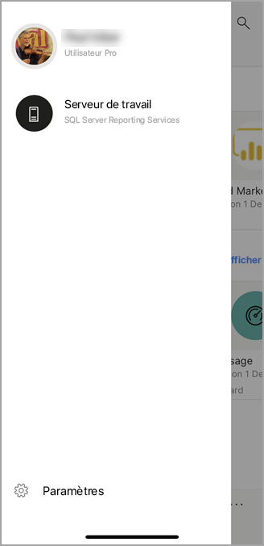
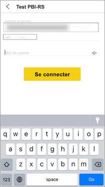
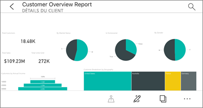
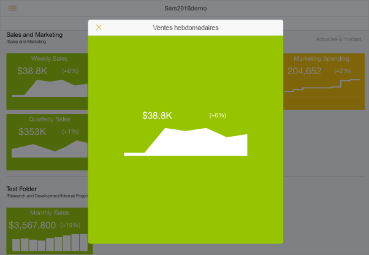

# Afficher des indicateurs de performance clés et des rapports Report Server locaux dans des applications mobiles Power BI

Les applications mobiles Power BI vous offrent un accès mobile en direct à vos informations métier locales via une interface tactile dans Power BI Report Server et SQL Server 2016 Reporting Services (SSRS).

S’applique à :

|  |  |  |  |
|:--- |:--- |:--- |:--- |
| iPhone |iPad |Téléphones Android |Tablettes Android |

## Avant tout
**Les applications mobiles sont l’emplacement où vous affichez du contenu Power BI, pas celui où vous le créez.**

* Vous et d’autres créateurs de rapports dans votre organisation [créez des rapports Power BI avec Power BI Desktop, puis les publiez sur le portail web de Power BI Report Server](../../report-server/quickstart-create-powerbi-report.md). 
* Vous pouvez également créer des [indicateurs de performance clés dans le portail web](https://docs.microsoft.com/sql/reporting-services/working-with-kpis-in-reporting-services), les organiser en dossiers et marquer vos favoris afin de pouvoir les retrouver aisément. 
* [Créez des rapports mobiles Reporting Services](https://docs.microsoft.com/sql/reporting-services/mobile-reports/create-mobile-reports-with-sql-server-mobile-report-publisher) avec l’éditeur de rapports mobiles SQL Server 2016 Enterprise Edition et publiez-les sur le [portail web Reporting Services](https://docs.microsoft.com/sql/reporting-services/web-portal-ssrs-native-mode).  

Ensuite, dans les applications mobiles Power BI, connectez-vous à jusqu’à jusqu’à cinq serveurs de rapports pour afficher les rapports et indicateurs de performance clés Power BI organisés dans des dossiers ou regroupés en favoris. 

## Explorer des exemples dans les applications mobiles sans connexion au serveur
Même si vous n’avez pas accès à un portail web Reporting Services, vous pouvez toujours explorer les fonctionnalités des rapports mobiles et des indicateurs de performances clés de Reporting Services. 

1. Appuyez sur le bouton de navigation globale  dans l’angle supérieur gauche, puis cliquez sur l’icône d’engrenage dans l’angle supérieur droit .
2. Appuyez sur **Exemples Reporting Services**, puis naviguez pour interagir avec les exemples d’indicateurs de performance clés et de rapports mobiles.
   
   

## Se connecter à un serveur de rapports local
Vous pouvez afficher des rapports Power BI locaux, des rapports mobiles Reporting Services et des indicateurs de performance clés dans les applications mobiles Power BI. 

1. Sur votre appareil mobile, ouvrez l’application Power BI.
2. Si vous n’êtes pas encore connecté à Power BI, appuyez sur **Report Server**.
   
   
   
   Si vous êtes déjà connecté à l’application Power BI, appuyez sur le bouton de navigation globale , puis sur l’icône d’engrenage  dans l’angle supérieur droit.
3. Appuyez sur **Se connecter au serveur**.
   
    

     L’application mobile doit accéder au serveur d’une certaine façon. Plusieurs solutions s’offrent à vous :

    - Rester sur le même réseau/utiliser un VPN est le moyen le plus simple.
    - Il est possible d’utiliser un proxy d’application web pour se connecter depuis l’extérieur de l’organisation. Pour plus d’informations, consultez [Utilisation d’OAuth pour la connexion à Reporting Services](mobile-oauth-ssrs.md). 
    - Ouvrez une connexion (port) dans le pare-feu.

1. Renseignez l’adresse du serveur, ainsi que votre nom d’utilisateur et votre mot de passe. Utilisez ce format pour l’adresse du serveur :
   
     `http://<servername>/reports`
   
     OR
   
     `https://<servername>/reports`
   
   Ajoutez **http** ou **https** devant la chaîne de connexion.
   
    
5. (Facultatif) Sous **Options avancées**, vous pouvez affecter un nom convivial au serveur, si vous le souhaitez.
6. À présent, le serveur est visible dans la barre de navigation à gauche. Dans cet exemple, il est nommé « Power BI Report Server ».
   
   

## Se connecter à un serveur de rapports local dans iOS

Si vous affichez Power BI dans l’application mobile iOS, votre administrateur informatique peut avoir défini une stratégie de configuration d’application. Dans ce cas, votre expérience de connexion au serveur de rapports est simplifiée et vous ne devez pas fournir beaucoup d’informations quand vous vous connectez à un serveur de rapports. 

1. Vous voyez un message indiquant que leur application mobile est configurée avec un serveur de rapports. Appuyez sur **Se connecter**.

    

2.  Dans la page **Se connecter au serveur**, les détails du serveur de rapports sont déjà renseignés. Appuyez sur **Se connecter**.

    

3. Tapez un mot de passe pour vous authentifier, puis appuyez sur **Se connecter**. 

    

Vous pouvez désormais afficher et interagir avec les indicateurs de performance clés et les rapports Power BI stockés sur le serveur de rapports.

## Afficher les rapports Power BI et les indicateurs de performance clés dans l’application Power BI
Les rapports Power BI, les rapports mobiles Reporting Services et les indicateurs de performance clés sont affichés dans les mêmes dossiers que sur le portail web Reporting Services. 

* Appuyer sur un rapport Power BI . Celui-ci s’ouvre en mode paysage et vous pouvez interagir avec lui dans l’application Power BI.

    > [!NOTE]
  > Monter et descendre dans une hiérarchie n’est actuellement pas autorisé dans les rapports Power BI sur un serveur Power BI Report Server.
  
    
* Dans Power BI Desktop, les propriétaires de rapports peuvent [optimiser un rapport](../../desktop-create-phone-report.md) pour les applications mobiles Power BI. Sur votre téléphone mobile, les rapports optimisés ont une icône  et une disposition spéciales.
  
    
* Appuyez sur un indicateur de performance clé pour l’afficher en mode Focus.
  
    

## Afficher vos rapports et indicateurs de performance clés favoris
Vous pouvez marquer des indicateurs de performance clés et des rapports en tant que favoris sur le portail web, et les afficher ainsi que vos tableaux de bord Power BI favoris dans un seul dossier sur votre appareil.

* Appuyez sur **Favoris**.
  
   
  
   Vos indicateurs de performance clés et rapports favoris du portail web figurent tous sur cette page, ainsi que les tableaux de bord Power BI du service Power BI :
  
   

## Supprimez une connexion à un serveur de rapports
1. Appuyez sur **Paramètres**en bas de la barre de navigation de gauche.
2. Appuyez sur le nom du serveur duquel vous souhaitez vous déconnecter.
3. Appuyez sur **Supprimer le serveur**.

## Étapes suivantes
* [Qu’est-ce que Power BI ?](../../fundamentals/power-bi-overview.md)  
* Vous avez des questions ? [Essayez d’interroger la communauté Power BI](http://community.powerbi.com/)

