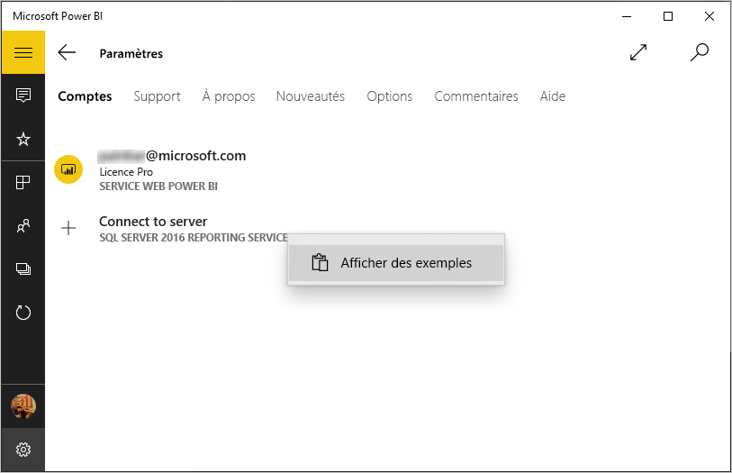
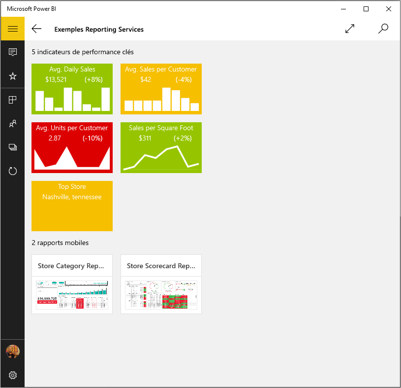
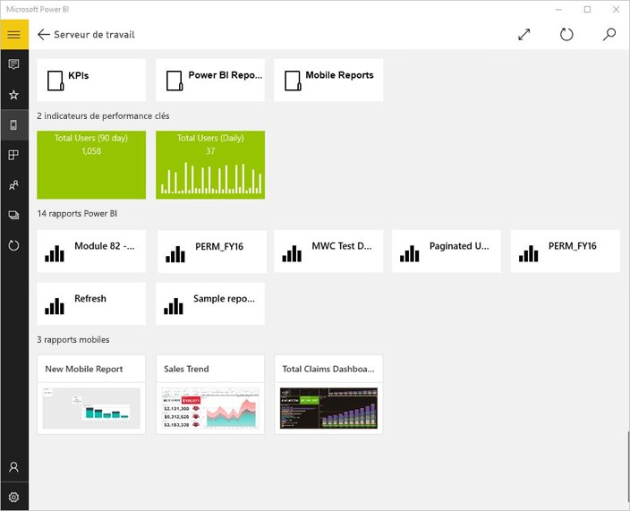
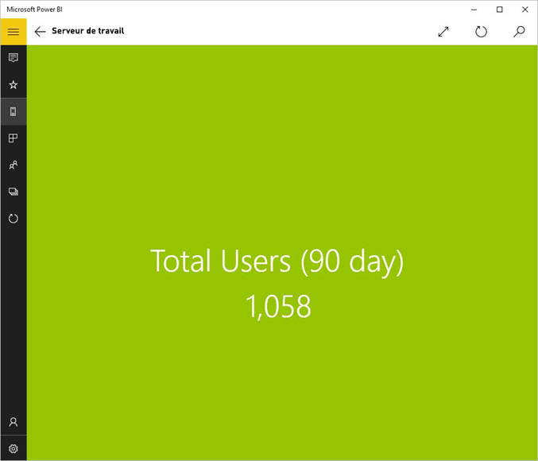

# Afficher des rapports et des indicateurs de performance clés locaux dans l’application Power BI Windows
L’application Power BI pour Windows 10 offre un accès mobile direct aux informations importantes locales de votre entreprise, via une interface tactile dans SQL Server 2016 Reporting Services. 

## Avant tout
[Créez des rapports mobiles Reporting Services](https://msdn.microsoft.com/library/mt652547.aspx) avec l’éditeur de rapports mobiles SQL Server 2016 Enterprise Edition et publiez-les sur le [portail web Reporting Services](https://msdn.microsoft.com/library/mt637133.aspx). Créez des indicateurs de performance clés directement dans le portail web. Organisez-les dans des dossiers et marquez vos favoris, afin de les trouver facilement. 

Ensuite, dans l’application Power BI pour Windows 10, vous pouvez afficher les indicateurs de performance clés et les rapports Power BI, organisés dans des dossiers ou regroupés en favoris. 

> [!NOTE]
> Votre appareil doit exécuter Windows 10. L’application fonctionne mieux sur les appareils avec au moins 1 Go de RAM et 8 Go de stockage interne.
> 
> 

## Explorer des exemples sans serveur SQL Server 2016 Reporting Services
Même si vous n’avez pas accès à un portail web Reporting Services, vous pouvez toujours explorer les fonctionnalités des rapports mobiles Reporting Services.

1. Sur votre appareil Windows 10, ouvrez l’application Power BI.
2. Appuyez sur le bouton de navigation globale  en haut à gauche.
3. Appuyez sur l’icône **Paramètres**, cliquez avec le bouton droit ou appuyez longuement sur **Se connecter au serveur**, puis appuyez sur **Afficher des exemples**.
   
   
4. Ouvrez le dossier Retail Reports ou Sales Reports pour explorer les indicateurs de performance clés et les rapports mobiles.
   
   

Parcourez les exemples pour interagir avec les indicateurs de performance clés et les rapports mobiles.

## Se connecter à un serveur de rapports Reporting Services
1. En bas du volet de navigation, appuyez sur **Paramètres** 
2. Appuyez sur **Se connecter au serveur**.
3. Renseignez l’adresse du serveur, ainsi que votre nom d’utilisateur et votre mot de passe. Utilisez ce format pour l’adresse du serveur :
   
     `https://<servername>/reports` OU   `https://<servername>/reports`
   
   > [!NOTE]
   > Ajoutez **http** ou **https** au début de la chaîne de connexion.
   > 
   > 
   
    Appuyez sur **Option avancée** pour affecter un nom au serveur, si vous le souhaitez.
4. Appuyez sur la coche pour vous connecter. 
   
   À présent, le serveur est visible dans le volet de navigation.
   
   
   
   >[!TIP]
   >Appuyez sur le bouton de navigation globale  à tout moment pour naviguer entre vos rapports mobiles Reporting Services et vos tableaux de bord dans le service Power BI. 
   > 

## Afficher les rapports mobiles et les indicateurs de performance clés Reporting Services dans l’application Power BI
Les indicateurs de performance clés, les rapports mobiles Reporting Services et les rapports Power BI (préversion) sont affichés dans les mêmes dossiers que sur le portail web Reporting Services.

* Appuyez sur un indicateur de performance clé pour l’afficher en mode Focus.
  
    
* Appuyez sur un rapport mobile pour l’ouvrir et interagir avec celui-ci dans l’application Power BI.
  
    

## Afficher vos rapports et indicateurs de performance clés favoris
Vous pouvez marquer des indicateurs de performance clés, des rapports mobiles et des rapports Power BI en tant que favoris sur votre portail web Reporting Services, puis les afficher dans un dossier approprié sur votre appareil Windows 10, ainsi que vos tableaux de bord et rapports Power BI favoris.

* Appuyez sur **Favoris**.
  
   
  
   Vos favoris du portail web se trouvent tous sur cette page.
  
Accédez à des informations supplémentaires sur les [favoris dans les applications mobiles Power BI](mobile-apps-favorites.md).

## Supprimez une connexion à un serveur de rapports
Vous ne pouvez vous connecter qu’à un seul serveur de rapports à la fois depuis votre application mobile Power BI. Si vous souhaitez vous connecter à un autre serveur, vous devez vous déconnecter du serveur actif.

1. En bas du volet de navigation, appuyez sur **Paramètres** .
2. Appuyez sur le nom du serveur auquel vous ne voulez pas être connecté.
3. Appuyez sur **Supprimer le serveur**.
   
    

## Créer des rapports mobiles et des indicateurs de performance clés Reporting Services
Vous ne créez pas de rapports mobiles ni d’indicateurs de performance clés Reporting Services dans l’application Power BI. Vous les créez dans l’éditeur de rapports mobiles Microsoft SQL Server et dans un portail web de SQL Server 2016 Reporting Services.

* [Créez vos propres rapports mobiles Reporting Services](https://msdn.microsoft.com/library/mt652547.aspx) et publiez-les sur un portail web Reporting Services.
* Créer des [indicateurs de performance clés sur un portail web Reporting Services](https://msdn.microsoft.com/library/mt683632.aspx)

## Étapes suivantes
* [Prise en main de l’application mobile Power BI pour Windows 10](mobile-windows-10-phone-app-get-started.md)  
* [Qu’est-ce que Power BI ?](../../fundamentals/power-bi-overview.md)  
* Vous avez des questions ? [Essayez d’interroger la communauté Power BI](https://community.powerbi.com/)

