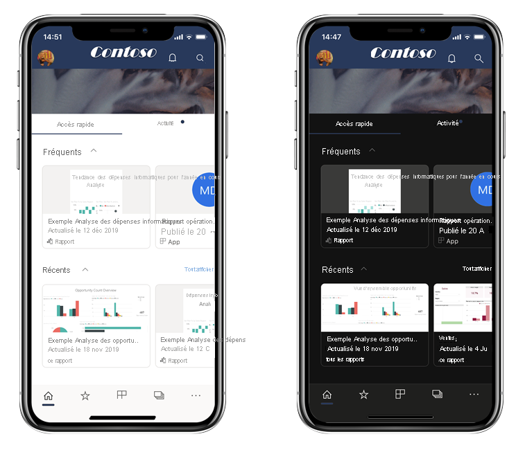
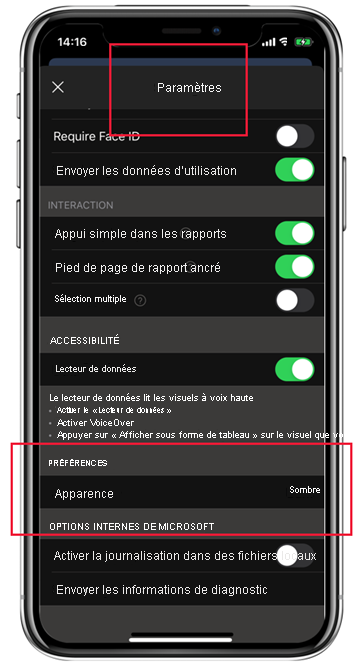

# Mode sombre

Pour prendre en compte vos préférences d’affichage individuelles, les applications mobiles Power BI pour iOS et Android prennent en charge les modes d’écran clair et foncé. Le mode sombre réduit la luminosité de l’écran, ce qui vous permet de voir plus facilement votre contenu.

 En mode sombre, toutes les expériences d’application s’affichent avec un arrière-plan sombre. Toutefois, le contenu de Power BI n’est pas affecté. Vos rapports, tableaux de bord et applications sont toujours affichés comme les concepteurs l’ont prévu.
 
 Par défaut, votre application mobile Power BI utilise les paramètres de votre appareil pour déterminer l’apparence d’écran à afficher. Si votre appareil est configuré pour le mode sombre, l’application s’affiche en mode sombre.

>[!NOTE]
>La prise en charge du mode foncé au niveau de l’appareil sur les appareils Android est officiellement disponible à partir d’Android 10. Sur les appareils exécutant des versions antérieures d’Android, le mode foncé dans l’application mobile Power BI peut être contrôlé par les paramètres d’apparence de l’application.

Pour basculer entre les modes clair et foncé, ou pour laisser les paramètres de l’appareil déterminer le mode, accédez à la page **Paramètres**, faites défiler vers le bas jusqu’à **Préférences**, appuyez sur cette option, puis choisissez le mode souhaité.

