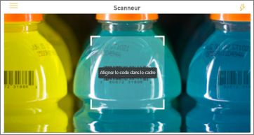

# Obtenir des données réelles avec les applications mobiles Power BI
Les applications mobiles Power BI peuvent connecter des éléments du monde réel directement à des informations connexes BI de différentes façons. 

## Codes QR pour les vignettes
Créez un code QR pour un rapport ou pour une vignette d’un tableau de bord, et placez-le où bon vous semble. Quand vos collègues scannent le code avec leur iPhone ou leur téléphone Android, ou avec l’application Power BI for Mixed Reality, ils peuvent voir la vignette que vous avez associée à ce code QR. Sur un iPhone, la vignette est affichée en réalité augmentée.

En savoir plus sur :

* [Créer un code QR pour une vignette dans Power BI](../../service-create-qr-code-for-tile.md)
* [Scanner un code QR Power BI à partir de votre appareil mobile](mobile-apps-qr-code.md)
* [Scanner un code QR avec l’application Power BI for Mixed Reality](mobile-mixed-reality-app.md#scan-a-report-qr-code-in-holographic-view).

## Codes QR pour les rapports
Créez un code QR pour un rapport.  Quand vos collègues scannent le code avec leur iPhone (ou un téléphone Android prochainement), ils voient le rapport que vous avez associé à ce code QR. 

En savoir plus sur la [création d’un code QR pour un rapport dans Power BI](../../service-create-qr-code-for-report.md)

## Codes-barres
Marquez des données de code-barres dans votre rapport afin que vos collègues puissent scanner un code-barres d’un produit et accéder directement à ce rapport, filtré pour ce produit.

En savoir plus sur :

* [Marquer des données de code-barres dans un rapport](../../desktop-mobile-barcodes.md)
* [Scanner un code-barres depuis l’application Power BI sur votre iPhone](mobile-apps-scan-barcode-iphone.md)

## Filtrer par emplacement
Classez les données géographiques d’un rapport dans Power BI Desktop. Vos collègues peuvent ensuite afficher ce rapport dans l’application mobile Power BI pour iOS, et Power BI fournit automatiquement les filtres géographiques correspondant à leur emplacement.

En savoir plus sur le [filtrage par emplacement](mobile-apps-geographic-filtering.md).

## Étapes suivantes
* [Créer un code QR pour une vignette dans Power BI](../../service-create-qr-code-for-tile.md)
* [Créer un code QR pour un rapport dans Power BI](../../service-create-qr-code-for-report.md)

