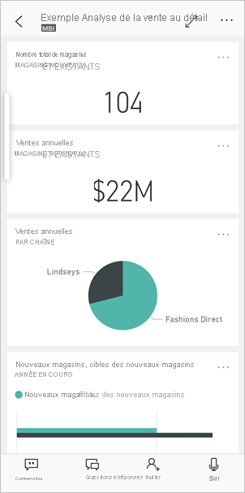
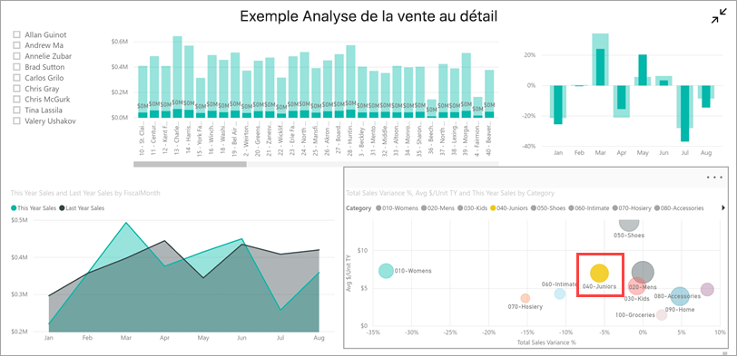
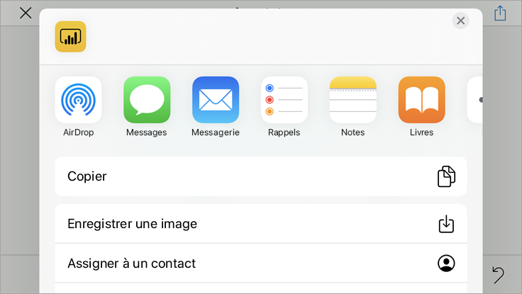
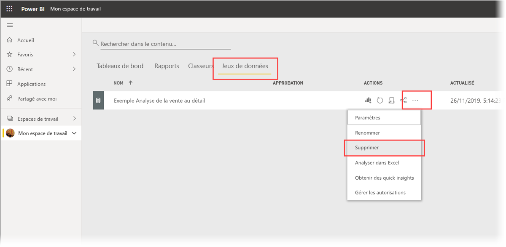

# Démarrage rapide : Explorer des tableaux de bord et des rapports dans les applications mobiles Power BI
Dans ce guide de démarrage rapide, nous allons explorer rapidement l’application Power BI Mobile, puis nous nous intéresserons à un exemple de tableau de bord et à un exemple de rapport. Nous vous montrons ici l’application Power BI pour iOS. Toutefois, vous pourrez facilement suivre les instructions sur d’autres appareils.

S’applique à :

|  |  |  |  |
|:--- |:--- |:--- |:--- |
| iPhone | iPad | Téléphone | Windows 10 |

>[!NOTE]
>La prise en charge des applications mobiles Power BI pour les **téléphones utilisant Windows 10 Mobile** ne sera plus disponible après le 16 mars 2021. [En savoir plus](/legal/powerbi/powerbi-mobile/power-bi-mobile-app-end-of-support-for-windows-phones)

Un tableau de bord est un portail qui donne accès au cycle de vie et aux processus de votre entreprise. Il s’agit d’une vue d’ensemble, d’un seul et même emplacement à partir duquel vous pouvez superviser l’état actuel des activités de l’entreprise. Les rapports sont des vues de données interactives qui comprennent des visuels représentant différentes observations et différents insights. 

## Prérequis

* **Inscrivez-vous à Power BI** : Si vous n’êtes pas inscrit à Power BI, [inscrivez-vous à un essai gratuit](https://app.powerbi.com/signupredirect?pbi_source=web) avant de commencer.
* **Installez l’application Power BI adaptée à votre appareil** : Téléchargez l'application mobile Power BI** à partir de l’[App Store](https://apps.apple.com/app/microsoft-power-bi/id929738808) (iOS) et de [Google Play](https://play.google.com/store/apps/details?id=com.microsoft.powerbim&amp;amp;clcid=0x409) (Android).
* **Téléchargez l’exemple Analyse de la vente au détail** : La première étape de ce guide de démarrage rapide consiste à télécharger l’exemple Analyse de la vente au détail dans le service Power BI. [Découvrez comment télécharger un exemple](./mobile-apps-download-samples.md) dans votre compte Power BI pour commencer. Veillez à bien sélectionner l’exemple Analyse de la vente au détail.

Une fois que vous avez effectué les prérequis et que vous avez téléchargé l’exemple Analyse de la vente au détail dans votre compte Power BI, vous être prêt pour cette présentation rapide.

## Consulter un tableau de bord sur un appareil mobile
1. Sur votre appareil, ouvrez l’application Power BI et connectez-vous avec les informations d’identification de compte Power BI que vous avez utilisées pour le service Power BI dans le navigateur.
 
1. Maintenant, appuyez sur l’icône **Espaces de travail** , choisissez **Mes espaces de travail**, puis appuyez sur l’exemple Analyse de la vente au détail afin de l’ouvrir.

    
   
    L’apparence des tableaux de bord Power BI diffère légèrement selon que vous les consultez sur votre appareil mobile ou dans le service Power BI. Toutes les vignettes ont la même largeur et elles sont disposées verticalement.

6. Faites défiler la page et appuyez sur le graphique en courbes pleines « This Year’s Sales, Last Year’s Sales » (« Ventes de cette année, ventes de l’année dernière »).

    

    Il s’ouvre en mode Focus.

7. En mode Focus, appuyez sur **Apr** dans le graphique. Les valeurs d’avril s’affichent alors en haut du graphique.

    

8. Appuyez sur l’icône Rapport  au bas de l’écran (sur les appareils Android, elle peut se trouver en haut de l’écran). Le rapport lié à cette vignette s’ouvre en mode paysage.

    

9. Appuyez sur la bulle jaune « 040 – Juniors » dans le graphique en bulles. Remarquez que les valeurs associées sont mises en surbrillance dans les autres graphiques. 

    

10. Balayez avec votre doigt pour voir la barre d’outils en bas, puis appuyez sur **Autres options (...)** .

    

11. Faites défiler la liste vers le bas puis sélectionnez **Annoter**.

    

12. Dans la barre d’outils Annoter, appuyez sur l’icône représentant un émoticône, puis appuyez dans la page de rapport où vous souhaitez ajouter les émoticônes.
 
    

13. À présent, appuyez sur **Partager** en haut à droite.

14. Choisissez la façon dont vous souhaitez partager le rapport.  

    

    Vous pouvez partager cet instantané avec d’autres personnes appartenant ou non à votre organisation. Celles qui font partie de votre organisation et ont leur propre compte Power BI pourront également ouvrir le rapport de l’exemple Analyse de la vente au détail.

## Nettoyer les ressources

Maintenant que vous avez suivi ce guide de démarrage rapide, vous pouvez, si vous le souhaitez, supprimer le rapport, le jeu de données et le tableau de bord de l’exemple Analyse de la vente au détail.

1. Ouvrez le service Power BI ([service Power BI](https://app.powerbi.com)), puis connectez-vous.

2. Dans le volet de navigation, sélectionnez **Mon espace de travail**.

3. Sélectionnez l’onglet Tableaux de bord, puis cliquez sur la corbeille.

    

    À présent, cliquez sur l’onglet Rapports et recommencez la même procédure.

4. Sélectionnez l’onglet Jeux de données, cliquez sur **Autres options** (...), puis choisissez **Supprimer**. 

    

## Étapes suivantes

Dans ce guide de démarrage rapide, vous avez exploré un exemple de tableau de bord et de rapport sur votre appareil mobile. Découvrez plus en détail comment travailler avec le service Power BI. 

> [!div class="nextstepaction"]
> [Démarrage rapide : Découverte du service Power BI](../end-user-experience.md)