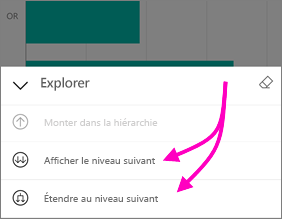
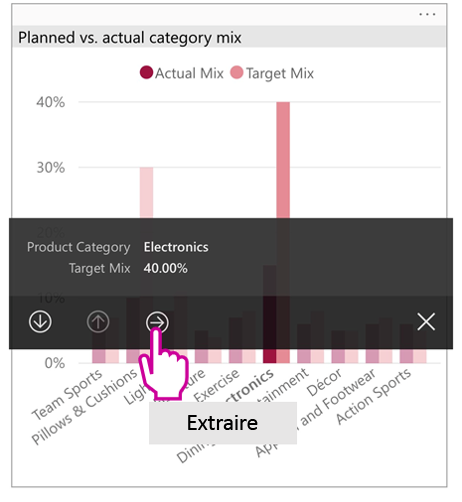

# Afficher les rapports Power BI optimisés pour votre téléphone

S’applique à :

|  |  |
|:--- |:--- |
| iPhone |Téléphones Android |

Quand vous ouvrez un rapport Power BI sur un téléphone, Power BI vérifie si le rapport a été optimisé pour les téléphones. Si c’est le cas, Power BI ouvre automatiquement le rapport optimisé en mode portrait.

Si le rapport optimisé pour les téléphones n’existe pas, le rapport s’ouvre toujours, mais en mode paysage non optimisé. Même dans un rapport optimisé pour les téléphones, si vous tournez votre téléphone sur le côté, le rapport s’ouvre dans l’affichage non optimisé avec sa disposition d’origine. Si seules certaines pages sont optimisées, un message s’affiche en mode portrait pour vous indiquer que le rapport est disponible en mode paysage.

Toutes les autres fonctionnalités des rapports Power BI continuent de fonctionner dans les rapports optimisés pour les téléphones. Découvrez ce que vous pouvez faire dans :

* [Les rapports sur iPhone](mobile-reports-in-the-mobile-apps.md). 
* [Les rapports sur Android](mobile-reports-in-the-mobile-apps.md).

## Filtrer la page de rapport sur un téléphone
Si des filtres ont été définis dans un rapport optimisé pour les téléphones, lorsque vous affichez le rapport sur un téléphone, vous pouvez utiliser ces filtres. Le rapport s’ouvre sur votre téléphone et montre les valeurs qui sont filtrées dans le rapport sur le web. Un message s’affiche indiquant qu’il existe des filtres actifs sur la page. Vous pouvez modifier les filtres sur votre téléphone.

1. Appuyez sur l’icône de filtre  en bas de la page. 
2. Pour voir les résultats qui vous intéressent, utilisez le filtrage de base ou avancé.
   
    

## Sélection croisée de visuels
La sélection croisée de visuels en mode portrait fonctionne de la même façon que dans le service Power BI, et que sur les téléphones en mode paysage : Lorsque vous sélectionnez des données dans un visuel, cela met en évidence les données associées dans les autres visuels sur cette page.

En savoir plus sur le [filtrage et la mise en évidence dans Power BI](../../power-bi-reports-filters-and-highlighting.md).

## Sélectionner des visuels
Quand vous sélectionnez un visuel dans des rapports sur téléphone, ces derniers le mettent en évidence et se concentrent dessus en neutralisant les mouvements sur le canevas.

Quand le visuel est sélectionné, vous pouvez effectuer différentes opérations, comme défiler au sein du visuel. Pour désélectionner un visuel, touchez n’importe où en dehors de la zone du visuel.

## Ouvrir les visuels en mode Focus
Les rapports sur téléphone offrent également un mode Focus : Vous bénéficiez d’une vue agrandie d’un visuel et pouvez ainsi l’explorer plus facilement.

* Dans un rapport pour téléphone, cliquez sur les points de suspension ( **...** ) situés dans le coin supérieur droit d’un visuel, puis sur **Développer en mode focus**.
  
    

Ce que vous effectuez en mode Focus se reflète sur le canevas du rapport et inversement. Par exemple, si vous mettez en surbrillance la valeur d’un visuel, puis revenez au rapport, celui-ci est entièrement filtré sur la valeur que vous avez mise en surbrillance dans le visuel.

Voici les actions qui ne sont possibles qu’en mode focus en raison des contraintes liées à la taille des écrans :

* **Descendre dans la hiérarchie** des informations affichées dans un visuel. Pour en savoir plus sur les [opérations de montée et descente dans la hiérarchie](mobile-apps-view-phone-report.md#drill-down-in-a-visual) dans un rapport pour téléphone, consultez la suite de cet article.
* **Trier** les valeurs du visuel.
* **Rétablir** : Effacer les étapes d’exploration effectuées sur un visuel et revenir à la définition définie lors de la création du rapport.
  
    Pour effacer toutes les explorations à partir d’un visuel, cliquez sur les points de suspension ( **...** ), puis sur **Rétablir**.
  
    
  
    L’action Rétablir est disponible au niveau du rapport et permet d’effacer l’exploration de tous les visuels. Au niveau du visuel, elle permet d’effacer l’exploration du visuel sélectionné.   

## Descendre dans la hiérarchie d’un visuel
Si des niveaux de la hiérarchie sont définis dans un visuel, vous pouvez descendre dans la hiérarchie des informations détaillées affichées, puis revenir en arrière. Vous pouvez [ajouter une descente dans la hiérarchie d’un visuel](../end-user-drill.md) soit dans le service Power BI, soit dans Power BI Desktop.

Il existe plusieurs types d’exploration :

### Exploration au niveau d’une valeur
1. Appuyez de façon prolongée sur un point de données d’un visuel.
2. Une info-bulle s’affiche et, si une hiérarchie est définie, le pied de page de l’info-bulle montre les flèches permettant de monter et de descendre dans la hiérarchie.
3. Appuyez sur la flèche vers le bas pour descendre dans la hiérarchie.

    
    
4. Appuyez sur la flèche vers le haut pour monter dans la hiérarchie.

### Exploration du niveau suivant
1. Dans un rapport pour téléphone, cliquez sur les points de suspension ( **...** ) situés dans le coin supérieur droit, puis sur **Développer en mode focus**.
   
    
   
    Dans cet exemple, les barres indiquent des états.
2. Appuyez sur l’icône Explorer  en bas à gauche.
   
    
3. Appuyez sur **Afficher le niveau suivant** ou **Développer au prochain niveau**.
   
    
   
    Maintenant, les barres affichent les valeurs des villes.
   
    
4. Si vous appuyez sur la flèche dans le coin supérieur gauche, vous revenez au rapport pour téléphone contenant les valeurs toujours développées au niveau inférieur.
   
    
5. Pour remonter au niveau d’origine, appuyez de nouveau sur les points de suspension ( **...** ), puis sur **Rétablir**.
   
    

## Extraction à partir d’une valeur
L’extraction permet de connecter les valeurs d’une page de rapport à d’autres pages de rapport. Lorsque vous effectuez une extraction à partir d’un point de données vers une autre page de rapport, les valeurs du point de données sont utilisées pour filtrer la page extraite, et vous vous retrouvez dans le contexte des données sélectionnées.
Les auteurs de rapports peuvent [définir l’extraction](https://docs.microsoft.com/power-bi/desktop-drillthrough) lorsqu’ils créent un rapport.

1. Appuyez de façon prolongée sur un point de données d’un visuel.
2. Une info-bulle s’affiche et, si l’extraction est définie, le pied de page de l’info-bulle montre la flèche permettant d’effectuer une extraction.
3. Appuyez sur la flèche d’extraction.

    

4. Choisir la page de rapport à extraire

    

5. Utilisez le bouton Précédent situé dans l’en-tête de l’application pour revenir à la page de départ.

## Étapes suivantes
* [Créer des rapports optimisés pour les applications Power BI pour téléphone](../../desktop-create-phone-report.md)
* [Créer une vue téléphone d’un tableau de bord dans Power BI](../../service-create-dashboard-mobile-phone-view.md)
* [Créer des visuels réactifs optimisés pour toute taille](../../visuals/desktop-create-responsive-visuals.md)
* D’autres questions ? [Essayez d’interroger la communauté Power BI](https://community.powerbi.com/)

