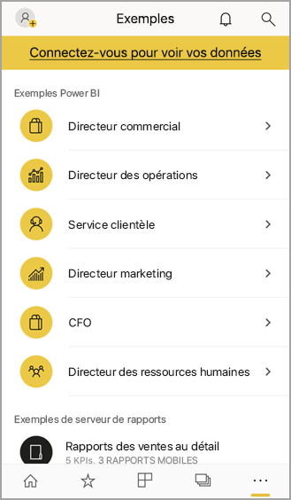

# Bien démarrer avec l’application mobile Power BI sur les appareils iOS
L’application Microsoft Power BI pour iOS sur les iPhone et iPad fournit une expérience mobile pour Power BI, Power BI Report Server et Reporting Services. Consultez les tableaux de bord de votre organisation et interagissez avec eux, localement et dans le cloud, en tout lieu, grâce à un accès mobile en direct via une interface tactile. Explorez les données des tableaux de bord et partagez-les avec vos collègues par e-mail ou SMS. Et tenez-vous au courant des données les plus à jour sur votre [Apple Watch](mobile-apple-watch.md).  

Vous créez des rapports Power BI dans Power BI Desktop, puis les publiez :

* [Publiez-les sur le service Power BI](../../service-get-started.md) puis créez des tableaux de bord.
* [Publiez-les localement sur Power BI Report Server](../../report-server/quickstart-create-powerbi-report.md).

Ensuite, dans l’application mobile Power BI pour iOS, vous pouvez manipuler vos tableaux de bord et rapports, tant en local que dans le cloud.

Découvrez les [nouveautés sur les applications mobiles Power BI](mobile-whats-new-in-the-mobile-apps.md).

## Télécharger l’application
[Téléchargez l’application iOS](https://go.microsoft.com/fwlink/?LinkId=522062 "Télécharger l’application iOS") à partir de l’Apple App Store sur votre iPhone ou iPad.

Vous pouvez exécuter l’application Power BI pour iOS sur n’importe quel appareil exécutant iOS 11 ou ultérieur. 

## S’inscrire au service Power BI
Si vous ne vous êtes pas déjà inscrit, accédez à [powerbi.com](https://powerbi.microsoft.com/get-started/) puis, sous **Power BI - Collaboration et partage cloud**, sélectionnez **Essai gratuit**.

## Prise en main de l’application Power BI
1. Sur votre appareil iOS, ouvrez l’application Power BI.
2. Pour afficher vos tableaux de bord Power BI, appuyez sur **Power BI**.  
   Pour voir vos rapports mobiles Reporting Services et les indicateurs de performance clés, appuyez sur **Report Server**.
   
   
   
   Quand vous êtes dans l’application, appuyez sur l’image de profil du compte en haut à gauche de l’écran afin de passer de l’un à l’autre. 

## Essayer les exemples Power BI et Reporting Services
Même sans vous inscrire, vous pouvez voir et utiliser des exemples Power BI et Reporting Services.

Pour accéder aux exemples, appuyez sur **Autres options** (...) dans la barre de navigation, puis choisissez **Exemples**.

Un certain nombre d’exemples Power BI sont suivis de plusieurs exemples de serveur de rapports.

   
   
   > [!NOTE]
   > Certaines fonctionnalités ne sont pas disponibles dans les exemples. Par exemple, vous ne pouvez pas voir les exemples de rapports sous-jacents des tableaux de bord. Vous ne pouvez pas non plus partager les exemples et les définir comme favoris. 
   > 
   >

## Trouver votre contenu dans les applications mobiles Power BI

Appuyez sur la loupe dans l’en-tête pour commencer à rechercher votre contenu Power BI.

## Afficher vos tableaux de bord et rapports favoris
Appuyez sur **Favoris** () dans la barre de navigation pour voir votre page Favoris. 

Accédez à des informations supplémentaires sur les [favoris dans les applications mobiles Power BI](mobile-apps-favorites.md).

## Prise en charge des applications mobiles Power BI pour les entreprises
Les entreprises peuvent utiliser Microsoft Intune pour gérer les appareils et applications, dont les applications mobiles Power BI pour Android et iOS.

Microsoft Intune permet aux organisations de contrôler divers éléments, comme la nécessité de disposer d’un code confidentiel d’accès, la façon dont l’application traite les données et même le chiffrement des données de l’application quand cette dernière n’est pas utilisée.

> [!NOTE]
> Si vous utilisez l’application mobile Power BI sur votre appareil iOS et que votre organisation a configuré Microsoft Intune MAM, l’actualisation des données en arrière-plan est désactivée. La prochaine fois que vous ouvrez l’application, Power BI actualise les données à partir du service Power BI sur le web.
> 

En savoir plus sur la [configuration des applications mobiles Power BI avec Microsoft Intune](../../service-admin-mobile-intune.md). 

## Étapes suivantes

* [Qu’est-ce que Power BI ?](../../fundamentals/power-bi-overview.md)
* Vous avez des questions ? [Essayez d’interroger la communauté Power BI](https://community.powerbi.com/)

