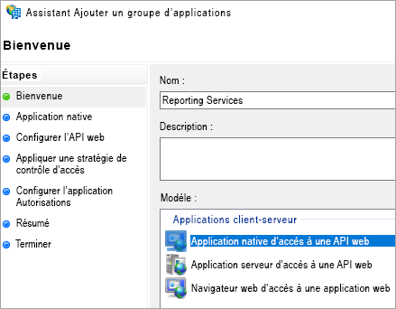
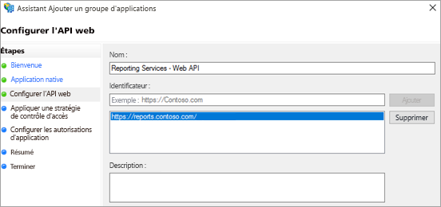
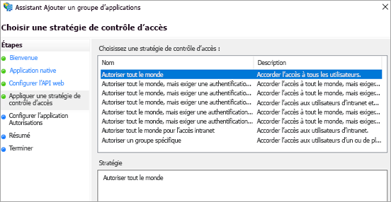
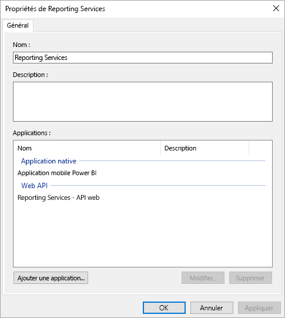
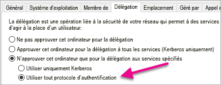
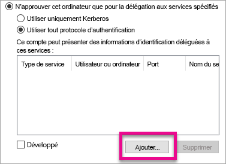
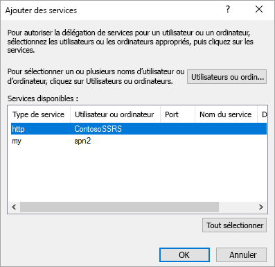
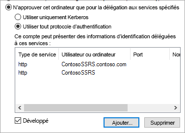
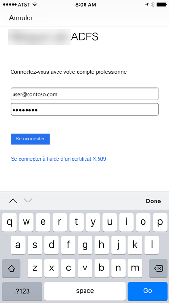
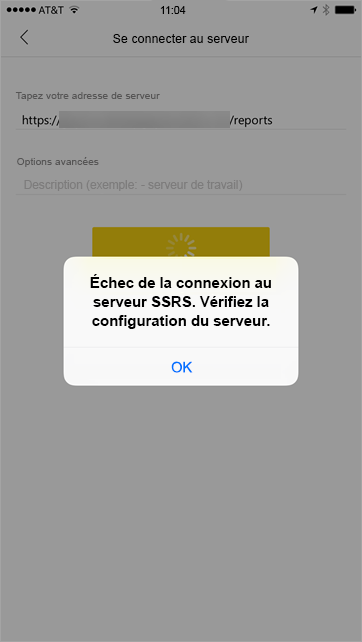

# <a name="using-oauth-to-connect-to-power-bi-report-server-and-ssrs"></a>Utilisation d’OAuth pour se connecter à Power BI Report Server et SSRS

Vous pouvez utiliser OAuth pour vous connecter à Power BI Report Server et Reporting Services afin d’afficher des rapports mobiles ou des indicateurs de performance clés. Découvrez comment configurer votre environnement pour prendre en charge l’authentification OAuth avec l’application mobile Power BI afin de vous connecter à Power BI Report Server et SQL Server Reporting Services 2016 ou ultérieur.

Regardez Adam se connecter de Power BI Mobile à SSRS avec OAuth :


<iframe width="560" height="350" src="https://www.youtube.com/embed/okzPAI2uUek" frameborder="0" allowfullscreen></iframe>


> [!NOTE]
> L’affichage des rapports Power BI hébergés dans Power BI Report Server à l’aide de WAP pour l’authentification est maintenant pris en charge pour les applications iOS et Android.

## <a name="requirements"></a>Configuration requise

Windows Server 2016 est requis pour les serveurs Proxy d’application web (WAP) et Active Directory Federation Services (ADFS). Il est inutile d’avoir un domaine de niveau fonctionnel Windows 2016.

## <a name="domain-name-services-dns-configuration"></a>Configuration DNS (Domain Name Services)

L’URL publique est celle à laquelle l’application Power BI Mobile se connecte. L’URL peut par exemple ressembler à ce qui suit.

```https
https://reports.contoso.com
```

Pointez votre enregistrement DNS correspondant aux **rapports** sur l’adresse IP publique du serveur Proxy d’application web (WAP). Vous devez également configurer un enregistrement DNS public pour votre serveur AD FS. Par exemple, vous pouvez configurer le serveur ADFS avec l’URL suivante.

```https
https://fs.contoso.com
```

Pointez votre enregistrement DNS correspondant à **fs** sur l’adresse IP publique du serveur Proxy d’application web (WAP), car il sera publié en tant que composant de l’application WAP.

## <a name="certificates"></a>Certificats

Vous devez configurer des certificats pour l’application WAP et le serveur ADFS. Ces certificats doivent faire partie d’une autorité de certificat valide reconnue par vos appareils mobiles.

## <a name="reporting-services-configuration"></a>Configuration de Reporting Services

Il n’y a pas grand chose à configurer du côté de Reporting Services. Nous devons simplement vérifier que nous avons un nom de principal du service valide pour autoriser l’authentification Kerberos et que le serveur Reporting Services est activé pour l’authentification négociée.

### <a name="service-principal-name-spn"></a>Nom de principal du service

Le nom de principal du service est un identificateur unique pour un service qui utilise l’authentification Kerberos. Vous devez avoir un nom de principal du service HTTP approprié pour votre serveur de rapports.

Pour plus d’informations sur la configuration du nom de principal du service adéquat pour votre serveur de rapports, consultez [Inscrire un nom de principal du service (SPN) pour un serveur de rapports](https://msdn.microsoft.com/library/cc281382.aspx).

### <a name="enabling-negotiate-authentication"></a>Activation de l’authentification négociée

Pour autoriser un serveur de rapports à utiliser l’authentification Kerberos, vous devez définir le type d’authentification associé sur RSWindowsNegotiate. Effectuez cette opération dans le fichier rsreportserver.config.

```xml
<AuthenticationTypes>  
    <RSWindowsNegotiate />  
    <RSWindowsKerberos />  
    <RSWindowsNTLM />  
</AuthenticationTypes>
```

Pour plus d’informations, consultez [Modifier un fichier de configuration Reporting Services](https://msdn.microsoft.com/library/bb630448.aspx) et [Configurer l’authentification Windows sur un serveur de rapports](https://msdn.microsoft.com/library/cc281253.aspx).

## <a name="active-directory-federation-services-adfs-configuration"></a>Configuration d’Active Directory Federation Services (ADFS)

Vous devez configurer AD FS sur un serveur Windows 2016 au sein de votre environnement. Vous pouvez effectuer cette configuration dans le Gestionnaire de serveur en sélectionnant Ajouter des rôles et fonctionnalités sous Gérer. Pour plus d’informations, consultez [Active Directory Federation Services](https://technet.microsoft.com/windows-server-docs/identity/active-directory-federation-services).

### <a name="create-an-application-group"></a>Créer un groupe d’applications

Dans l’écran de gestion AD FS, vous souhaitez créer un groupe d’applications pour Reporting Services qui inclut des informations pour les applications Power BI Mobile.

Pour créer le groupe d’applications, procédez comme suit.

1. Depuis l’application de gestion AD FS, cliquez avec le bouton droit sur **Groupes d’applications**, puis sélectionnez **Ajouter un groupe d’applications...**

   

2. Dans l’Assistant Ajout de groupe d’applications, indiquez le **nom** du groupe d’applications et sélectionnez **Application native accédant à une API web**.

   

3. Sélectionnez **Suivant**.

4. Indiquez le **nom** de l’application que vous ajoutez. 

5. Alors que l’**ID client** est automatiquement généré pour vous, entrez *484d54fc-b481-4eee-9505-0258a1913020* pour iOS et Android.

6. Vous pouvez ajouter les **URL de redirection** suivantes :

   **Entrées pour Power BI Mobile - iOS :**  
   msauth://code/mspbi-adal://com.microsoft.powerbimobile  
   msauth://code/mspbi-adalms://com.microsoft.powerbimobilems  
   mspbi-adal://com.microsoft.powerbimobile  
   mspbi-adalms://com.microsoft.powerbimobilems

   **Les applications Android ont seulement besoin des étapes suivantes :**  
   urn:ietf:wg:oauth:2.0:oob

   
7. Sélectionnez **Suivant**.

8. Indiquez l’URL de votre serveur de rapports. Il s’agit de l’URL externe qui pointe vers votre proxy d’application web. Elle doit être au format suivant :

   > [!NOTE]
   > Cette URL est sensible à la casse.

   *https://<URL du serveur de rapports>/*

   
9. Sélectionnez **Suivant**.

10. Choisissez la **Stratégie de contrôle d’accès** répondant aux besoins de votre organisation.

    

11. Sélectionnez **Suivant**.

12. Sélectionnez **Suivant**.

13. Sélectionnez **Suivant**.

14. Sélectionnez **Fermer**.

Lorsque vous avez terminé, les propriétés de votre groupe d’applications doivent avoir l’aspect suivant.



## <a name="web-application-proxy-wap-configuration"></a>Configuration du proxy d’application web (WAP)

Vous devez activer le rôle Windows Proxy d’application web sur un serveur dans votre environnement. Il doit s’agir d’un serveur Windows 2016. Pour plus d’informations, consultez [Proxy d’application web dans Windows Server 2016](https://technet.microsoft.com/windows-server-docs/identity/web-application-proxy/web-application-proxy-windows-server) et [Publication d’applications à l’aide de la pré-authentification AD FS](https://technet.microsoft.com/windows-server-docs/identity/web-application-proxy/publishing-applications-using-ad-fs-preauthentication#a-namebkmk14apublish-an-application-that-uses-oauth2-such-as-a-windows-store-app).

### <a name="constrained-delegation-configuration"></a>Configuration de la délégation contrainte

Pour passer de l’authentification OAuth à l’authentification Windows, nous devons utiliser la délégation contrainte avec la transition de protocole. Cela fait partie de la configuration de Kerberos. Nous avons déjà défini le nom de principal du service Reporting Services lors de la configuration de Reporting Services.

Nous devons configurer la délégation contrainte sur le compte du serveur WAP dans Active Directory. Vous devrez peut-être faire appel à un administrateur de domaine si vous n’avez pas de droits d’accès à Active Directory.

Pour configurer la délégation contrainte, vous devez effectuer les étapes suivantes.

1. Sur un ordinateur sur lequel les outils Active Directory sont installés, lancez **Utilisateurs et ordinateurs Active Directory**.

2. Recherchez le compte correspondant à votre serveur WAP. Par défaut, il s’agit du conteneur Ordinateurs.

3. Cliquez avec le bouton droit sur le serveur WAP et accédez à **Propriétés**.

4. Sélectionnez l’onglet **Délégation**.

5. Sélectionnez **N’approuver cet ordinateur que pour la délégation aux services spécifiés**, puis **Utiliser tout protocole d’authentification**.

   

   Cela permet de configurer la délégation contrainte pour le compte du serveur WAP. Nous devons ensuite spécifier les services auxquels cet ordinateur est autorisé à déléguer.

6. Sélectionnez **Ajouter...** sous la zone Services.

   

7. Sélectionnez **Utilisateurs ou ordinateurs...**

8. Entrez le compte de service que vous utilisez pour Reporting Services. Il s’agit du compte auquel vous avez ajouté le nom de principal du service lors de la configuration de Reporting Services.

9. Sélectionnez le nom de principal du service pour Reporting Services, puis **OK**.

   > [!NOTE]
   > Vous voyez peut-être uniquement le nom de principal du service NetBIOS. Les noms de principal du service NetBIOS et FQDN sont tous deux sélectionnés s’ils existent.

   

10. Le résultat doit ressembler à ce qui suit lorsque la case à cocher **Développé** est activée.

    

11. Sélectionnez **OK**.

### <a name="add-wap-application"></a>Ajouter une application WAP

Bien que vous puissiez publier des applications au sein de la console de gestion d’accès aux rapports, nous allons créer l’application au moyen de PowerShell. Voici la commande permettant d’ajouter l’application.

```powershell
Add-WebApplicationProxyApplication -Name "Contoso Reports" -ExternalPreauthentication ADFS -ExternalUrl https://reports.contoso.com/ -ExternalCertificateThumbprint "0ff79c75a725e6f67e3e2db55bdb103efc9acb12" -BackendServerUrl https://ContosoSSRS/ -ADFSRelyingPartyName "Reporting Services - Web API" -BackendServerAuthenticationSPN "http/ContosoSSRS.contoso.com" -UseOAuthAuthentication
```

| Paramètre | Commentaires |
| --- | --- |
| **ADFSRelyingPartyName** |Il s’agit du nom de l’API web que vous avez créée dans le groupe d’applications au sein d’ADFS. |
| **ExternalCertificateThumbprint** |Il s’agit du certificat à utiliser pour les utilisateurs externes. Il est important que le certificat soit valide sur les appareils mobiles et provienne d’une autorité de certification approuvée. |
| **BackendServerUrl** |Il s’agit de l’URL permettant d’accéder au serveur de rapports à partir du serveur WAP. Si le serveur WAP est situé dans un réseau de périmètre, vous devrez peut-être utiliser un nom de domaine complet. Vérifiez que vous pouvez atteindre cette URL à partir du navigateur web sur le serveur WAP. |
| **BackendServerAuthenticationSPN** |Il s’agit du nom de principal du service que vous avez créé lors de la configuration de Reporting Services. |

### <a name="setting-integrated-authentication-for-the-wap-application"></a>Définition de l’authentification intégrée pour l’application de proxy d’application web

Une fois que vous avez ajouté l’application de proxy d’application web, vous devez définir BackendServerAuthenticationMode sur IntegratedWindowsAuthentication. Vous avez besoin de l’ID de l’application de proxy d’application web pour cela.

```powershell
Get-WebApplicationProxyApplication “Contoso Reports” | fl
```


Exécutez la commande suivante pour définir le BackendServerAuthenticationMode sur l’ID de l’application de proxy d’application web.

```powershell
Set-WebApplicationProxyApplication -id 30198C7F-DDE4-0D82-E654-D369A47B1EE5 -BackendServerAuthenticationMode IntegratedWindowsAuthentication
```


## <a name="connecting-with-the-power-bi-mobile-app"></a>Connexion à l’application mobile Power BI

Dans l’application mobile Power BI, vous pouvez vous connecter à l’instance Reporting Services. Pour ce faire, fournissez l’**URL externe** de votre application de proxy d’application web.


Quand vous sélectionnez **Se connecter**, vous êtes dirigé vers votre page de connexion à ADFS. Entrez les informations d’identification valides pour votre domaine.



Une fois que vous avez sélectionné **Se connecter**, vous voyez les éléments de votre serveur Reporting Services.

## <a name="multi-factor-authentication"></a>Multi-Factor Authentication

Vous pouvez activer l’authentification multifacteur pour activer une sécurité supplémentaire pour votre environnement. Pour plus d’informations, consultez [Configurer AD FS 2016 et Azure MFA](https://technet.microsoft.com/windows-server-docs/identity/ad-fs/operations/configure-ad-fs-2016-and-azure-mfa).

## <a name="troubleshooting"></a>Résolution des problèmes

### <a name="you-receive-the-error-failed-to-login-to-ssrs-server"></a>Vous recevez l’erreur « Échec de la connexion au serveur SSRS »



Vous pouvez configurer [Fiddler](https://www.telerik.com/fiddler) de façon à ce qu’il agisse en tant que proxy pour vos appareils mobiles pour voir jusqu’où la demande est allée. Pour activer un proxy Fiddler pour votre appareil mobile, vous avez besoin du programme d’installation de [CertMaker pour iOS et Android](https://www.telerik.com/fiddler/add-ons) sur l’ordinateur exécutant Fiddler. Il s’agit d’un module complémentaire de Telerik pour Fiddler.

Si la connexion fonctionne correctement lorsque vous utilisez Fiddler, vous pouvez avoir un problème de certificat avec l’application de proxy d’application web ou le serveur ADFS. Vous pouvez utiliser un outil tel que [Microsoft Message Analyzer](https://www.microsoft.com/download/details.aspx?id=44226) pour vérifier si les certificats sont valides.

## <a name="next-steps"></a>Étapes suivantes

[Inscrire un nom de principal du service pour un serveur de rapports](https://msdn.microsoft.com/library/cc281382.aspx)  
[Modifier un fichier de configuration Reporting Services](https://msdn.microsoft.com/library/bb630448.aspx)  
[Configurer l’authentification Windows sur un serveur de rapports](https://msdn.microsoft.com/library/cc281253.aspx)  
[Active Directory Federation Services](https://technet.microsoft.com/windows-server-docs/identity/active-directory-federation-services)  
[Proxy d’application web dans Windows Server 2016](https://technet.microsoft.com/windows-server-docs/identity/web-application-proxy/web-application-proxy-windows-server)  
[Publication d’applications à l’aide de la pré-authentification AD FS](https://technet.microsoft.com/windows-server-docs/identity/web-application-proxy/publishing-applications-using-ad-fs-preauthentication#a-namebkmk14apublish-an-application-that-uses-oauth2-such-as-a-windows-store-app)  
[Configurer AD FS 2016 et Azure MFA](https://technet.microsoft.com/windows-server-docs/identity/ad-fs/operations/configure-ad-fs-2016-and-azure-mfa)  
D’autres questions ? [Posez vos questions à la communauté Power BI](https://community.powerbi.com/)
