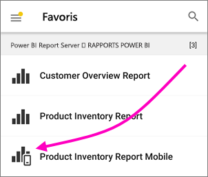
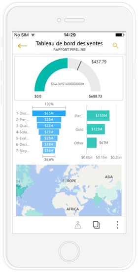
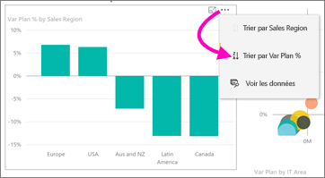
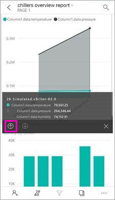
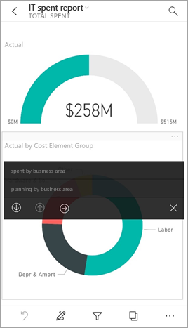

# Explorer des rapports dans les applications mobiles Power BI
S’applique à :

|  |  |  |  |  |
|:--- |:--- |:--- |:--- |:--- |
| iPhone |iPad |Téléphones Android |Tablettes Android |Appareils Windows 10 |

Un rapport Power BI est une vue interactive de vos données, dont la découverte et l’analyse sont traduites par des insights. L’affichage de rapports dans les applications mobiles Power BI est la troisième étape du processus.

1. [Créez des rapports dans Power BI Desktop](../../desktop-report-view.md). Vous pouvez même [optimiser un rapport pour les téléphones](mobile-apps-view-phone-report.md) dans Power BI Desktop. 
2. Publiez ces rapports dans le service Power BI [ (https://powerbi.com)](https://powerbi.com) ou [Power BI Report Server](../../report-server/get-started.md)).  
3. Ensuite, exploitez ces rapports dans les applications mobiles Power BI.

## Ouvrir un rapport Power BI dans l’application mobile
Les rapports Power BI sont stockés dans des emplacements différents dans l’application mobile, en fonction de leur provenance. Ils peuvent être situés dans Applications, Partagés avec moi, Espaces de travail (y compris Mon espace de travail) ou sur un serveur de rapports. Parfois, ils sont répertoriés dans un tableau de bord associé par lequel vous accédez à un rapport.

* Dans un tableau de bord, appuyez sur les points de suspension (...) dans le coin supérieur droit d’une vignette > **Ouvrir un rapport**.
  
  
  
  Les vignettes ne peuvent pas toutes s’ouvrir dans un rapport. Par exemple, les vignettes créées en posant une question dans la zone Questions et réponses n’ouvrent pas de rapports quand vous appuyez dessus. 
  
  Sur un téléphone, le rapport s’ouvre en mode paysage, sauf s’il est [optimisé pour un affichage sur téléphone](mobile-reports-in-the-mobile-apps.md#view-reports-optimized-for-phones).
  
  

## Afficher les rapports optimisés pour les téléphones
Les auteurs de rapports Power BI peuvent créer une disposition de rapport spécialement optimisée pour les téléphones. Les pages de rapport optimisées pour les téléphones ont de nouvelles fonctionnalités : par exemple, vous pouvez effectuer une exploration vers le bas et un tri des visuels, et vous pouvez accéder aux [filtres que l’auteur du rapport a ajoutés à la page de rapport](mobile-apps-view-phone-report.md#filter-the-report-page-on-a-phone). Le rapport s’ouvre sur votre téléphone. Il est filtré en fonction des valeurs filtrées dans le rapport sur le web, avec un message indiquant qu’il existe des filtres actifs sur la page. Vous pouvez modifier les filtres sur votre téléphone.

Dans la liste des rapports, un rapport optimisé possède une icône spéciale :

Lorsque vous affichez un rapport sur un téléphone, il s’ouvre en mode portrait.

 Un rapport peut avoir une combinaison de pages optimisées et non optimisées pour les téléphones. Dans ce cas, lorsque vous parcourez le rapport, l’affichage bascule du mode portrait au mode paysage pour chaque page.

En savoir plus sur les [rapports optimisés pour l’affichage sur téléphone](mobile-apps-view-phone-report.md).

## Utiliser des segments pour filtrer un rapport
Quand vous concevez un rapport dans Power BI Desktop ou le service Power BI, vous pouvez [ajouter des segments à une page de rapport](../../visuals/power-bi-visualization-slicers.md). Vous et vos collègues pouvez les utiliser pour filtrer la page dans un navigateur et dans les applications mobiles. Lorsque vous affichez le rapport sur un téléphone, vous pouvez voir et interagir avec les segments en mode paysage et sur une page optimisée pour le mode portrait du téléphone. Si vous sélectionnez une valeur dans un segment ou un filtre dans le navigateur, la valeur est également sélectionnée lorsque vous affichez la page dans l’application mobile. Un message s’affiche indiquant qu’il existe des filtres actifs sur la page.  

* Lorsque vous sélectionnez une valeur dans un segment de la page de rapport, celle-ci filtre les autres visuels sur la page.
  
  
  
  Dans cette illustration, le segment filtre l’histogramme pour afficher uniquement les valeurs de juillet.

## Effectuer un filtrage croisé et mettre en surbrillance un rapport
Lorsque vous sélectionnez une valeur dans un visuel, elle ne filtre pas les autres visuels. Elle met en surbrillance les valeurs associées dans les autres visuels.

* Appuyez sur une valeur dans un visuel.
  
  
  
  Un appui sur la colonne Large (Grand) dans un visuel met en surbrillance les valeurs associées dans les autres visuels. 

## Trier un visuel sur un iPad ou une tablette
* Appuyez sur le graphique, sur les points de suspension (**...**), puis sur le nom de champ.
  
   
* Pour inverser l’ordre de tri, rappuyez sur les points de suspension (**...**), puis appuyez sur le même nom de champ.

## Monter et descendre dans la hiérarchie d’un visuel
Si l’auteur d’un rapport a ajouté cette fonctionnalité à un visuel, vous pouvez descendre dans la hiérarchie d’un visuel pour voir les valeurs qui composent une partie de celui-ci. [Ajoutez la descente dans la hiérarchie à un visuel](../end-user-drill.md) dans le service Power BI ou dans Power BI Desktop. 

* Appuyez et maintenez l’appui sur une barre ou un point spécifique dans un visuel pour afficher son info-bulle. Si la fonctionnalité d’exploration est activée, l’info-bulle a des flèches en bas sur lesquelles vous pouvez appuyer. 
  
  

* Pour remonter dans la hiérarchie, appuyez sur la flèche vers le haut de l’info-bulle.
  
  

* Vous pouvez aussi explorer tous les points de données d’un visuel. Ouvrez-le en mode Focus, appuyez sur l’icône Explorer, puis choisissez d’afficher tout le niveau suivant ou développez pour afficher le niveau actuel et le suivant.

   

## Extraction d’une page vers une autre

Avec *l’extraction*, quand vous appuyez sur une partie spécifique d’un visuel, Power BI vous redirige sur une autre page du rapport, filtrée sur la valeur que vous avez choisie. L’auteur d’un rapport peut définir une ou plusieurs options d’extraction, chacune vous redirigeant sur une page différente. Dans ce cas, vous pouvez choisir celle que vous voulez extraire. Dans l’exemple suivant, quand vous appuyez sur la valeur de la jauge, vous pouvez choisir entre effectuer une extraction selon **spent by business area** ou **planning by business area**.

Quand vous effectuez une extraction, le bouton de retour vous redirige sur la page de rapport précédente.

Découvrez comment [ajouter l’extraction dans Power BI Desktop](../../desktop-drillthrough.md).

## Étapes suivantes
* [Visualiser les rapports Power BI optimisés pour les téléphones et interagir avec eux](mobile-apps-view-phone-report.md)
* [Créer une version de rapport optimisée pour les téléphones](../../desktop-create-phone-report.md)
* Vous avez des questions ? [Essayez d’interroger la communauté Power BI](http://community.powerbi.com/)

