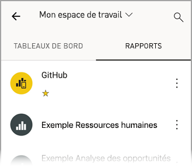
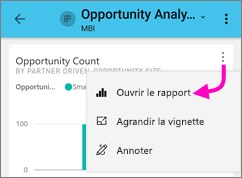
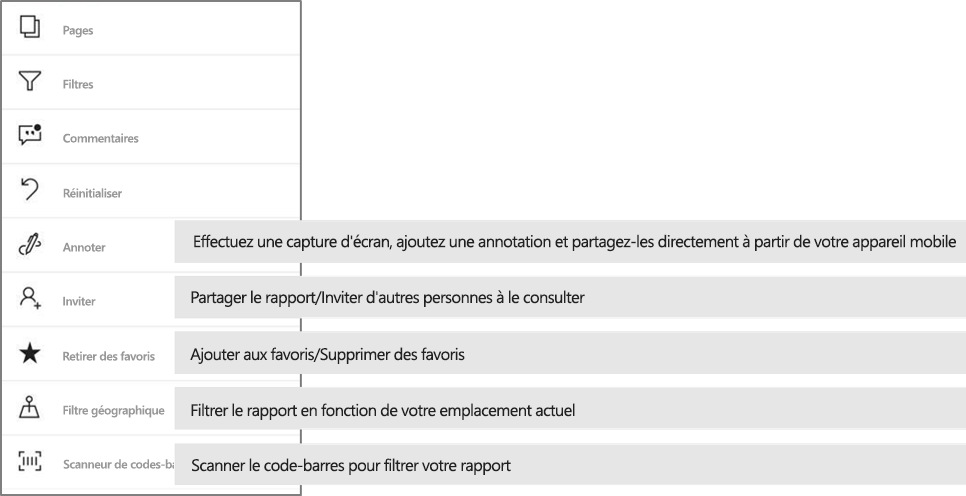

# Explorer des rapports dans les applications mobiles Power BI
S’applique à :

|  |  |  |  |  |
|:--- |:--- |:--- |:--- |:--- |
| iPhone |iPad |Téléphones Android |Tablettes Android |Appareils Windows 10 |

Un rapport Power BI est une vue interactive de vos données, dont la découverte et l’analyse sont traduites par des insights. L’affichage de rapports dans les applications mobiles Power BI est la troisième étape du processus.

1. [Créez des rapports dans Power BI Desktop](../../desktop-report-view.md). Vous pouvez même [optimiser un rapport pour les téléphones](mobile-apps-view-phone-report.md) dans Power BI Desktop. 
2. Publiez ces rapports dans le service Power BI [ (https://powerbi.com)](https://powerbi.com) ou [Power BI Report Server](../../report-server/get-started.md)).  
3. Ensuite, exploitez ces rapports dans les applications mobiles Power BI.

## Ouvrir un rapport Power BI dans l’application mobile
Les rapports Power BI sont stockés dans des emplacements différents dans l’application mobile, en fonction de leur provenance. Ils peuvent être situés dans Applications, Partagés avec moi, Espaces de travail (y compris Mon espace de travail) ou sur un serveur de rapports. Parfois, ils sont répertoriés dans un tableau de bord associé par lequel vous accédez à un rapport.

Dans les listes et les menus, vous trouverez une icône en regard d’un nom de rapport, vous aider à comprendre que cet élément est un rapport. 

 

Il existe deux icônes pour les rapports dans les applications mobiles Power BI :

*  Indique un rapport qui s’affiche en mode paysage dans l’application et ont le même aspect telle qu’elle apparaît dans le navigateur.

*  Indique un rapport possédant au moins une page de rapport optimisé de téléphone, qui s’affiche en mode portrait. 

Remarque : Maintenez votre téléphone en mode paysage, vous obtiendrez toujours l’en mode paysage, le même si la page de rapport a le mode téléphone. 

Pour accéder à un rapport à partir d’un tableau de bord, appuyez sur les points de suspension (...) dans le coin supérieur droit d’une vignette > **ouvrir rapport**.
  
  
  
  Les vignettes ne peuvent pas toutes s’ouvrir dans un rapport. Par exemple, les vignettes créées en posant une question dans la zone Questions et réponses n’ouvrent pas de rapports quand vous appuyez dessus. 
  
## Interaction avec les rapports
Une fois que vous avez un rapport ouvert dans l’application, vous pouvez commencer à travailler avec lui. Il existe de nombreuses choses à que faire avec votre rapport et ses données. Dans le pied de page, vous trouverez des actions que vous pouvez effectuer sur le rapport et en appuyant sur et long appuyant sur les données affichées dans le rapport, vous pouvez également découper et manipulent les données.

### À l’aide d’appuyez sur et long appuyez sur
Equals tap à une souris, cliquez sur. Par conséquent, si vous souhaitez cross mettez en surbrillance le rapport basé sur un point de données, appuyez sur ce point de données.
En appuyant sur une valeur de segment, rend cette valeur sélectionné et le reste du rapport de découpage par cette valeur. En appuyant sur un lien, bouton ou un signet activera en fonction de l’action définie par l’auteur.

Vous est probablement remarqué que lorsque vous appuyez sur un élément visuel, une bordure apparaît. Dans l’angle supérieur droit de la bordure, il existe de points de suspension (...). Tapant dessus, affiche un menu avec les actions que vous pouvez effectuer sur ce visuel.

### Info-bulle et l’extraction des actions

Lorsque vous appuyez long (cliquez et maintenez) un point de données, une info-bulle s’affichera présentant les valeurs représente ce point de données. 

Les auteurs de rapports peuvent définir des hiérarchies dans les données et les relations entre les pages de rapport. Hiérarchie permet des examens approfondis, exploration des et extraire une autre page de rapport à partir d’un élément visuel et une valeur. Par conséquent, lorsque vous appuyez longtemps sur une valeur, en plus de l’info-bulle, les options de simulation pertinentes s’affichent dans le pied de page. 

Avec *l’extraction*, quand vous appuyez sur une partie spécifique d’un visuel, Power BI vous redirige sur une autre page du rapport, filtrée sur la valeur que vous avez choisie.  L’auteur d’un rapport peut définir une ou plusieurs options d’extraction, chacune vous redirigeant sur une page différente. Dans ce cas, vous pouvez choisir celle que vous voulez extraire. Le bouton précédent vous permet de revenir à la page de rapport précédente.

Découvrez comment [ajouter l’extraction dans Power BI Desktop](../../desktop-drillthrough.md).
   
   > [!IMPORTANT]
   > Dans l’application Power BI Mobile, exploration dans les visuels de matrice et de table est activée via une valeur uniquement et non par les en-têtes de colonne et ligne.
   
   
   
### À l’aide des actions dans le pied de page
Le pied de page a des actions à qu'effectuer sur la page de rapport actuel ou sur l’intégralité du rapport. Le pied de page a un accès rapide aux actions plus utiles, et toutes les actions sont accessibles à partir de points de suspension (...).

Les actions que vous pouvez effectuer dans le pied de page sont :
1) Réinitialiser le filtre de rapport et croisée mettre en surbrillance les sélections à son état d’origine.
2) Ouvrez le volet de conversation pour afficher ou ajouter des commentaires sur ce rapport.
3) Ouvrez le volet de filtre pour afficher et modifier le filtre actuellement appliqué sur le rapport.
4) Répertorier toutes les pages de ce rapport. Appuyant sur le nom de la page charge et présenter cette page.
Déplacement entre les pages de rapport est possible en balayant depuis le bord de votre écran au centre.
5) Afficher toutes les actions de rapport.

#### Toutes les actions de rapport
En appuyant sur le... Affiche toutes les actions que vous pouvez effectuer sur un rapport, l’option dans le pied de page. 

Certaines des actions peuvent être désactivées, car elles sont dépendants sur les fonctionnalités de rapport spécifique.
Par exemple :
1) **Filtrer par emplacement actuel** est activé si les données dans votre rapport a été classées par l’auteur avec les données géographiques. [Découvrez comment identifier les données géographiques dans votre rapport](https://docs.microsoft.com/power-bi/desktop-mobile-geofiltering).
2) **Analyse pour filtrer le rapport par code-barres** est activée uniquement si le jeu de données dans votre rapport a été marqué comme le code-barres. [Comment vous identifiez les codes-barres dans Power BI Desktop](https://docs.microsoft.com/power-bi/desktop-mobile-barcodes). 
3) **Inviter** est activée uniquement si vous êtes autorisé à partager ce rapport avec d’autres utilisateurs. Vous avez autorisation uniquement si vous êtes le propriétaire du rapport ou si vous avez eu l’autorisation de repartager par le propriétaire.
4) **Annoter et partager** peut-être désactiver s’il existe un [stratégie de protection Intune](https://docs.microsoft.com/intune/app-protection-policies) dans votre organisation qui interdit le partage d’application Power BI Mobile. 

## Étapes suivantes
* [Visualiser les rapports Power BI optimisés pour les téléphones et interagir avec eux](mobile-apps-view-phone-report.md)
* [Créer une version de rapport optimisée pour les téléphones](../../desktop-create-phone-report.md)
* Vous avez des questions ? [Essayez d’interroger la communauté Power BI](http://community.powerbi.com/)

