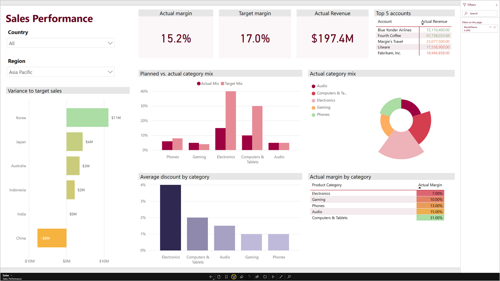
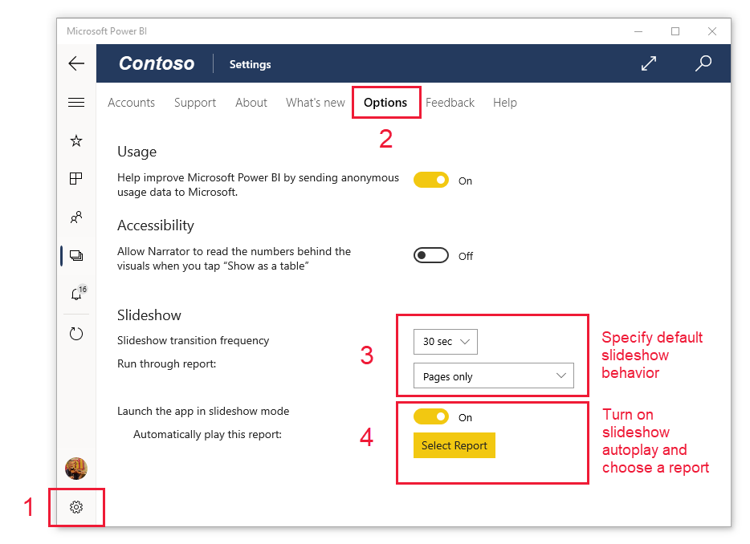

# Afficher des rapports et des tableaux de bord dans le mode de présentation dans les appareils Surface Hub et Windows 10
Vous pouvez utiliser le mode de présentation pour afficher des rapports et des tableaux de bord en plein écran sur les appareils Windows 10 et Surface Hub. Le mode Présentation est utile pour afficher Power BI lors de réunions ou de conférences ou sur un projecteur dédié au bureau ou pour optimiser l’espace sur un petit écran.

En mode Présentation :
* Tous les éléments de type « chrome » (comme les barres de navigation et de menus) disparaissent, ce qui vous permet de mieux vous concentrer sur les données de votre rapport.
* Une barre d’outils d’action est disponible pour vous permettre d’interagir avec vos données et de contrôler la présentation.
* Vous pouvez lancer un diaporama qui navigue automatiquement entre les pages, les signets ou les pages et les signets.

>[!NOTE]
>La prise en charge des applications mobiles Power BI pour les **téléphones utilisant Windows 10 Mobile** ne sera plus disponible après le 16 mars 2021. [En savoir plus](/legal/powerbi/powerbi-mobile/power-bi-mobile-app-end-of-support-for-windows-phones)

## Utiliser le mode de présentation
Dans l’application mobile Power BI, appuyez sur l’icône **Plein écran** pour accéder au mode plein écran.
 Tout ce qui est inutile dans l’application disparaît et la barre d’outils d’action s’affiche en bas de l’écran ou sur les côtés gauche et droit (selon la taille de votre écran).

Dans la barre d’outils, vous pouvez appuyer pour effectuer les actions suivantes :

| Icône | Action |
|------|--------|
||**Revenir** à la page précédente. Un appui long sur l’icône fait apparaître les fenêtres Fil d’Ariane, ce qui vous permet d’accéder au dossier contenant votre rapport ou tableau de bord.|
||**Basculer** vers une autre page du rapport de votre présentation.|
||**Appliquer un signet** pour présenter la vue spécifique de vos données capturées par le signet. Vous pouvez appliquer des signets personnels et de rapport.|
||**Choisir la couleur de l’encre** lors de l’utilisation du stylet Surface pour annoter et dessiner sur votre page de rapport.|
||**Effacer les marques d’encre** que vous avez faites avec le stylet Surface pour dessiner et annoter sur la page de votre rapport.          |
||**Rétablir l’affichage par défaut** et effacer tous les filtres, segments ou autres modifications apportées à l’affichage des données au cours de la présentation.|
||**Partager** une image de la vue Présentation avec vos collègues. L’image inclut les annotations que vous avez éventuellement créées avec le stylet Surface pendant la présentation.|
||**Actualiser** le rapport.|
||**Lire le diaporama**, en masquant la barre d’action et en démarrant le diaporama. Un sélecteur vous permet de choisir de naviguer automatiquement les pages, les signets ou entre les pages et les signets. Par défaut, le diaporama navigue automatiquement entre les pages toutes les 30 secondes. Vous pouvez modifier ces paramètres dans [**Paramètres > Options**](#slideshow-settings). Voir [plus de détails](#slideshows) sur les diaporamas|
||**Quitter** le mode Présentation.|
||**Rechercher** d’autres artefacts dans Power BI.|

Vous pouvez détacher la barre d’outils et la placer n’importe où sur l’écran. Cela est utile pour les grands écrans, lorsque vous souhaitez vous concentrer sur une zone spécifique de votre rapport et placer les outils en regard de celui-ci. Placez simplement votre doigt sur la barre d’outils et faites la défiler dans le canevas de rapport.

## Diaporamas

Vous pouvez lire un diaporama pour parcourir automatiquement votre présentation. Vous pouvez définir le diaporama pour qu’il parcourt les pages, les signets ou les pages et les signets. Pendant le diaporama, les pages de rapport avec [actualisation automatique de la page](../../create-reports/desktop-automatic-page-refresh.md) continuent à s’actualiser automatiquement comme configuré, garantissant ainsi que les données les plus récentes sont toujours affichées.

Lorsque vous sélectionnez le bouton **Lecture** dans la barre d’outils action, le diaporama démarre. Un contrôleur s’affiche pour vous permettre de suspendre le diaporama ou de modifier le contenu en cours de lecture : pages, signets ou pages et signets.

 Le contrôleur affiche le nom de la vue actuellement affichée (page ou signet et page). Dans l’image ci-dessus, nous voyons que dans le rapport appelé **Sales** (Ventes), nous voyons actuellement le signet **Asia Pacific** (Asie-Pacifique) sur la page **Sales Performance** (Performances des ventes).

Par défaut, un diaporama parcourt les pages uniquement, à raison d’une toutes les 30 secondes. Vous pouvez modifier le comportement par défaut est dans les [Paramètres du diaporama](#slideshow-settings).

### Lire automatiquement un diaporama au démarrage

Vous pouvez configurer l’application mobile Power BI pour démarrer automatiquement la lecture d’un diaporama chaque fois que l’application est lancée. Cette option est utile pour créer une expérience de type kiosque qui exécute un rapport dans des affichages publics sans aucune intervention manuelle. Pour plus d’informations sur la configuration d’un rapport pour l’exécution automatique, consultez [Paramètres de diaporama](#slideshow-settings) .

### Paramètres du diaporama

Par défaut, un diaporama parcourt les pages uniquement, à raison d’une toutes les 30 secondes. Vous pouvez modifier ce comportement par défaut en accédant à **Paramètres > Options**, comme illustré ci-dessous. Vous pouvez également activer l’exécution automatique et choisir un rapport à lire.

1. Sélectionnez l’icône Paramètres.

1. Ouvrez l’onglet Options.

1. Si vous le souhaitez, modifiez les paramètres par défaut pour le mode de basculement du diaporama (pages, signets ou les deux) et la fréquence de transition des diapositives.

1. Si vous souhaitez que votre rapport démarre automatiquement lorsque l’application est lancée, activez le bouton bascule et choisissez **Sélectionner un rapport**. Vous pouvez rechercher les rapports auxquels vous avez accès.

## Étapes suivantes
* [Afficher les tableaux de bord et les rapports en mode Plein écran à partir du service Power BI](../end-user-focus.md)
* Vous avez des questions ? [Essayez d’interroger la communauté Power BI](https://community.powerbi.com/)