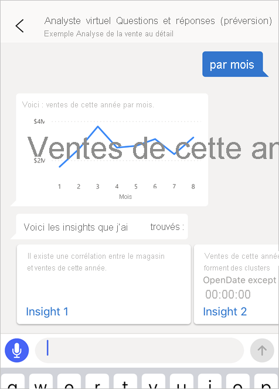

# Tutoriel : Poser des questions sur vos données avec l’analyste virtuel Questions et réponses dans des applications iOS pour Power BI

Le moyen le plus simple de tirer des enseignements de vos données consiste à poser des questions à leur sujet en utilisant vos propres mots. Dans ce tutoriel, vous posez des questions et affichez les insights proposés sur les exemples de données à l’aide de l’analyste virtuel des questions et réponses dans l’application mobile Microsoft Power BI sur votre iPad, iPhone et iPod Touch. 

S’applique à :

|  |  |
|:--- |:--- |
| iPhone |iPad |

L’analyste virtuel des questions et réponses est une expérience décisionnelle de type conversationnel qui accède aux données de questions et réponses sous-jacentes du service Power BI [(https://powerbi.com)](https://powerbi.com). Il suggère des insights sur les données ; vous pouvez poser vos questions par écrit ou oralement.

Durant ce tutoriel, vous allez effectuer les opérations suivantes :

> [!div class="checklist"]
> * Installer l’application mobile Power BI pour iOS
> * Télécharger un exemple de tableau de bord et de rapport Power BI
> * Consulter les insights proposés par l’application mobile

Si vous n’êtes pas inscrit à Power BI, [inscrivez-vous à un essai gratuit](https://app.powerbi.com/signupredirect?pbi_source=web) avant de commencer.

## Conditions préalables

### Installer l’application Power BI pour iOS
[Téléchargez l’application iOS](http://go.microsoft.com/fwlink/?LinkId=522062 "Téléchargez l’application iPhone") à partir de l’Apple App Store sur votre iPad, iPhone ou iPod touch.

Les versions suivantes prennent en charge l’application Power BI pour iOS :
- iPad sous iOS 10 (et versions ultérieures) ;
- iPhone 5 (et versions ultérieures) sous iOS 10 (et versions ultérieures) ; 
- iPod Touch avec iOS 10 ou version ultérieure.

### Télécharger l’exemple Opportunity Analysis (Analyse des opportunités)
La première étape du tutoriel consiste à télécharger l’exemple Analyse des opportunités dans le service Power BI.

1. Ouvrez le service Power BI dans votre navigateur (app.powerbi.com) et connectez-vous.

1. Sélectionnez l’icône de navigation globale pour ouvrir le volet de navigation de gauche.

    

2. Dans le volet de navigation de gauche, sélectionnez **Espaces de travail** > **Mon espace de travail**.

    

3. Dans le coin inférieur gauche, sélectionnez **Obtenir des données**.
   
    

3. Sur la page Obtenir des données, sélectionnez l’icône **Exemples**.
   
   

4. Sélectionnez **l’exemple Opportunity Analysis** (Analyse des opportunités).
 
    
 
8. Sélectionnez **Se connecter**.  
  
   
   
5. Power BI importe l’exemple, puis ajoute un tableau de bord, un rapport et un jeu de données à votre espace de travail.
   
   

Voilà, vous êtes prêt à consulter l’exemple sur votre appareil iOS.

## Essayer les insights recommandés
1. Sur votre iPhone ou iPad, ouvrez l’application Power BI et connectez-vous avec vos informations d’identification de compte Power BI, les mêmes que celles utilisées dans le service Power BI dans le navigateur.

1.  Appuyez sur le bouton de navigation globale  > **Espaces de travail** > **Mon espace de travail** et ouvrez le tableau de bord Exemple Opportunity Analysis (Analyse des opportunités).

2. Appuyez sur l’icône de l’analyste virtuel des questions et réponses  à partir du menu d’action en bas de la page (en haut de la page sur iPad).

     

     L’analyste virtuel des questions et réponses de Power BI commence par proposer des suggestions.

     
3. Appuyez sur **featured insights (Insights recommandés)**.

     L’analyste virtuel des questions et réponses suggère certaines informations.
4. Faites-les défiler vers la droite, puis appuyez sur **Insight 2**.

    

     L’analyste virtuel des questions et réponses affiche l’information 2.

    
5. Appuyez sur le graphique pour l’ouvrir en mode Focus.

    
6. Appuyez sur la flèche dans l’angle supérieur gauche pour revenir à l’analyste virtuel des questions et réponses.

## Nettoyer les ressources

Une fois que vous avez terminé le tutoriel, vous pouvez supprimer le tableau de bord, le rapport et le jeu de données relatifs à l’exemple Opportunity Analysis (Analyse des opportunités).

1. Ouvrez le service Power BI (app.powerbi.com) et connectez-vous.

2. Dans le volet de navigation de gauche, sélectionnez **Espaces de travail** > **Mon espace de travail**.

3. Dans l’onglet **Tableaux de bord**, sélectionnez l’icône **Supprimer** de la corbeille en regard du tableau de bord Opportunity Analysis (Analyse des opportunités).

    

4. Sélectionnez l’onglet **Rapports** et procédez de la même façon que ci-dessus pour le rapport Opportunity Analysis (Analyse des opportunités).

5. Sélectionnez l’onglet **Jeux de données** et procédez de la même façon que ci-dessus pour le jeu de données Opportunity Analysis (Analyse des opportunités).

## Étapes suivantes

Vous avez testé l’assistant virtuel Questions et réponses dans les applications mobiles Power BI pour iOS. En savoir plus sur les questions et réponses dans le service Power BI.
> [!div class="nextstepaction"]
> [Questions et réponses dans le service Power BI](../end-user-q-and-a.md)

