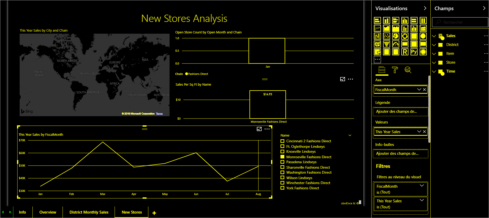

# Vue d’ensemble de l’accessibilité dans Power BI

Quand vous utilisez Power BI, prenez en compte les différents types d’utilisateurs qui peuvent interagir avec vos rapports. Vous pouvez créer des rapports faciles à parcourir et à comprendre par les utilisateurs de clavier ou de lecteur d’écran. Ces rapports permettent aux utilisateurs présentant des handicaps visuels ou physiques de bénéficier de vos rapports.

Cet article offre une vue d’ensemble de l’accessibilité dans Power BI. D’autres articles fournissent des conseils qui vous aideront à créer d’excellents rapports en favorisant l’accessibilité. Ces articles abordent également les outils à utiliser à cette fin.

## Conception universelle

La conception universelle consiste à concevoir des produits utilisables par le plus grand nombre de personnes possible sans nécessiter d’adaptation ou de conception spéciale. Quand vous créez des rapports ou des expériences dans Power BI, il est important de prendre en compte les besoins de vos utilisateurs. La conception d’une expérience accessible sera bénéfique non seulement pour les utilisateurs présentant des troubles auditifs, moteurs, cognitifs ou visuels, mais également pour tous les utilisateurs de votre organisation. Power BI vous apporte les outils nécessaires pour créer et consommer des rapports accessibles. En tant qu’auteur de rapport, il vous appartient d’utiliser ces outils pour améliorer l’expérience de chaque utilisateur.

## Normes d’accessibilité

Power BI répond aux normes d’accessibilité suivantes. Les normes permettent de garantir que vos expériences Power BI sont accessibles au plus grand nombre de personnes possible. Quand vous générez des rapports ou des tableaux de bord accessibles, ce contenu est accessible à toute personne qui les consulte avec Power BI Mobile.

### WCAG 2.1

Les règles pour l’accessibilité des contenus web (WCAG, Web Content Accessibility Guidelines) contribuent à rendre du contenu web accessible aux personnes souffrant d’un handicap. Voici quelques principes clés de ces règles :

1. **Perceptibles**. Les informations et composants d’interface utilisateur présentés doivent être perceptibles pour les utilisateurs.
2. **Utilisables**. Les composants d’interface utilisateur et la navigation doivent être accessibles aux utilisateurs.
3. **Compréhensibles**. Les informations et le fonctionnement de l’interface utilisateur doivent être compréhensibles.

### Section 508 (États-Unis)

La section 508 est une norme américaine exigeant que les administrations et les organisations fédérales rendent leur technologie électronique et informatique accessible aux personnes présentant des handicaps.

### EN 301 549

La norme européenne harmonisée EN 301 549 couvre les exigences d’accessibilité relatives aux produits et services TIC.  

## Étapes suivantes

Pour plus d’informations sur l’accessibilité de Power BI, consultez les ressources suivantes :

* [Concevoir des rapports Power BI pour l’accessibilité](desktop-accessibility-creating-reports.md)
* [Consommer des rapports Power BI à l’aide des fonctionnalités d’accessibilité](desktop-accessibility-consuming-tools.md)
* [Création de rapports dans Power BI avec des outils d’accessibilité](desktop-accessibility-creating-tools.md)
* [Raccourcis clavier dans Power BI Desktop](desktop-accessibility-keyboard-shortcuts.md)
* [Liste de vérification de l’accessibilité des rapports](desktop-accessibility-creating-reports.md#report-accessibility-checklist)

