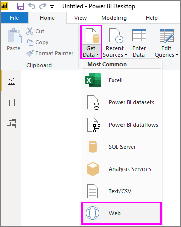
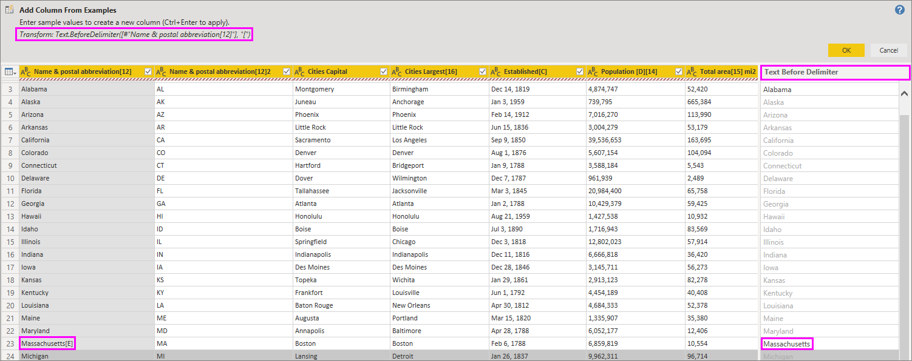

# Ajouter une colonne à partir d’exemples dans Power BI Desktop
En utilisant la fonctionnalité *Ajouter une colonne à partir d’exemples* dans l’éditeur Power Query, vous pouvez ajouter de nouvelles colonnes à votre modèle de données simplement en fournissant un ou plusieurs exemples de valeurs pour les nouvelles colonnes. Vous pouvez créer les exemples de la nouvelle colonne à partir d’une sélection ou fournir des entrées basées sur toutes les colonnes existantes dans la table.

La fonctionnalité *Ajouter une colonne à partir d’exemples* vous permet de créer rapidement et facilement des colonnes, ce qui s’avère particulièrement utile dans les situations suivantes :

- Vous savez quelles données doit contenir la nouvelle colonne, mais vous hésitez sur la transformation ou la collection de transformations à utiliser pour obtenir le résultat souhaité.
- Vous savez déjà quelles transformations vous allez utiliser, mais vous hésitez sur les options à sélectionner dans l’interface utilisateur pour que ces transformations soient effectuées.
- Vous savez tout des transformations à effectuer à l’aide d’une expression *Colonne personnalisée* dans le langage *M*, mais une ou plusieurs de ces expressions ne sont pas disponibles dans l’interface utilisateur.

L’ajout d’une colonne à partir d’un exemple est simple et rapide. Les sections suivantes vous le montrent.

## Ajouter une nouvelle colonne à partir d’exemples

Pour obtenir des exemples de données provenant d’un article sur Wikipédia, sélectionnez **Obtenir des données** > **Web** dans l’onglet **Accueil** du ruban Power BI Desktop. 

Collez l’URL suivante dans la boîte de dialogue qui s’affiche, puis sélectionnez **OK** : 

*https:\//wikipedia.org/wiki/List_of_states_and_territories_of_the_United_States*

Dans la boîte de dialogue **Navigateur**, sélectionnez la table **States of the United States of America**, puis sélectionnez **Transformer les données**. La table s’ouvre dans l’Éditeur Power Query.

Vous pouvez aussi afficher des données déjà chargées à partir de Power BI Desktop en sélectionnant **Modifier les requêtes** dans l’onglet **Accueil** du ruban. Les données s’affichent dans l’éditeur Power Query. 

Une fois les exemples de données ouverts dans l’éditeur Power Query, sélectionnez l’onglet **Ajouter une colonne** dans le ruban, puis sélectionnez **Colonne à partir d’exemples**. Sélectionnez directement l’icône **Colonne à partir d’exemples** pour créer la colonne à partir de toutes les colonnes existantes ou sélectionnez la flèche déroulante pour choisir **À partir de toutes les colonnes** ou **À partir de la sélection**. Dans le cadre de cette procédure pas à pas, choisissez **À partir de toutes les colonnes**.

## Volet Ajouter une colonne à partir d’exemples
Quand vous sélectionnez **Ajouter une colonne** > **À partir d’exemples**, le volet **Ajouter une colonne à partir d’exemples** s’ouvre en haut de la table. La nouvelle colonne (**Colonne 1**) est ajoutée à droite des colonnes existantes (au besoin, faites défiler le contenu pour les voir toutes). Quand vous entrez des exemples de valeurs dans les cellules vides de la **Colonne 1**, Power BI crée des règles et des transformations pour les faire correspondre à vos exemples, puis les utilise pour remplir le reste de la colonne.

Notez que **Colonne à partir d’exemples** apparaît également comme une **Étape appliquée** dans le volet **Paramètres de la requête**. Comme toujours, l’éditeur Power Query enregistre vos étapes de transformation, puis les applique à la requête dans le même ordre.

À mesure que vous entrez des exemples dans la nouvelle colonne, Power BI affiche un aperçu de la façon dont le reste de la colonne s’affichera, sur la base des transformations qu’il crée. Par exemple, si vous tapez *Alabama* dans la première ligne, cela correspond à la valeur **Alabama** dans la première colonne du tableau. Dès que vous appuyez sur Entrée, Power BI remplit le reste de la nouvelle colonne sur la base de la valeur de la première colonne, et il nomme la colonne **Name & postal abbreviation[12] - Copy**.

Accédez à présent à la ligne **Massachusetts[E]** de la nouvelle colonne et supprimez la partie **[E]** de la chaîne. Power BI détecte la modification et utilise l’exemple pour créer une transformation. Power BI décrit les transformations dans le volet **Ajouter une colonne à partir d’exemples** et renomme la colonne en **Text Before Delimiter** (Texte avant le délimiteur). 

À mesure que vous continuez à fournir des exemples, l’Éditeur Power Query complète les transformations. Lorsque vous êtes satisfait du résultat, sélectionnez **OK** pour enregistrer vos modifications. 

Vous pouvez renommer la nouvelle colonne comme vous le souhaitez en double-cliquant sur l’en-tête de colonne, ou en cliquant dessus avec le bouton droit et en sélectionnant **Renommer**. 

Regardez cette vidéo pour voir la fonctionnalité **Ajouter une colonne à partir d’exemples** s’exécuter avec l’exemple de source de données : 

[Power BI Desktop : Ajouter une colonne à partir d’exemples](https://www.youtube.com/watch?v=-ykbVW9wQfw). 

## Liste des transformations prises en charge
La plupart des transformations, mais pas toutes, sont disponibles avec la fonctionnalité **Ajouter une colonne à partir d’exemples**. Les transformations prises en charge sont listées ci-après :

**Général**

- Colonne conditionnelle

**Référence**
  
- Référencer une colonne spécifique, y compris les transformations Supprimer les espaces, Nettoyer et Casse

**Transformations Text**

- Combiner (prend en charge la combinaison de chaînes littérales et de valeurs de colonne entière)
- Remplacer
- Longueur
- Extraire   
  - Premiers caractères
  - Derniers caractères
  - Plage
  - Texte avant le délimiteur
  - Texte après le délimiteur
  - Texte entre les délimiteurs
  - Longueur
  - Supprimer des caractères
  - Conserver des caractères

> [!NOTE]
> Toutes les transformations *Texte* prennent en compte le besoin potentiel de supprimer les espaces, de nettoyer ou d’appliquer une transformation de casse aux valeurs de la colonne.

**Transformations Date**

- Jour
- Jour de la semaine
- Nom du jour de la semaine
- Jour de l’année
- Mois
- Nom du mois
- Trimestre de l’année
- Semaine du mois
- Semaine de l’année
- Année
- Âge
- Début de l’année
- Fin de l’année
- Début du mois
- Fin du mois
- Début du trimestre
- Jours du mois
- Fin du trimestre
- Début de semaine
- Fin de semaine
- Jour du mois
- Début de journée
- Fin de journée

**Transformations Time**

- Hour
- Minute
- Second  
- Vers Heure locale

> [!NOTE]
> Toutes les transformations *Date* et *Time* prennent en compte le besoin potentiel de convertir les valeurs de la colonne en *Date*, *Time* ou *DateTime*.

**Transformations Nombre** 

- Valeur absolue
- Arccosinus
- Arcsinus
- Arctangente
- Convertir en nombre
- Cosinus
- Cube
- Diviser
- Exposant
- Factorielle
- Diviser par entier
- Est pair
- Est impair
- Ln
- Logarithme de base 10
- Modulo
- Multiplier
- Arrondi à l’entier inférieur
- Arrondi à l’entier supérieur
- Signe
- Sin
- Racine carrée
- Carré
- Soustraire
- Somme
- Tangente
- Création de compartiments/plages
