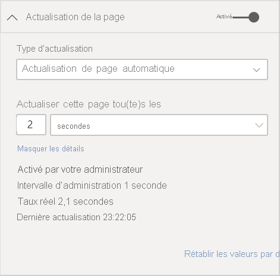
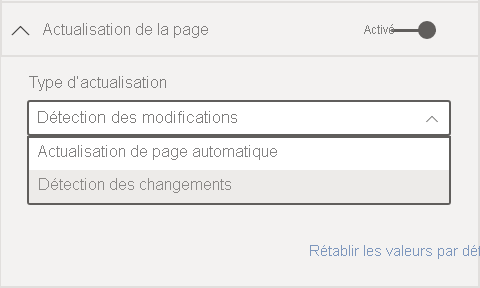
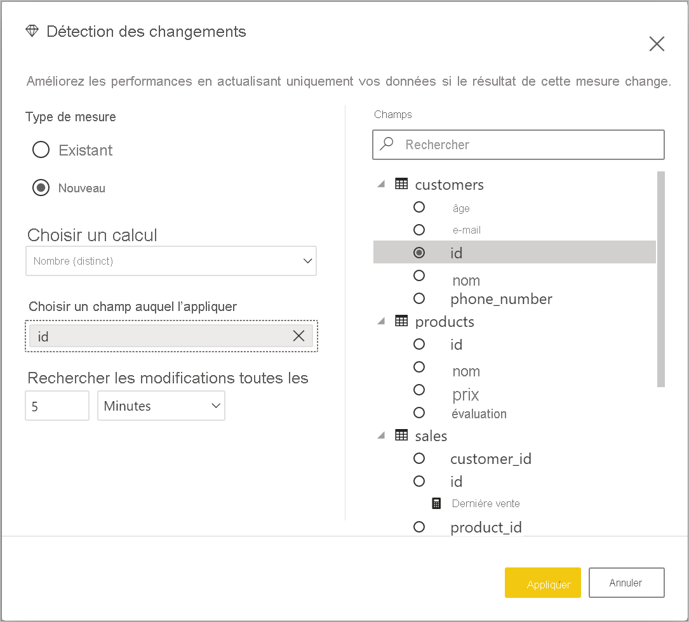
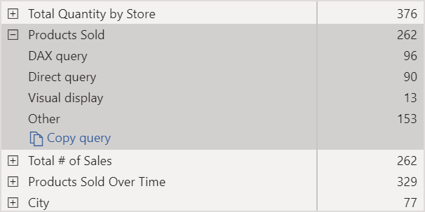
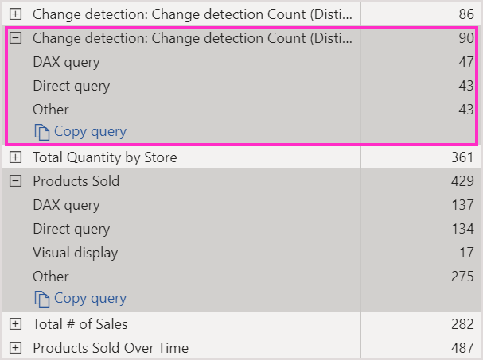
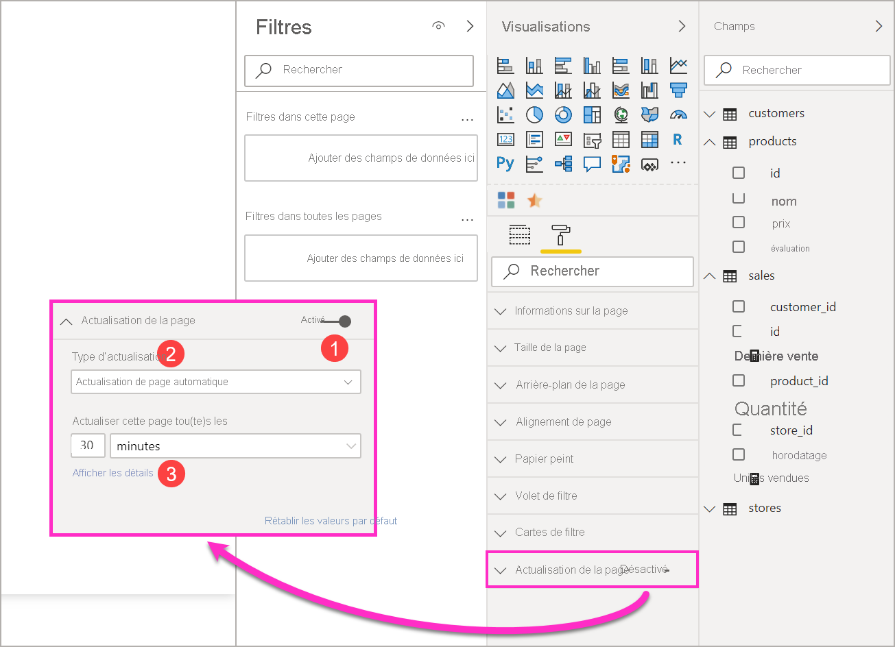
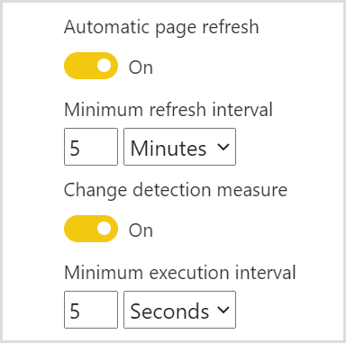

# Actualisation automatique des pages dans Power BI

Lors de la surveillance des événements critiques, il est important que les données soient actualisées dès que les données sources sont mises à jour. Par exemple, dans le secteur de la fabrication, il est essentiel de savoir quand un ordinateur ne fonctionne pas correctement ou est sur le point de connaître une défaillance. Si vous surveillez des signaux comme un sentiment sur les réseaux sociaux, vous souhaitez connaître les changements soudains dès qu’ils se produisent.

L’actualisation automatique de la page de Power BI permet à votre page de rapport active de rechercher de nouvelles données, à une cadence prédéfinie, pour les [sources DirectQuery](../connect-data/desktop-directquery-about.md).

## Types d'actualisation

Lorsque vous utilisez l’actualisation automatique de la page, deux types d’actualisation sont disponibles : intervalle fixe et détection des modifications.

### Intervalle fixe

Ce type d’actualisation vous permet de mettre à jour tous les visuels d’une page de rapport en fonction d’un intervalle constant, par exemple une seconde ou cinq minutes. Lorsque cet intervalle spécifique est atteint, tous les visuels de cette page envoient une requête de mise à jour à la source de données et se mettent à jour en conséquence.

### Détection des changements

Ce type d’actualisation vous permet d’actualiser des visuels sur une page en fonction de la détection des changements apportés aux données plutôt qu’à un intervalle d’actualisation spécifique. Plus précisément, cette mesure interroge les modifications apportées à votre [source DirectQuery](../connect-data/desktop-directquery-about.md). Outre la définition de la mesure, vous devez également sélectionner la fréquence à laquelle Power BI Desktop vérifiera les changements. Lors de la publication sur le service, ce type d’actualisation est uniquement pris en charge dans les espaces de travail qui font partie d’une capacité Premium.

## Création de rapports avec actualisation automatique des pages dans Power BI Desktop

L’actualisation automatique des pages n’est disponible que pour les [sources de DirectQuery](../connect-data/desktop-directquery-about.md), et donc uniquement si vous vous connectez à une source de données DirectQuery. Cette restriction s’applique aux deux types d’actualisation automatique des pages.

Pour utiliser l’actualisation automatique de la page dans Power BI, sélectionnez la page de rapport pour laquelle vous souhaitez activer l’actualisation automatique des pages. Dans le volet **Visualisations**, sélectionnez le bouton **Mise en forme** (un rouleau de peinture) et recherchez la section **Actualisation de la page** en bas du volet.

1. Active ou désactive l’actualisation des pages.
2. Type d’actualisation
3. Entrées et informations (selon le type d’actualisation)

La carte **Actualisation des pages** sera disponible uniquement si vous vous connectez à une [source DirectQuery](../connect-data/desktop-directquery-about.md). Pour activer l’actualisation automatique des pages, le bouton bascule doit être sur la position Activer. Les entrées nécessaires et les informations fournies dépendent du type d’actualisation sélectionné.

### Configuration d’un intervalle fixe

Lorsque vous sélectionnez **Actualisation automatique des pages** comme type d’actualisation, vous devez fournir l’intervalle d’actualisation souhaité. La valeur par défaut est 30 minutes. (L’intervalle d’actualisation minimal est d’une seconde.) Votre rapport commence à s’actualiser à l’intervalle que vous avez défini.

Quand vous cliquez sur Afficher les détails, Power BI fournit des informations supplémentaires en indiquant :

- Si la fonctionnalité est activée par votre administrateur (uniquement quand vous vous connectez à votre compte Power BI)
- L’intervalle minimal autorisé par votre administrateur (uniquement quand vous vous connectez à votre compte Power BI)
- Le taux d’actualisation réel (généralement plus long que l’intervalle sélectionné)
- Heure de la dernière actualisation

### Configuration de la détection des changements

Lorsque vous sélectionnez **Détection des changements** en tant que type d’actualisation, un lien vers **Ajouter la détection des changements** s’affiche. Vous pouvez également accéder à la fenêtre **Détection des changements** à partir de l’onglet Modélisation du ruban. Cliquez ensuite sur l’icône **Détection des changements** dans la section **Actualisation des pages**. Enfin, vous pouvez cliquer avec le bouton droit ou sélectionner la flèche déroulante en regard de toute valeur dans la zone valeurs, puis sélectionner **Détection des changements** dans le menu.

Une fois que la fenêtre est ouverte, l’option **Type de mesure** vous permet de sélectionner une mesure existante ou d’en créer une nouvelle à partir de zéro. Lors de la sélection d’une mesure existante, il vous suffit de sélectionner la mesure souhaitée dans la liste ou de la faire glisser dans la section **Choisir une mesure existante**. Lorsque vous créez une mesure, vous pouvez **Choisir un calcul** pour la mesure comprise entre count, count distinct, minimum, maximum et sum. Par exemple, vous pouvez utiliser count distinct pour compter les ID de client et actualiser uniquement lorsqu’un nouveau client est ajouté à la liste. Une fois que vous avez sélectionné une mesure, vous devez définir la fréquence à laquelle Power BI **vérifie les changements**. Il s’agit de la fréquence à laquelle Power BI calcule la mesure et vérifie les changements. Une fois que vous avez cliqué sur Appliquer, une nouvelle mesure avec l’icône de détection des changements s’affiche dans votre liste de champs.

Ensuite, de retour dans la section Actualisation des pages, vous verrez les informations relatives à la mesure utilisée pour la détection des changements et l’intervalle défini pour votre référence.

> [!NOTE]
> Une seule mesure de détection des changements est autorisée par modèle.

## Détermination de l’intervalle d’actualisation

Lorsque l’actualisation automatique de la page est activée, Power BI Desktop envoie en permanence des requêtes à votre source DirectQuery. Il y aura un délai entre l’envoi de la requête et l’obtention des données renvoyées. Par conséquent, pour des intervalles d’actualisation courts, vous devez vérifier que les requêtes renvoient correctement les données interrogées dans l’intervalle configuré. Si les données ne sont pas retournées dans l’intervalle, les objets visuels seront mis à jour moins fréquemment que ceux configurés.

Ces considérations s’appliquent aux deux types d’actualisation : intervalle fixe et détection des changements. La principale différence réside dans le fait que, pour la détection des changements, une seule requête revient à la source à intervalle fixe et que l’actualisation de l’élément visuel est déclenchée uniquement lorsque la valeur de la mesure de détection des changements change.

En guise de meilleure pratique, l’intervalle d’actualisation doit être au moins identique à celui attendu pour le taux d’arrivée de nouvelles données :

* Si de nouvelles données arrivent à la source toutes les 20 minutes, votre intervalle d’actualisation ne peut pas être inférieur à 20 minutes.
* Si de nouvelles données arrivent chaque seconde, définissez l’intervalle sur une seconde.

Pour les intervalles d’actualisation faibles comme une seconde, prenez en considération les facteurs suivants :

- Le type de la source de données DirectQuery
- La charge que vos requêtes créent
- La distance entre les observateurs de vos rapports et le centre de données de la capacité

Vous pouvez estimer les temps de retour à l’aide de [l’analyseur de performances](desktop-performance-analyzer.md) dans Power BI Desktop et le menu Afficher les détails dans la section Actualisation de la page pour le type d’actualisation à intervalle fixe. L’analyseur de performances vous permet de vérifier si chaque requête visuelle a suffisamment de temps pour revenir avec les résultats de la source. Il vous permet également de déterminer où le temps est passé. En fonction des résultats de l’analyseur de performances, vous pouvez ajuster la source de données, ou vous pouvez faire des essais avec d’autres visuels et mesures dans votre rapport.

Cette image montre les résultats d’une source DirectQuery dans l’analyseur de performances :

Examinons d’autres caractéristiques de cette source de données :

- Les données arrivent avec un rythme de 2 secondes
- L’analyseur de performances affiche un temps maximal de requête + affichage d’environ 4,9 secondes (4 688 millisecondes)
- La source de données est configurée pour gérer environ 1 000 requêtes simultanées par seconde
- Environ 10 utilisateurs peuvent afficher le rapport simultanément

Il en découle l’équation suivante :

- **5 visuels x 10 utilisateurs = environ 50 requêtes**

Le résultat de ce calcul indique une charge bien supérieure à celle que la source de données peut prendre en charge. Les données arrivent à un rythme de deux secondes, ce qui doit être votre taux d’actualisation. Toutefois, étant donné que l’exécution de la requête prend environ cinq secondes, vous devez la définir sur plus de cinq secondes.

Notez également que ce résultat peut différer lorsque vous publiez votre rapport sur le service. Cette différence est due au fait que le rapport utilisera l’instance Azure Analysis Services hébergée dans le cloud. Vous souhaiterez peut-être ajuster vos taux d’actualisation en conséquence.

Pour prendre en compte les requêtes et la cadence de l’actualisation, Power BI exécute uniquement la requête d’actualisation suivante lorsque toutes les requêtes d’actualisation restantes sont terminées. Par conséquent, même si l’intervalle d’actualisation est plus faible que le temps de traitement de vos requêtes, Power BI n’est actualisé qu’une fois les requêtes restantes terminées.

Dans le cas du type d’actualisation Détection des changements, ces considérations s’appliquent toujours. En outre, [l’analyseur de performances](desktop-performance-analyzer.md) affiche les résultats de la requête de mesure de détection des changements, même si elle ne correspond à aucun visuel dans votre rapport. Nous vous proposons cette fonctionnalité pour vous permettre de dépanner ce type de mesure spécifique en suivant les mêmes instructions que celles mentionnées précédemment. La principale différence pour ce type d’actualisation est qu’une seule requête va à la source de données au lieu de toutes les requêtes de tous les visuels. C’est toujours le cas si plusieurs utilisateurs visualisent le rapport.

Pour le même scénario, nous avons abordé les sujets suivants :

- **1 mesure de détection des changements pour 5 éléments visuels génère une seule requête pour un nombre quelconque de visionneuses**

- **Lorsque la mesure de détection des changements déclenche une mise à jour en supposant le même scénario qu’auparavant avec 5 éléments visuels x 10 utilisateurs = environ 50 requêtes**

Pour résumer, lors de l’utilisation de la détection des changements, une seule requête est envoyée à la source de données jusqu’à ce qu’une modification soit détectée. Dans ce cas, la logique utilisée pour le type d’actualisation à intervalle fixe applique la mise à jour de tous les visuels pour tous les utilisateurs générant le même nombre de requêtes. Cette approche devrait être la plus efficace à long terme.

Voyons ensuite comment vous pouvez potentiellement détecter et diagnostiquer les problèmes de performances en tant qu’administrateur de capacité. Vous pouvez également consulter la section [Forum Aux Questions](#frequently-asked-questions), plus loin dans cet article, pour voir des questions et des réponses sur les performances et la résolution des problèmes.

## Actualisation automatique de la page dans le service Power BI

Vous pouvez également définir l’actualisation automatique des pages pour les rapports qui ont été publiés dans le service Power BI tant que la source de données est [DirectQuery](../connect-data/desktop-directquery-about.md).

Pour configurer l’actualisation automatique des pages pour les rapports dans le service Power BI, vous utilisez des étapes similaires à celles pour Power BI Desktop. Quand elle est configurée dans le service Power BI, l’actualisation automatique des pages prend aussi en charge le contenu [Power BI incorporé](../developer/embedded/embedding.md). Cette illustration montre la configuration **d’actualisation de la page** pour le service Power BI :

1. Active ou désactive l’actualisation des pages.
2. Type d’actualisation
3. Entrées et informations (selon le type d’actualisation)

> [!NOTE]
> Lors de la publication de votre rapport avec actualisation automatique de la page de Power BI Desktop vers le service, vous devez fournir les informations d’identification de la source de données DirectQuery dans le menu de paramètres du jeu de données. Vous pouvez configurer les informations d’identification afin que les visionneuses de rapports accèdent à cette source de données avec leurs propres identités, en respectant la configuration de sécurité à la source. Dans le cas d’une mesure de détection des changements, elle est toujours évaluée avec les informations d’identification de l’auteur.

### Intervalles d’actualisation de la page

Les types et intervalles d’actualisation de la page autorisés dans le service Power BI sont affectés par le type d’espace de travail du rapport. Cela s’applique à ces scénarios :

* Publication d’un rapport dans un espace de travail pour lequel l’actualisation automatique de la page est activée
* Modification d’un intervalle d’actualisation de page se trouvant déjà dans un espace de travail
* Création d’un rapport directement dans le service

Power BI Desktop n’a aucune restriction pour l’intervalle d’actualisation, et peut être aussi fréquent que chaque seconde. Mais lorsque les rapports sont publiés sur le service Power BI, certaines restrictions s’appliquent et sont décrites dans les sections suivantes.

### Restrictions sur les intervalles d’actualisation

Dans le service Power BI, des restrictions d’actualisation automatique de la page s’appliquent en fonction de l’espace de travail dans lequel le rapport est publié, si vous utilisez ou non les services Premium, et les paramètres d’administration de capacité Premium.

Pour clarifier le fonctionnement de ces restrictions, commençons par des informations générales sur les capacités et les espaces de travail.

Les *capacités* sont un concept important de Power BI. Elles représentent un ensemble de ressources (stockage, processeur et mémoire) utilisées pour héberger et distribuer du contenu Power BI. Les capacités sont partagées ou dédiées. Une *capacité partagée* est partagée avec d’autres clients Microsoft. Une *capacité dédiée* est entièrement réservée pour un seul client. Pour une présentation des capacités dédiées, consultez [Gérer les capacités Premium](../admin/service-premium-capacity-manage.md).

Dans une capacité partagée, les charges de travail s’exécutent sur des ressources de calcul partagées avec d’autres clients. Étant donné que la capacité doit partager des ressources, des restrictions sont imposées pour s’assurer d’une *utilisation juste*, par exemple avec la définition d’une taille de modèle maximale (1 Go) et d’une fréquence d’actualisation quotidienne maximale (huit fois par jour).

Les *espaces de travail* Power BI résident sur des capacités. Ils représentent des conteneurs de sécurité, de collaboration et de déploiement. Chaque utilisateur Power BI dispose d’un espace de travail personnel nommé **Mon espace de travail**. Vous pouvez créer d’autres espaces pour permettre la collaboration et le déploiement. Ils sont appelés *espaces de travail*. Par défaut, les espaces de travail, qui incluent également les espaces de travail personnels, sont créés dans une capacité partagée.

Voici quelques détails sur les deux scénarios d’espace de travail :

**Espaces de travail partagés**. Pour les espaces de travail standard (les espaces de travail qui ne font pas partie d’une capacité Premium), l’actualisation automatique de la page a un intervalle minimal de 30 minutes (l’intervalle le plus bas autorisé). Le type d’actualisation de détection des changements n’est pas disponible dans les capacités partagées.

**Espaces de travail Premium**. La disponibilité de l’actualisation automatique de la page dans les espaces de travail Premium (aussi bien pour l’intervalle fixe que pour la détection des changements) dépend des paramètres de charge de travail que votre administrateur Premium a configurés pour la capacité Power BI Premium. Il existe deux variables qui peuvent affecter votre capacité à configurer l’actualisation automatique de la page :

 - **Fonctionnalité activée/désactivée**. Si votre administrateur de capacité a désactivé la fonctionnalité, vous ne pourrez pas configurer le type d’actualisation de page dans votre rapport publié. L’intervalle fixe et la détection des changements peuvent être activés et désactivés séparément.

 - **Intervalle minimal d’actualisation**. Lors de l’activation de l’actualisation automatique des pages pour un intervalle fixe, votre administrateur de capacité doit configurer un intervalle d’actualisation minimal (la valeur par défaut est de cinq minutes). Si votre intervalle est inférieur au minimum, le service Power BI remplace votre intervalle pour respecter l’intervalle minimal défini par votre administrateur de capacité.

 - **Intervalle d'exécution minimal**. Lors de l’activation de la détection des changements, votre administrateur de capacité doit configurer un intervalle d’exécution minimal (la valeur par défaut est de cinq secondes). Si votre intervalle est inférieur au minimum, le service Power BI remplace votre intervalle pour respecter l’intervalle minimal défini par votre administrateur de capacité.

Ce tableau décrit de façon plus détaillée où cette fonctionnalité est disponible, et les limites de chaque type de capacité et du [mode de stockage](../connect-data/service-dataset-modes-understand.md) :

| Mode de stockage | Capacité dédiée | Capacité partagée |
| --- | --- | --- |
| DirectQuery | **FI prise en charge** : Oui  **CD prise en charge** : Oui  **Minimum** : 1 seconde  **Remplacement par l’administrateur** : Oui | **FI prise en charge** : Oui  **CD prise en charge** : Non  **Minimum** : 30 minutes  **Remplacement par l’administrateur** : Non |
| Importer | **FI prise en charge** : Non  **CD prise en charge** : Non  **Minimum** : N/A  **Remplacement par l’administrateur** : N/A | **FI prise en charge** : Non  **CD prise en charge** : Non  **Minimum** : N/A  **Remplacement par l’administrateur** : N/A |
| Mode mixte (DirectQuery + autres sources de données) | **FI prise en charge** : Oui  **CD prise en charge** : Oui  **Minimum** : 1 seconde  **Remplacement par l’administrateur** : Oui | **FI prise en charge** : Oui  **CD prise en charge** : Non  **Minimum** : 30 minutes  **Remplacement par l’administrateur** : Non |
| Live Connect AS | **FI prise en charge** : Non  **CD prise en charge** : Non  **Minimum** : N/A  **Remplacement par l’administrateur** : N/A | **FI prise en charge** : Non  **CD prise en charge** : Non  **Minimum** : N/A  **Remplacement par l’administrateur** : N/A |
| Live Connect PBI | **FI prise en charge** : Non  **CD prise en charge** : Non  **Minimum** : N/A  **Remplacement par l’administrateur** : N/A | **FI prise en charge** : Non  **CD prise en charge** : Non  **Minimum** : N/A  **Remplacement par l’administrateur** : N/A |

*Légende du tableau :*
1. *FI : Intervalle fixe*
2. *CD : Détection des changements*

## Considérations et limitations

Il y a quelques éléments à prendre en compte lors de l’utilisation de l’actualisation automatique de la page, dans Power BI Desktop ou dans le service Power BI :

* Les modes de stockage Importer, Connexion active et Push ne sont pas pris en charge pour l’actualisation automatique de la page.  
* Les modèles composites qui ont au moins une source de données DirectQuery sont pris en charge.
* Power BI Desktop n’a aucune restriction pour les intervalles d’actualisation. L’intervalle peut être aussi fréquent que chaque seconde pour les types d’actualisation à intervalle fixe et de détection des changements. Lorsque les rapports sont publiés sur le service Power BI, certaines restrictions s’appliquent, comme décrit [précédemment](#restrictions-on-refresh-intervals) dans cet article.
* Vous ne pouvez avoir qu’une seule mesure de détection des changements par jeu de données.
* Il ne peut y avoir qu’un maximum de 10 modèles avec une mesure de détection des changements dans un locataire Power BI.

### Diagnostics des performances

L’actualisation automatique de la page est utile pour la surveillance des scénarios et l’exploration de données évoluant rapidement. Toutefois, cela peut parfois entraîner une charge excessive sur la capacité ou la source de données.

Pour éviter une charge excessive sur les sources de données, Power BI utilise ces protections :

- Toutes les requêtes d’actualisation automatique de la page s’exécutent avec une priorité inférieure pour s’assurer que les requêtes interactives (comme le chargement de la page et le filtrage croisé des visuels) restent prioritaires.
- Si une requête n’est pas terminée avant le prochain cycle d’actualisation, Power BI n’émet pas de nouvelles requêtes d’actualisation tant que la requête précédente n’est pas terminée. Par exemple, si vous avez un intervalle d’actualisation d’une seconde, et que vos requêtes prennent en moyenne quatre secondes, Power BI émet réellement une requête toutes les quatre secondes.

Il existe deux facteurs qui peuvent constituer des goulots d’étranglement des performances :

1. **La capacité**. La requête atteint d’abord la capacité Premium, qui replie et évalue la requête DAX générée à partir des visualisations de rapport dans les requêtes source.
2. **La source de données DirectQuery**. Les requêtes traduites à l’étape précédente sont ensuite exécutées sur la source. La source correspond à vos instances SQL Server, aux sources SAP Hana, etc.

À l’aide de [l’application Premium Capacity Metrics](../admin/service-admin-premium-monitor-capacity.md) disponible pour les administrateurs, vous pouvez visualiser la quantité de capacité utilisée par les requêtes de faible priorité.

Les requêtes de faible priorité consistent en des requêtes d’actualisation automatique de la page et des requêtes d’actualisation du modèle. Il n’existe actuellement aucun moyen de faire la distinction entre les charges des requêtes d’actualisation automatique de page et celles d’actualisation de modèle.

Si vous remarquez que la capacité est surchargée avec des requêtes de faible priorité, vous pouvez prendre certaines mesures :

- Demandez une référence SKU Premium plus grande.
- Demandez au propriétaire du rapport de réduire l’intervalle d’actualisation.
- Dans le portail d’administration de la capacité, vous pouvez :
   - Désactiver l’actualisation automatique de la page pour cette capacité.
   - Augmenter l’intervalle d’actualisation minimal, qui affectera tous les rapports sur cette capacité.

### Forum Aux Questions

**Je suis un auteur de rapport. J’ai défini l’intervalle d’actualisation de mon rapport sur une seconde sur Power BI Desktop, mais après la publication, mon rapport n’est pas actualisé dans le service.**

* Vérifiez que l’actualisation automatique de la page est activée pour la page. Étant donné que ce paramètre est propre à chaque page, vous devez vous assurer qu’il est activé pour chaque page du rapport que vous voulez actualiser.
* Vérifiez que vous avez téléchargé sur un espace de travail avec une capacité Premium attachée. Dans le cas contraire, votre intervalle d’actualisation sera verrouillé sur 30 minutes pour l’intervalle fixe et ne sera pas disponible pour la détection des changements.
* Si votre rapport se trouve dans un espace de travail Premium, demandez à votre administrateur si cette fonctionnalité est activée pour la capacité attachée. En outre, assurez-vous que l’intervalle d’actualisation minimal pour la capacité est inférieur ou égal à l’intervalle de votre rapport. Cela s’applique séparément à l’intervalle fixe et à la détection des changements

**Je suis administrateur de capacité. J’ai modifié les paramètres de l’intervalle d’actualisation automatique de la page, mais les modifications ne sont pas reflétées. En d’autres termes, les rapports ne sont toujours pas actualisés au rythme auquel ils devraient l’être ou ne s’actualisent pas, même si j’ai activé l’actualisation automatique de la page.**

* Les modifications apportées aux paramètres d’actualisation automatique de la page prennent jusqu’à 5 minutes pour se propager aux rapports.
* Outre l’activation de l’actualisation automatique de la page pour la capacité, vous devez également l’activer pour les pages des rapports de votre choix.
* Les deux types d’actualisation sont gérés séparément. Assurez-vous que le type d’actualisation que vous voulez activer est bien activé.

**Mon rapport fonctionne en mode mixte. (Le mode mixte signifie que le rapport a une connexion DirectQuery et une source de données d’importation.) Certains objets visuels ne sont pas actualisés.**

- Si vos éléments visuels référencent des tables d’importation, ce comportement est attendu. L’actualisation automatique des pages n’est pas prise en charge pour l’importation.
- Consultez la première question de cette section.

**Mon rapport s’actualisait dans le service quand il s’est arrêté soudainement.**

* Essayez d’actualiser la page pour voir si le problème se résout de lui-même.
* Vérifiez auprès de votre administrateur de capacité. L’administrateur a peut-être désactivé la fonctionnalité ou augmenté l’intervalle d’actualisation minimal. (Voir la deuxième question de cette section.)

**Je suis un auteur de rapport. Mes visuels ne sont pas actualisés à la cadence que j’ai indiquée. Ils sont actualisés à un rythme plus lent.**

* Si l’exécution de vos requêtes prend du temps, l’intervalle d’actualisation sera retardé. L’actualisation automatique de la page attend la fin de l’exécution de toutes les requêtes avant d’en exécuter de nouvelles.
* Votre administrateur de capacité a peut-être défini un intervalle d’actualisation minimal supérieur à celui que vous avez défini pour votre rapport. Demandez à votre administrateur de capacité de réduire l’intervalle d’actualisation minimal.

**Les requêtes d’actualisation de page automatique sont-elles traitées à partir du cache ?**

* Non. Toutes les requêtes d’actualisation automatique de la page contournent les données mises en cache.

**Ma mesure de détection des changements ne déclenche aucune mise à jour**

* Vérifiez que la détection des changements est activée pour la page. Étant donné que ce paramètre est propre à chaque page, vous devez vous assurer qu’il est activé pour chaque page du rapport que vous voulez actualiser.
* Vérifiez que vous avez téléchargé sur un espace de travail avec une capacité Premium attachée. Dans le cas contraire, la détection des changements ne fonctionnera pas.
* Si votre rapport se trouve dans un espace de travail Premium, demandez à votre administrateur si cette fonctionnalité est activée pour la capacité attachée. En outre, assurez-vous que l’intervalle d’exécution minimal pour la capacité est inférieur ou égal à l’intervalle de votre rapport.
* Si vous avez vérifié tous les éléments mentionnés précédemment, regardez dans Power BI Desktop ou en mode édition si la mesure change en premier lieu. Pour ce faire, faites-la glisser dans la zone de dessin et vérifiez si la valeur change. Si ce n’est pas le cas, la mesure peut ne pas être un bon choix pour interroger les changements de la source de données.

## Étapes suivantes

Pour plus d’informations, consultez les articles suivants :

* [Utilisation de DirectQuery dans Power BI](../connect-data/desktop-directquery-about.md)
* [Utiliser des modèles composites dans Power BI Desktop](../transform-model/desktop-composite-models.md)
* [Utiliser l’analyseur de performances pour examiner les performances des éléments de rapport](desktop-performance-analyzer.md)
* [Déployer et gérer les capacités Power BI Premium](../guidance/whitepaper-powerbi-premium-deployment.md)
* [Sources de données dans Power BI Desktop](../connect-data/desktop-data-sources.md)
* [Mettre en forme et combiner des données dans Power BI Desktop](../connect-data/desktop-shape-and-combine-data.md)
* [Se connecter à des classeurs Excel dans Power BI Desktop](../connect-data/desktop-connect-excel.md)   
* [Entrer des données directement dans Power BI Desktop](../connect-data/desktop-enter-data-directly-into-desktop.md)   
