# Créer des signets dans Power BI Desktop pour partager des insights et créer des récits
L’utilisation de *signets* dans Power BI Desktop vous permet de capturer la vue actuellement configurée d’une page de rapport, y compris le filtrage et l’état des objets visuels. Vous pouvez revenir ultérieurement à cet état en sélectionnant le signet enregistré. 

Vous pouvez également créer une collection de signets, les réorganiser dans l’ordre de votre choix, puis parcourir chaque signet d’une présentation pour mettre en avant une série d’insights ou le récit que vous souhaitez raconter avec vos visuels et vos rapports. 

Les signets ont de nombreuses utilisations. Par exemple, vous pouvez utiliser les signets pour suivre la progression de la création de rapports (les signets sont faciles à ajouter, à supprimer et à renommer). Il est également possible de créer des signets pour concevoir une présentation de type PowerPoint qui parcourt les signets dans l’ordre, de façon à accompagner votre rapport d’un récit. 

> [!TIP]
> Pour plus d’informations sur l’utilisation de signets personnels dans le service Power BI, lisez [Announcing personal bookmarks in the Power BI Service](https://powerbi.microsoft.com/blog/announcing-personal-bookmarks-in-the-power-bi-service/). 

## Utilisation des signets
Pour utiliser des signets, sélectionnez l’onglet **Affichage** dans le ruban Power BI Desktop, puis sélectionnez **Volet de signets**. 

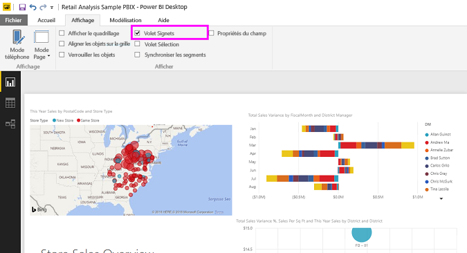

Lorsque vous créez un signet, les éléments suivants sont enregistrés :

* Page actuelle
* Filtres
* Segments, y compris le type de segments (par exemple, liste déroulante ou liste) et l’état des segment
* État de sélection des visuels (par exemple, filtres de mise en surbrillance croisée)
* Ordre de tri
* Emplacement d’exploration
* Visibilité d’un objet (à l’aide du volet **Sélection**)
* Le mode focus ou **À la une** des objets visibles

Configurez une page de rapport telle que vous souhaitez qu’elle apparaisse dans le signet. Une fois que votre page de rapport et les visuels sont organisés comment vous le souhaitez, sélectionnez **Ajouter** dans le volet **Signets** pour ajouter un signet. 

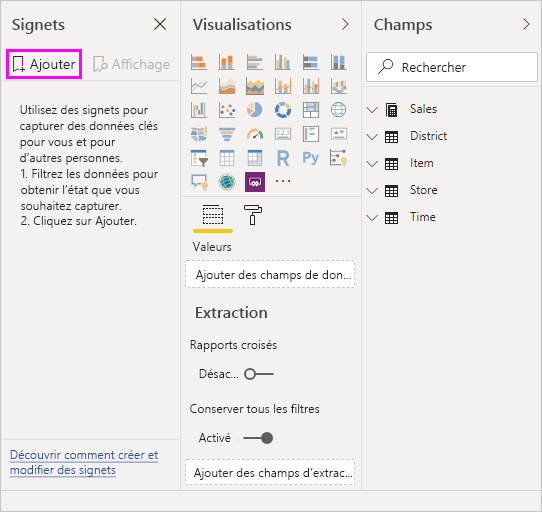

Power BI Desktop crée un signet et lui donne un nom générique. Vous pouvez facilement **renommer**, **supprimer** ou **mettre à jour** un signet en sélectionnant les points de suspension en regard de son nom, puis en sélectionnant une action dans le menu qui s’affiche.

Une fois que vous avez créé un signet, affichez-le en le sélectionnant dans le volet **Signets**. 

Vous pouvez également choisir si chaque signet appliquera des propriétés de **données**, comme des filtres et des segments, des propriétés **d’affichage**, comme À la une et sa visibilité, et les modifications de la **page active** représentant la page qui était visible lors de l’ajout du signet. Ces fonctionnalités sont utiles si vous utilisez des signets pour naviguer entre les vues de rapport ou les sélections de visuels. Dans ce cas, vous pouvez désactiver les propriétés de données afin d’empêcher la réinitialisation des filtres quand les utilisateurs changent de vues en sélectionnant un signet. 

Pour effectuer ces modifications, sélectionnez les points de suspension en regard du nom du signet, puis sélectionnez ou désélectionnez les coches en regard de **Données**, **Affichage** et autres contrôles. 

## Organisation des signets
Lorsque vous créez des signets, vous pouvez trouver que l’ordre dans lequel vous les créez est différent de l’ordre dans lequel vous voulez les présenter à votre audience. Cela ne constitue pas un problème, car vous pouvez facilement réorganiser l’ordre des signets.

- Dans le volet **Signets**, glissez-déplacez les signets pour en changer l’ordre. 

   La barre jaune entre les signets désigne où le signet déplacé sera positionné.

   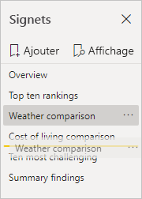

L’ordre de vos signets peut devenir important lorsque vous utilisez la fonctionnalité **Vue** des signets, comme décrit dans la section suivante.

## Signets en mode diaporama
Lorsque vous avez une collection de signets que vous souhaitez présenter dans l’ordre, vous pouvez sélectionner **Vue** dans le volet **Signets** pour lancer un diaporama.

Le mode **Vue** offre des fonctionnalités intéressantes.

   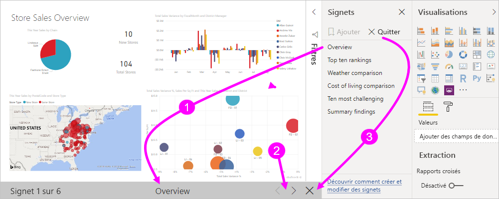

1. Le nom du signet apparaît dans la barre de titre de celui-ci, qui apparaît au bas du canevas.

2. La barre de titre des signets comporte des flèches permettant de passer au signet suivant ou précédent.

3. Vous pouvez quitter le mode **Vue** en sélectionnant **Quitter** dans le volet **Signets** ou la croix (**X**) dans la barre de titre des signets. 

Lorsque vous êtes en mode **Vue**, vous pouvez fermer le volet **Signets** (en sélectionnant le **X** dans ce volet) pour fournir davantage d’espace à votre présentation. En mode **Vue**, tous les visuels sont interactifs et compatibles avec la sélection croisée, comme dans toute autre interaction directe. 

## Visibilité : Utilisation du volet Sélection
Le volet **Sélection** (qui est associé au volet **Signets**) liste tous les objets de la page active. Il permet de sélectionner un objet et de spécifier si un objet est visible. 

Dans le volet **Sélection**, sélectionnez un objet, et choisissez de le rendre ou non visible à l’aide de l’icône représentant un œil, qui est située à droite de l’objet. 

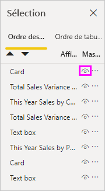

Lorsque vous ajoutez un signet, l’état de visibilité de chaque objet est également enregistré en fonction de son paramètre dans le volet **Sélection**. 

Il est important de noter que les segments continuent de filtrer une page de rapport, qu’ils soient visibles ou non. Par conséquent, vous pouvez créer différents signets, avec différents paramètres de segment. Vous pouvez ainsi donner un aspect différent à une page de rapport (et mettre en évidence différents insights) en créant différents signets.

> [!NOTE]
> Lorsque vous utilisez le volet **Sélection** en combinaison avec les signets, la modification de la visibilité d’une sélection entraîne le rétablissement du paramètre par défaut. Après avoir apporté ces modifications, vous pouvez cliquer avec le bouton droit sur un signet et sélectionner *Mettre à jour* pour mettre à jour sa visibilité.

## Signets pour les formes et images
Vous pouvez également lier des formes et des images à des signets. Lorsque vous sélectionnez un objet, cette fonctionnalité affiche le signet associé à l’objet. Cette fonctionnalité peut être particulièrement utile lorsque vous utilisez des boutons. Pour plus d’informations, consultez [Utilisation des boutons dans Power BI](desktop-buttons.md). 

Pour affecter un signet à un objet : 

1. Sélectionnez l’objet dans le canevas de rapport. Ensuite, dans le volet **Format de la forme** qui s’affiche, déplacez le curseur **Action** sur la valeur **Activé**.

2. Développez la section **Action**. Sous **Type**, sélectionnez **Signet**.

3. Sous **Signets**, sélectionnez un signet.

   

Les signets liés à des objets vous permettent d’effectuer des tâches très diverses. Vous pouvez créer un tableau visuel de contenu dans la page de rapport. Vous pouvez également fournir différentes vues (telles que des types de visuels) de la même information.

Lorsque vous êtes en mode édition, appuyez sur **Ctrl**, puis sélectionnez le lien pour le suivre. Si vous n’êtes pas en mode édition, sélectionnez l’objet pour suivre le lien. 

## Groupes de signets

À compter de la version d’août 2018 de Power BI Desktop, vous pouvez créer et utiliser des groupes de signets. Un groupe de signets est une collection de signets que vous spécifiez et qui peuvent être affichés et organisés sous forme de groupe. 

Pour créer un groupe de signets : 
1. Appuyez sur **Ctrl** et sélectionnez les signets que vous souhaitez inclure dans le groupe. 

2. Sélectionnez les points de suspension en regard des signets sélectionnés, puis sélectionnez **Groupe** dans le menu qui s’affiche.

   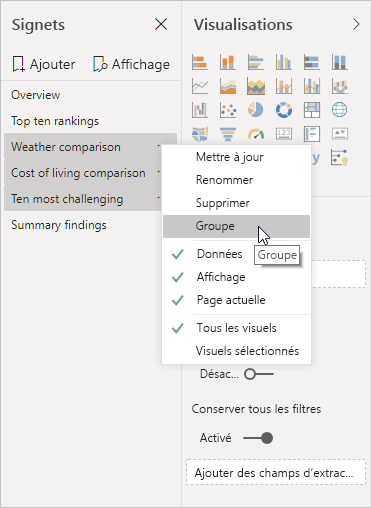

Power BI Desktop nomme automatiquement le groupe *Groupe 1*. Vous pouvez sélectionner les points de suspension en regard de ce nom, sélectionner **Renommer**, puis le renommer comme vous le souhaitez.

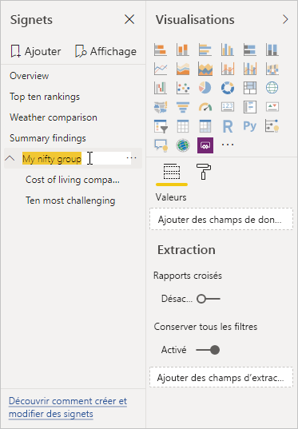

Comme avec tous les groupes de signets, le fait de développer le nom d’un groupe de signets développe ou réduit seulement le groupe de signets. Le nom ne représente pas le signet. 

Lorsque vous utilisez la fonctionnalité **Vue** des signets, les détails suivants s’appliquent :

* Si le signet sélectionné est dans un groupe quand vous sélectionnez **Afficher** à partir des signets, seuls les signets *de ce groupe* apparaissent dans la session de visualisation. 

* Si le signet sélectionné n’est pas dans un groupe ou est au plus haut niveau (comme le nom d’un groupe de signets), tous les signets de l’intégralité du rapport sont affichés, y compris les signets des groupes. 

Pour dissocier des signets : 
1. Sélectionnez un signet dans un groupe et sélectionnez les points de suspension. 

2. Dans le menu qui s’affiche, sélectionnez **Dissocier**.

   

   Le fait de sélectionner l’option **Dissocier** pour un signet a pour effet de retirer tous les signets du groupe (cette action supprimer le groupe, mais pas les signets eux-mêmes). 

Pour supprimer un signet d’un groupe : 
1. **Dissociez** tous les membres du groupe pour supprimer l’intégralité du regroupement. 

2. Sélectionnez les membres que vous souhaitez inclure dans le nouveau groupe en appuyant sur **Ctrl** et en sélectionnant chaque signet, puis sélectionnez **Groupe** de nouveau. 

## Utilisation du mode À la une
La fonctionnalité *À la une* est également fournie avec les signets. Avec la fonction À la une, vous pouvez attirer l’attention sur un graphique spécifique, par exemple lors de la présentation de vos signets en mode **Vue**.

Comparons les modes À la une et Focus pour voir en quoi ils diffèrent.

1. Avec le mode Focus, vous sélectionnez l’icône **Mode Focus** d’un visuel. De cette façon, l’intégralité du canevas est remplie par le visuel.

2. Avec le mode À la une, vous sélectionnez **À la une** en sélectionnant les points de suspension d’un visuel afin d’afficher celui-ci dans sa taille d’origine, ce qui rend transparent tous les autres visuels de la page. 

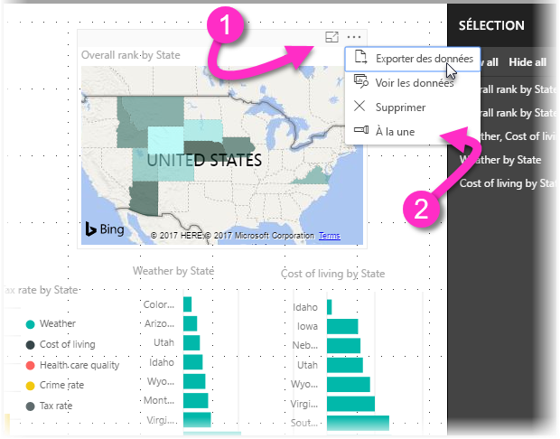

Lorsque vous sélectionnez l’icône **Mode Focus** du visuel dans l’image précédente, la page suivante s’affiche :

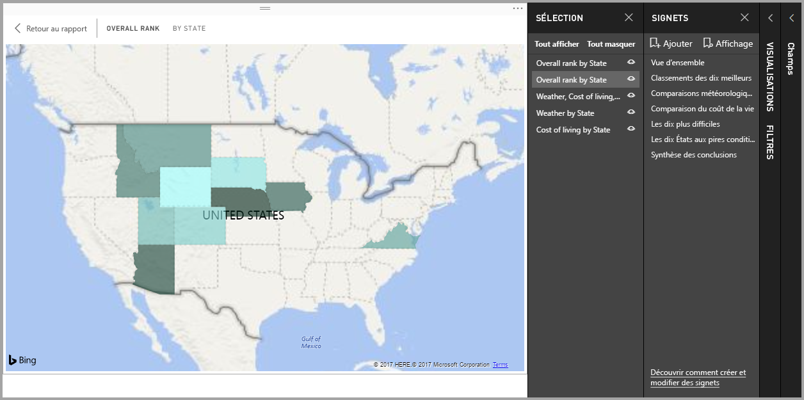

En revanche, quand **À la une** est sélectionné à l’aide des points de suspension du visuel, la page suivante s’affiche :

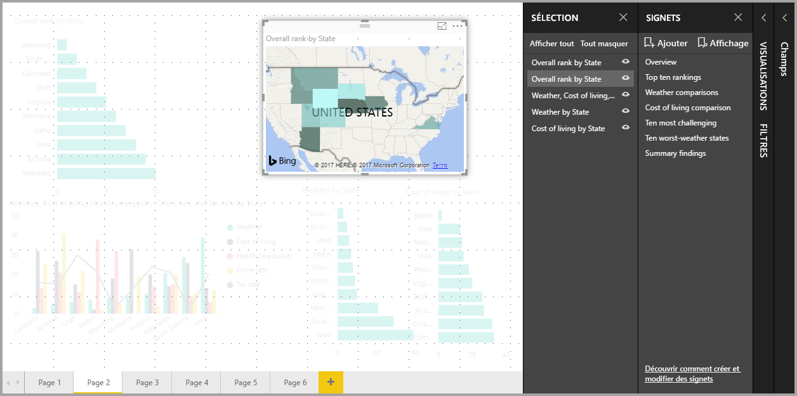

Si l’un des modes est sélectionné lors de l’ajout d’un signet, ce mode est conservé dans le signet.

## Signets dans le service Power BI
Lorsque vous publiez un rapport contenant au moins un signet dans le service Power BI, vous pouvez afficher et utiliser les signets dans le service Power BI. Lorsque des signets sont disponibles dans un rapport, affichez les volets **Sélection** et **Signets** en sélectionnant **Affichage** > **Volet Sélection** ou **Affichage** > **Volet Signets**. 

Dans le service Power BI, le volet **Signets** fonctionne comme dans Power BI Desktop, y compris la possibilité de sélectionner **Vue** pour afficher vos signets dans l’ordre, comme un diaporama.

Utilisez la barre de titre de signets grise, au lieu des flèches noires, pour parcourir les signets (les flèches noires permettent de passer d’une page de rapport à l’autre, et non d’un signet à l’autre).

## Activer la préversion des signets (versions antérieures à mars 2018)
Depuis la version de mars 2018 de Power BI Desktop, les signets sont en disponibilité générale. 

Nous vous conseillons de toujours effectuer la mise à niveau vers la version la plus récente. Si vous utilisez une version antérieure de Power BI Desktop, vous pouvez essayer la fonctionnalité Signets à partir de la version d’octobre 2017 de Power BI Desktop et, pour les rapports compatibles avec les signets, dans le service Power BI également. 

Pour activer la fonctionnalité Signets en préversion : 

1. Sélectionnez **Fichier** > **Options et paramètres** > **Options** > **Fonctionnalités en préversion**, puis sélectionnez **Signets**. 

   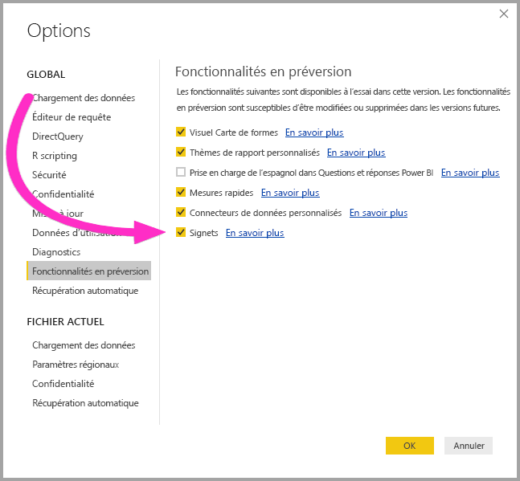

2. Redémarrez Power BI Desktop pour activer la préversion des signets.

## Considérations et limitations
Pour cette version de la fonctionnalité Signets, vous devez garder à l’esprit les considérations et limitations suivantes.

* La plupart des visuels Power BI doivent fonctionner correctement avec l’attribution de signets. Toutefois, si vous rencontrez des problèmes avec l’attribution de signets et un visuel personnalisé, contactez le créateur de ce dernier et demandez-lui d’ajouter la prise en charge des signets pour son visuel. 
* Si vous ajoutez un visuel dans une page de rapport après la création d’un signet, le visuel s’affichera dans son état par défaut. Autrement dit, si vous introduisez un segment dans une page où vous avez précédemment créé des signets, le segment sera dans son état par défaut.
* Le déplacement d’un visuel après la création d’un signet se reflète automatiquement dans ce dernier. 

## Étapes suivantes
Pour plus d’informations sur les fonctionnalités qui sont similaires ou sur l’utilisation des signets, consultez les articles suivants :

* [Utiliser une extraction dans Power BI Desktop](desktop-drillthrough.md)
* [Afficher une vignette de tableau de bord ou un visuel de rapport en mode Focus](../consumer/end-user-focus.md)
