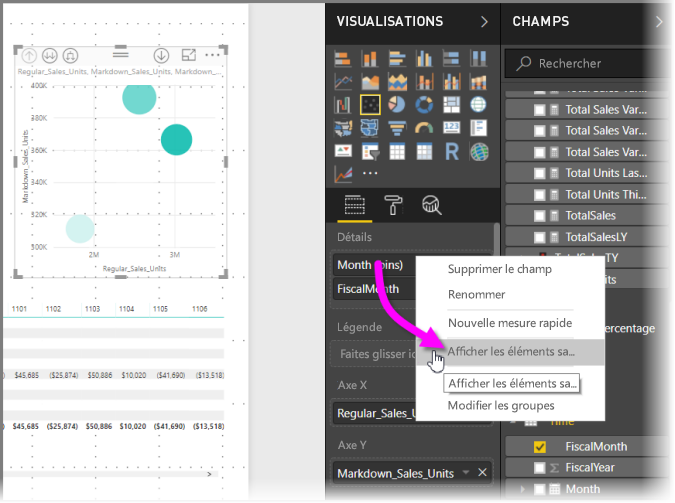
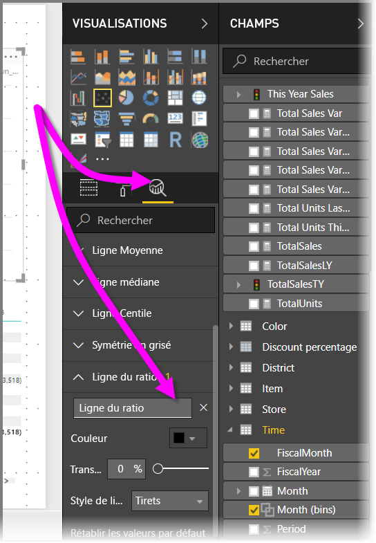
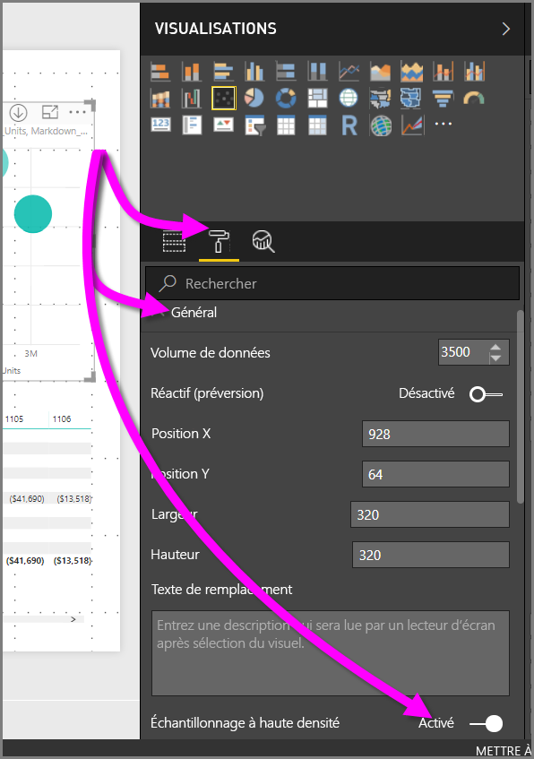

# Échantillonnage à haute densité dans les nuages de points de Power BI
À compter de la version de septembre 2017 de **Power BI Desktop** et des mises à jour apportées au **service Power BI**, un nouvel algorithme d’échantillonnage est disponible, qui améliore la façon dont les nuages de points représentent des données à haute densité.

Par exemple, vous pouvez créer un nuage de points à partir de l’activité de ventes de votre organisation, chaque magasin ayant des dizaines de milliers de points de données chaque année. Un nuage de points formé à partir de ces informations échantillonne les données (sélectionnez une représentation explicite de ces données pour illustrer la manière dont les ventes ont évolué au fil du temps) à partir des données disponibles ; un nuage de points représentant les données sous-jacentes est alors créé. Il s’agit d’une pratique courante pour les nuages de points à haute densité. Cet article décrit en détail comment Power BI a amélioré son échantillonnage des données à haute densité.

> [!NOTE]
> L’algorithme **Échantillonnage à haute densité** décrit dans cet article est disponible dans les nuages de points pour **Power BI Desktop** et pour le **service Power BI**.
> 
> 

## Fonctionnement des nuages de points à haute densité
Auparavant, **Power BI** sélectionnait une collection de points de données échantillons dans la plage complète des données sous-jacentes de manière déterministe afin de créer un nuage de points. Plus précisément, Power BI sélectionnait les première et dernière lignes de données dans la série utilisée pour produire le nuage de points, puis divisait uniformément les lignes restantes de façon à ce que 3 500 points de données au total soient représentés sur le nuage de points. Par exemple, si l’échantillon comptait 35 000 lignes, les première et dernière lignes étaient sélectionnées pour le traçage, puis chaque dixième ligne était également tracée (35 000 / 10 = chaque dixième ligne = 3 500 points de données). Toujours auparavant, les valeurs ou points Null qui ne pouvaient pas être tracés (par exemple les valeurs de texte) dans une série de données n’étaient pas affichés et étaient donc ignorés lors de la génération du visuel. Avec ce type d’échantillonnage, la densité perçue du nuage de points était également basée sur les points de données représentatifs, de sorte que la densité du visuel obtenu dépendait des points échantillonnés, et non pas de la collection complète des données sous-jacentes.

Lorsque vous activez l’option **Échantillonnage à haute densité**, Power BI implémente un algorithme qui élimine les points qui se chevauchent, garantissant ainsi que les points du visuel sont accessibles lors de l’interaction avec celui-ci. L’algorithme garantit également que tous les points du jeu de données sont représentés dans le visuel, ce qui fournit un contexte pour comprendre la signification des points sélectionnés, au lieu de tracer seulement un échantillon représentatif.

Par définition, les données à haute densité sont échantillonnées pour créer des visualisations d’une façon raisonnablement rapide, qui réagissent à l’interactivité. Trop de points de données sur un visuel peuvent le ralentir et nuire à la visibilité des tendances. Ainsi, la façon dont les données sont échantillonnées est ce qui gouverne la création de l’algorithme d’échantillonnage, pour offrir une expérience de visualisation optimale et garantir que toutes les données sont représentées. Dans Power BI, l’algorithme a été amélioré afin de fournir une combinaison optimale de réactivité, de représentation et de préservation claire des points importants de la totalité du jeu de données.

> [!NOTE]
> Les nuages de points utilisant l’algorithme **Échantillonnage à haute densité** sont tracés de façon optimale sur des visuels carrés, comme c’est le cas de tous les nuages de points.
> 
> 

## Fonctionnement du nouvel algorithme d’échantillonnage de nuage de points
Le nouvel algorithme **Échantillonnage à haute densité** utilisé pour la génération des nuages de points fait usage de méthodes qui capturent et représentent les données sous-jacentes plus efficacement, et élimine les points qui se chevauchent. Pour cela, il commence par un petit rayon pour chaque point de données (taille de cercle du visuel pour un point donné sur la visualisation). Il augmente ensuite le rayon de tous les points de données. En cas de chevauchement de points de données, un cercle unique (de la taille de rayon accrue) représente les points de données qui se chevauchent. L’algorithme continue d’augmenter le rayon des points de données, jusqu’à ce que la taille de celui-ci permette d’afficher à un nombre raisonnable de points de données (3 500) dans le nuage de points.

Les méthodes utilisées dans cet algorithme veillent que les valeurs hors norme soient représentées dans le visuel final. L’algorithme respecte également l’échelle lors de la détermination du chevauchement. Par exemple, les échelles exponentielles reflètent fidèlement les points de données sous-jacents visualisés.

L’algorithme conserve également la forme globale du nuage de points.

> [!NOTE]
> Lorsque vous utilisez l’algorithme d’**Échantillonnage à haute densité** pour des nuages de points, l’objectif est une *distribution précise* des données, *non* la densité du visuel obtenu. Par exemple, vous pouvez voir un nuage de points contenant un grand nombre de cercles qui se chevauchent (densité importante) dans une certaine zone, et imaginer que de nombreux points de données y sont agglutinés. Étant donné que l’algorithme d’**Échantillonnage à haute densité** peut utiliser un seul cercle pour représenter de nombreux points de données, une telle densité (ou « agglutination ») de visuel n’apparaît pas. Pour afficher plus de détails dans une zone donnée, vous pouvez utiliser des segments pour effectuer un zoom avant.
> 
> 

Par ailleurs, les points de données qui ne peuvent pas être tracés (par exemple, des valeurs Null ou des valeurs de texte) étant ignorés, une autre valeur traçable est sélectionnée, ce qui garantit la conservation de la forme réelle du nuage de points.

### Quand l’algorithme standard est utilisé pour les nuages de points
Dans certaines circonstances, l’algorithme **Échantillonnage à haute densité** ne peut pas être appliqué à un nuage de points : l’algorithme d’origine est alors utilisé. Ces circonstances sont les suivantes :

* Si vous cliquez sur une valeur sous **Détails** et que vous la définissez sur **Afficher les éléments sans données** dans le menu, le nuage de points revient à l’algorithme d’origine.
  
  
* Toute valeur sur l’axe de **lecture** a pour effet que le nuage de points revient à l’algorithme d’origine.
* Si les deux axes, X et Y, sont manquants sur un nuage de points, le graphique revient à l’algorithme d’origine.
* L’utilisation de l’option **Ligne du ratio** dans le volet **Analytique** a pour effet que le graphique revient à l’algorithme d’origine.
  
  

## Activer l’échantillonnage à haute densité pour un nuage de points
Pour activer **Échantillonnage à haute densité**, sélectionnez un nuage de points, accédez au volet **Mise en forme**, développez la carte **Général** et, près du bas de cette carte, faites glisser le curseur **Échantillonnage à haute densité** sur **Activé**.

> [!NOTE]
> Une fois le curseur activé, Power BI essaie d’utiliser l’algorithme d’**Échantillonnage à haute densité** chaque fois que c’est possible. Quand l’algorithme est inutilisable (par exemple, vous si placez une valeur sur l’axe de *Lecture*), le curseur reste en position **Activé**, même si le graphique a été rétabli sur l’algorithme standard. Si vous supprimez ensuite une valeur de l’axe de *Lecture* (ou si les conditions changent pour permettre l’utilisation de l’algorithme d’échantillonnage à haute densité), le graphique utilise automatiquement l’échantillonnage à haute densité pour ce graphique, car la fonctionnalité est activée.
> 
> [!NOTE]
> Les points de données sont groupés ou sélectionnés selon l’index. La présence d’une légende n’affecte pas l’échantillonnage pour l’algorithme, mais uniquement l’ordre du visuel.
> 
> 

## Considérations et limitations
L’algorithme d’échantillonnage à haute densité constitue une amélioration importante apportée à Power BI, mais vous n’avez que peu de choses à savoir quand vous travaillez avec des valeurs à haute densité et des nuages de points.

* L’algorithme **Échantillonnage à haute densité** fonctionne uniquement avec des connexions actives à des modèles basés sur le service Power BI, à des modèles importés ou à DirectQuery.

## Étapes suivantes

Pour plus d’informations sur l’échantillonnage à haute densité, consultez les articles suivants :

* [Échantillonnage de lignes à haute densité dans Power BI](desktop-high-density-sampling.md)
* [Conseils pour trier et distribuer des tracés de données dans les rapports Power BI](../guidance/report-tips-sort-distribute-data-plots.md)
