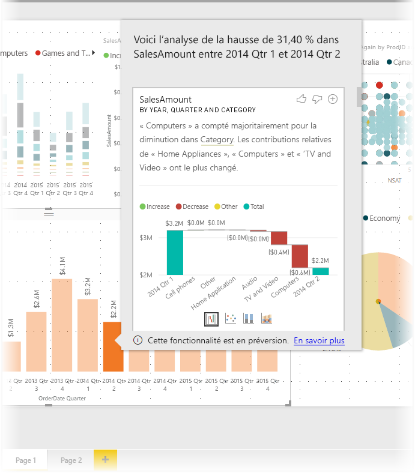
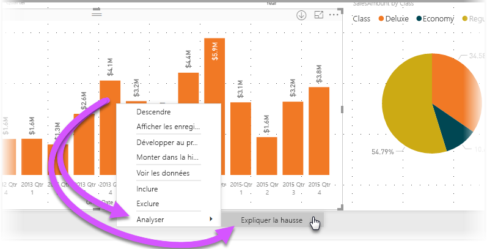
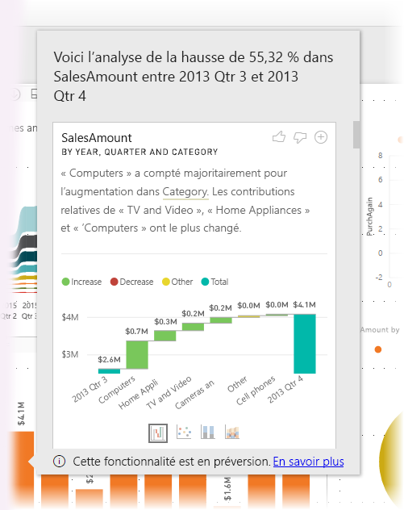

# Appliquer des insights dans Power BI pour expliquer les fluctuations dans les visuels (préversion)

Les visuels font souvent apparaître une hausse de valeur importante suivie d’une baisse marquée, et vous vous interrogez sur la cause de telles fluctuations. Grâce aux **insights** de **Power BI Desktop**, vous pouvez identifier la cause en quelques clics.

Par exemple, penchons-nous sur le visuel suivant qui présente le total des ventes (*Sales Amount*) par année (*Year*) et par trimestre (*Quarter*). Une baisse significative des ventes se produit en 2014, avec une chute marquée entre les 1er trimestre (*Qtr 1*) et 2e trimestre *Qtr 2*. Dans ce cas, vous pouvez explorer les données pour obtenir une explication sur ce qui s’est passé. 

Vous pouvez demander à **Power BI Desktop** d’expliquer des hausses ou des baisses observées dans des graphiques, voir des facteurs de distribution dans des graphiques et obtenir une analyse automatique, rapide et révélatrice de vos données. Cliquez simplement avec le bouton droit sur un point de données, puis sélectionnez **Analyser > Expliquer la baisse** (ou la hausse si la barre précédente était plus basse), ou **Analyser > Trouver où cette distribution est différente**. Vous obtenez ainsi des informations dans une fenêtre facile à utiliser.

Cette fonctionnalité est contextuelle et basée sur le point de données immédiatement précédent, par exemple, la barre ou la colonne précédentes.

> [!NOTE]
> Cette fonctionnalité étant en préversion, elle est sujette à modification. La fonctionnalité permettant d’obtenir des informations est activée par défaut (vous n’avez pas besoin de cliquer sur une zone d’aperçu pour l’activer) à partir de la version de septembre 2017 de **Power BI Desktop**.

## Utilisation des informations
Pour utiliser les insights et obtenir une explication sur les hausses et les baisses observées dans les graphiques, cliquez simplement avec le bouton droit sur un point de données dans un histogramme ou un graphique en courbes, puis sélectionnez **Analyser > Expliquer la hausse** (ou *Expliquer la baisse*, sachant que tous les insights fournis sont basés sur l’évolution par rapport au point de données précédent).

**Power BI Desktop** exécute alors ses algorithmes d’apprentissage sur les données, puis insère dans une fenêtre un visuel et une description des catégories qui ont le plus influencé la hausse ou la baisse. Par défaut, ces informations sont fournies sous la forme d’un visuel *en cascade*, comme illustré dans l’image suivante.

En sélectionnant les petites icônes au bas du visuel en cascade, vous pouvez choisir d’afficher les informations dans un nuage de points, un histogramme empilé ou un graphique de ruban.

Les icônes de *pouce levé* et de *pouce baissé* en haut de la page vous permettent de commenter le visuel et la fonctionnalité. En procédant ainsi, vous communiquez des commentaires, mais vous ne formez pas l’algorithme pour influencer les résultats qui seront retournés la prochaine fois que vous utiliserez la fonctionnalité.

Et surtout, le bouton **+** en haut d’un visuel vous permet d’ajouter le visuel sélectionné à votre rapport, exactement comme si vous créiez le visuel manuellement. Vous pouvez ensuite mettre en forme ou ajuster autrement le visuel ajouté, comme vous le feriez pour tout autre visuel figurant sur votre rapport. Lorsque vous modifiez un rapport dans **Power BI Desktop**, vous ne pouvez ajouter qu’un seul visuel d’information sélectionné.

Vous pouvez utiliser cette fonctionnalité d’affichage d’informations lorsque votre rapport est en mode de lecture ou de modification. La fonctionnalité est donc polyvalente pour l’analyse de données et la création de visuels que vous pouvez aisément ajouter à vos rapports.

## Détail des résultats retournés

Les détails retournés par les insights visent à souligner ce qui a changé entre les deux périodes et ainsi de mieux comprendre cette évolution.  

Par exemple, si les ventes (*Sales*) ont augmenté globalement de 55 % entre les 3e trimestre (*Qtr 3*) et 4e trimestre (*Qtr 4*) et que cette augmentation a profité de façon égale à chaque catégorie (*Category*) de produit (augmentation de 55 % des ventes pour les catégories Computers, Audio, etc.), à chaque pays et à chaque client, les données ont peu de choses à révéler pour expliquer cette évolution. Or, il s’agit d’une situation peu courante et il est généralement possible de trouver des différences. Par exemple, les catégories *Computers* et *Home Appliances* ont enregistré une augmentation bien plus marquée (63 %) que les catégories *TV and Audio*, qui n’ont augmenté que de 23 %. Autrement dit, les catégories *Computers* et *Home Appliances* ont bien plus contribué aux résultats du 4e trimestre (*Qtr 4*) qu’à ceux du 3e trimestre (*Qtr 3*).  Dans cet exemple, cette augmentation peut raisonnablement s’expliquer par des *ventes particulièrement soutenues dans les catégories Computers et TV et Audio*. 

Par conséquent, l’algorithme ne retourne pas simplement les valeurs qui contribuent le plus à l’évolution des chiffres. Par exemple, si la grande majorité (98 %) des ventes était à mettre à l’actif des États-Unis (USA), l’augmentation serait en grande partie aussi imputable aux États-Unis. Mais à moins qu’une évolution était à noter dans la contribution relative des États-Unis ou d’autres pays au total, la catégorie *Country* ne serait pas jugée intéressante dans ce contexte.  

De manière simpliste, on peut considérer que l’algorithme prend toutes les autres colonnes du modèle et calcule le décompte en fonction de cette colonne pour les périodes *antérieure* et *postérieure*, déterminant l’importance de l’évolution observée dans ce décompte et retournant ensuite les colonnes qui présentent la plus forte évolution. Par exemple, *Category* a été sélectionné dans l’exemple ci-dessus, alors que la part de la catégorie *TV and Video* a diminué de 7 points, passant de 33 % à 26 %, et que la part de la catégorie *Home Appliances* est passée de 0 à plus de 6 %. 

Pour chaque colonne retournée, quatre visuels peuvent être affichés. Trois de ces visuels sont destinés à souligner l’évolution de la contribution entre les deux périodes. Par exemple, pour l’explication de la hausse entre les 2e trimestre (*Qtr 2*) et 3e trimestre (*Qtr 3*).

### Nuage de points

Le visuel en nuage de points affiche la valeur de la mesure de la première période (sur l’axe des x) par rapport à la valeur de la mesure de la deuxième période (sur l’axe des y), pour chaque valeur de la colonne (*Category* dans ce cas). Par conséquent, comme le montre l’image suivante, les points de données se situent dans la zone verte si la valeur a augmenté et dans la zone rouge si elle a baissé. 

La ligne en pointillés représente la courbe de tendance. Ainsi, les points de données qui se trouvent au-dessus de cette ligne sont ceux qui ont augmenté davantage que la tendance globale et ceux qui se trouvent en dessous sont ceux qui ont moins augmenté.  

Notez que les éléments de données qui ne présentent pas de valeur dans l’une des périodes n’apparaissent pas dans le nuage de points (tel est le cas de *Home Appliances* dans cet exemple).

### Histogramme empilé 100 %

L’histogramme empilé 100 % est un visuel qui présente la valeur de la mesure antérieure et postérieure, en fonction de la colonne sélectionnée, sous la forme d’un histogramme empilé 100 %. Il permet une comparaison côte à côte de la contribution des deux périodes. Les info-bulles indiquent la contribution effective de la valeur sélectionnée.

### Graphique de ruban

Le graphique de ruban est un visuel qui montre aussi la mesure antérieure et postérieure. Il s’avère particulièrement utile pour montrer l’évolution des contributions quand le *classement* des contributeurs a évolué (par exemple, si de numéro un, la catégorie *Computers* est passée numéro trois d’une période à l’autre). 

### Graphique en cascade

Le quatrième visuel est un graphique en cascade qui souligne les principales hausses ou baisses effectives entre les périodes. Si ce visuel met clairement en lumière les évolutions réelles, il n’indique pas seulement l’évolution du niveau de contribution qui souligne au fond l’intérêt de la colonne choisie. 

Pour identifier la colonne qui présente les plus grandes différences en termes de contributions relatives, voici les éléments qui sont pris en considération : 

* La cardinalité est prise en compte, car une différence est statistiquement moins significative et moins intéressante quand une colonne présente une cardinalité importante. 

* Les différences concernant les catégories dont les valeurs d’origine étaient très élevées ou proches de zéro ont plus de poids que les autres. Par exemple, une catégorie qui comptait pour seulement 1 % des ventes et qui est passée à 6 % est statistiquement plus significative et donc plus intéressante qu’une catégorie dont la contribution est passé de 50 % à 55 %. 

* Plusieurs méthodes heuristiques sont utilisées pour sélectionner les résultats les plus significatifs, par exemple en prenant en considération d’autres relations entre les données.
 
Après examen des différentes colonnes, celles qui sont choisies et affichées sont celles dont la contribution relative a le plus fortement évolué. Pour chacune, les valeurs qui correspondent à la plus forte évolution sur le plan de la contribution sont représentées dans la description. Il en va de même des valeurs qui ont le plus augmenté ou baissé.

## Considérations et limitations
Étant donné que ces insights sont basés sur l’évolution du précédent point de données, ils ne sont pas disponibles au moment où vous sélectionnez le premier point de données dans un visuel. 

La liste suivante répertorie les scénarios actuellement non pris en charge pour **expliquer les hausses/baisses** :

* Filtres TopN
* Filtres Inclure/Exclure
* Filtres de mesures
* Mesures non numériques
* Utilisation de « Afficher la valeur comme »
* Mesures filtrées (les mesures filtrées sont des calculs effectués au niveau du visuel auxquels est appliqué un filtre spécifique (par exemple, *Total des ventes pour la France*) ; elles sont utilisées dans certains visuels créés par la fonctionnalité d’insights.
* Colonnes de catégorie sur l’axe X, sauf si celui-ci définit un tri par colonne de type scalaire. Si vous utilisez une hiérarchie, chaque colonne dans la hiérarchie active doit remplir cette condition.

De plus, les sources de données et les types de modèles suivants ne sont actuellement pas pris en charge pour la fonctionnalité d’affichage d’informations :

* DirectQuery
* Live Connect
* Reporting Services en local
* Incorporation

## Étapes suivantes
Pour plus d’informations sur **Power BI Desktop** et la prise en main de cette solution, voir les articles suivants.

* [Qu’est-ce que Power BI Desktop ?](../fundamentals/desktop-what-is-desktop.md)
* [Présentation des requêtes dans Power BI Desktop](../transform-model/desktop-query-overview.md)
* [Sources de données dans Power BI Desktop](../connect-data/desktop-data-sources.md)
* [Se connecter aux données dans Power BI Desktop](../connect-data/desktop-connect-to-data.md)
* [Mettre en forme et combiner des données dans Power BI Desktop](../connect-data/desktop-shape-and-combine-data.md)
* [Tâches courantes relatives aux requêtes dans Power BI Desktop](../transform-model/desktop-common-query-tasks.md)   
