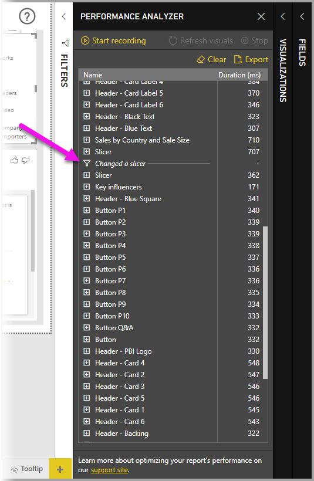
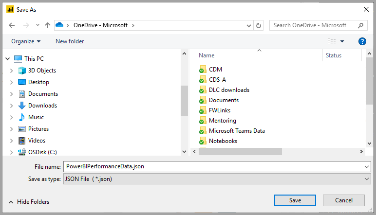

# Utiliser l’analyseur de performances pour examiner les performances des éléments de rapport

Dans **Power BI Desktop**, vous pouvez voir les performances de chacun de vos éléments de rapport, tels que les visuels et les formules DAX. Avec l’**analyseur de performances**, vous pouvez voir et enregistrer des journaux qui mesurent les performances de chacun de vos éléments de rapport lorsque ceux-ci sont utilisés. En outre, vous pouvez voir quels éléments sont les plus (ou les moins) gourmands en ressources.

L’analyseur de performances inspecte et affiche la durée nécessaire à la mise à jour ou à l’actualisation de tous les visuels en cours d’utilisation. En outre, il présente les informations de telle sorte que vous pouvez afficher, explorer ou exporter les résultats. L’analyseur de performances peut vous aider à identifier les visuels qui impactent les performances de vos rapports et à connaître la raison d’un tel impact.

## Affichage du volet Analyseur de performances

Dans **Power BI Desktop**, sélectionnez le ruban **Affichage**. Dans la zone **Affichage** du ruban **Affichage**, vous pouvez cocher la case en regard de **Analyseur de performances** pour afficher le volet Analyseur de performances.

Une fois sélectionné, l’analyseur de performances est affiché dans son propre volet, à droite du canevas de rapport.

## Utilisation de l’analyseur de performances

L’analyseur de performances mesure le temps de traitement nécessaire (y compris la durée de création ou de mise à jour d’un visuel) pour mettre à jour les éléments de rapport dont l’utilisation s’est traduite par l’exécution d’une requête. Par exemple, l’ajustement d’un segment nécessite la modification de son visuel, l’envoi d’une requête au modèle de données et l’affectation des visuels qui doivent être mis à jour après la modification des paramètres. 

Pour que l’analyseur de performances commence un enregistrement, sélectionnez simplement **Démarrer l’enregistrement**.

Toutes les actions que vous effectuez dans le rapport sont affichées et journalisées dans le volet Analyseur de performances, dans l’ordre où le visuel a été chargé par Power BI. Par exemple, vous disposez peut-être d’un rapport qui, d’après les utilisateurs, est très long à actualiser. Certains visuels d’un rapport prennent beaucoup de temps à s’afficher lorsqu’un segment est modifié. L’analyseur de performances peut vous indiquer quel visuel est responsable de ce problème, et préciser quels aspects du visuel sont les plus longs à traiter. 

Une fois que vous avez démarré l’enregistrement, le bouton **Démarrer l’enregistrement** est grisé (inactif, puisque vous avez déjà commencé l’enregistrement) et le bouton **Arrêter** est actif. 

L’analyseur de performances collecte et affiche les mesures des performances en temps réel. Ainsi, chaque fois que vous cliquez sur un visuel, déplacez un segment ou interagissez de toute autre manière, l’analyseur de performances affiche immédiatement les résultats de performances dans son volet.

Si le volet contient plus d’informations que ce qui peut être affiché, une barre de défilement s’affiche pour vous permettre d’accéder aux informations supplémentaires.

Dans le volet, chaque interaction a un identificateur de section qui décrit l’action à l’origine des entrées de journal. Dans l’image suivante, l’interaction correspond à la modification d’un segment par un utilisateur.

Les informations de journal de chaque visuel incluent le temps passé (durée) à effectuer les catégories de tâches suivantes :

* **Requête DAX** : si une requête DAX était nécessaire, il s’agirait du temps écoulé entre l’envoi de la requête par le visuel et l’envoi des résultats par Analysis Services.
* **Affichage de visuel** : temps nécessaire pour que le visuel s’affiche à l’écran, comprenant le temps nécessaire pour récupérer les images web ou le géocodage. 
* **Autre** : temps nécessaire au visuel pour préparer les requêtes, pour attendre la fin de l’exécution des autres visuels ou pour effectuer un autre traitement en arrière-plan.

Les valeurs **Durée (ms)** indiquent la différence entre une heure de *début* une heure de *fin* pour chaque opération. La plupart des opérations de canevas et de visuels s’exécutent de façon séquentielle sur un seul thread d’interface utilisateur, qui est partagé par plusieurs opérations. Les durées signalées incluent le temps passé en file d’attente pendant l’exécution d’autres opérations. L’[exemple de l’Analyseur de performances](https://github.com/microsoft/powerbi-desktop-samples/tree/master/Performance%20Analyzer) sur GitHub et la [documentation](https://github.com/microsoft/powerbi-desktop-samples/blob/master/Performance%20Analyzer/Power%20BI%20Performance%20Analyzer%20Export%20File%20Format.docx) qui lui est associée fournissent des détails sur la façon dont les visuels interrogent les données et dont ils s’affichent.

Une fois que vous avez interagi avec les éléments du rapport à mesurer avec l’analyseur de performances, vous pouvez sélectionner le bouton **Arrêter**. Lorsque vous sélectionnez **Arrêter**, les informations sur les performances restent dans le volet pour que vous puissiez les analyser.

Pour effacer les informations dans le volet Analyseur de performances, sélectionnez **Effacer**. Lorsque vous sélectionnez **Effacer**, les informations sont effacées et ne sont pas enregistrées. Pour savoir comment enregistrer les informations dans des journaux, consultez la section suivante. 

## Actualisation des visuels

Vous pouvez sélectionner **Actualiser les visuels** dans le volet Analyseur de performances pour actualiser tous les visuels de la page active du rapport, et ainsi obtenir que l’analyseur de performances collecte des informations sur tous les visuels de ce type.

Vous pouvez également actualiser les visuels un par un. Pendant que l’analyseur de performances enregistre, vous pouvez sélectionner **Actualiser ce visuel** dans l’angle supérieur droit de chaque visuel afin d’actualiser le visuel et de capturer les informations sur ses performances.

## Enregistrement des informations de performances

Vous pouvez enregistrer les informations que l’analyseur de performances génère à propos d’un rapport en sélectionnant le bouton **Exporter**. La sélection du bouton **Exporter** génère un fichier .json contenant les informations du volet Analyseur de performances. 

## Étapes suivantes
Pour plus d’informations sur **Power BI Desktop** et la prise en main de cette solution, voir les articles suivants.

* [Qu’est-ce que Power BI Desktop ?](../fundamentals/desktop-what-is-desktop.md)
* [Présentation des requêtes dans Power BI Desktop](../transform-model/desktop-query-overview.md)
* [Sources de données dans Power BI Desktop](../connect-data/desktop-data-sources.md)
* [Se connecter aux données dans Power BI Desktop](../connect-data/desktop-connect-to-data.md)
* [Mettre en forme et combiner des données dans Power BI Desktop](../connect-data/desktop-shape-and-combine-data.md)
* [Tâches courantes relatives aux requêtes dans Power BI Desktop](../transform-model/desktop-common-query-tasks.md)   

Pour plus d’informations sur l’exemple de l’Analyseur de performances, consultez les ressources suivantes.

* [Exemple de l’Analyseur de performances](https://github.com/microsoft/powerbi-desktop-samples/tree/master/Performance%20Analyzer)
* [Documentation de l’exemple de l’Analyseur de performances](https://github.com/microsoft/powerbi-desktop-samples/blob/master/Performance%20Analyzer/Power%20BI%20Performance%20Analyzer%20Export%20File%20Format.docx)
