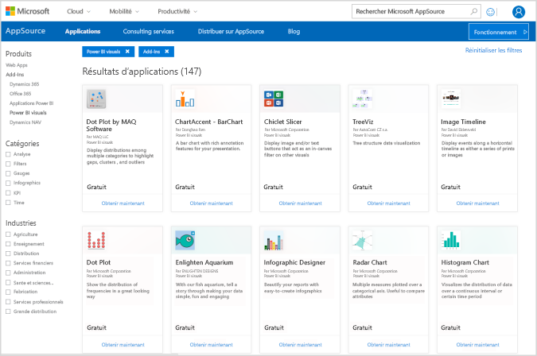
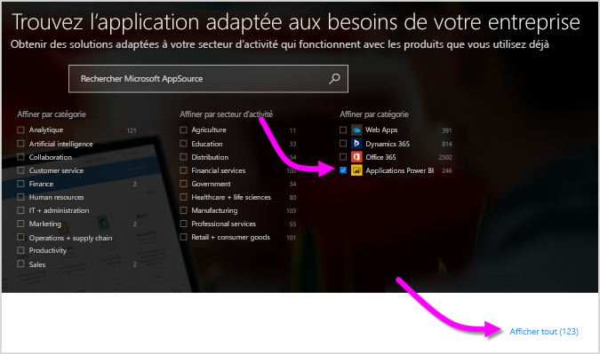
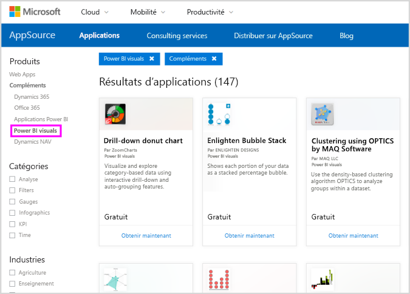
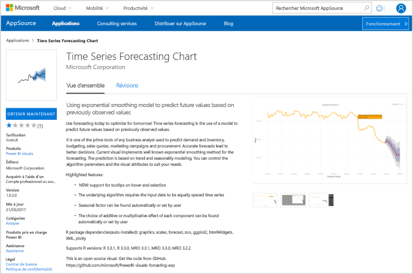
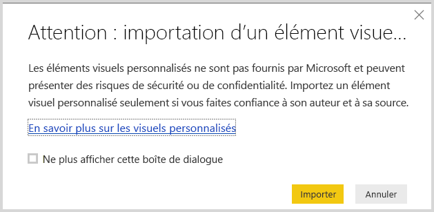
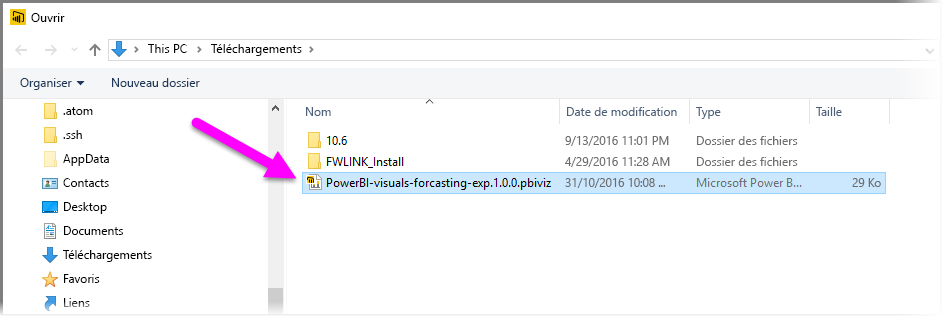
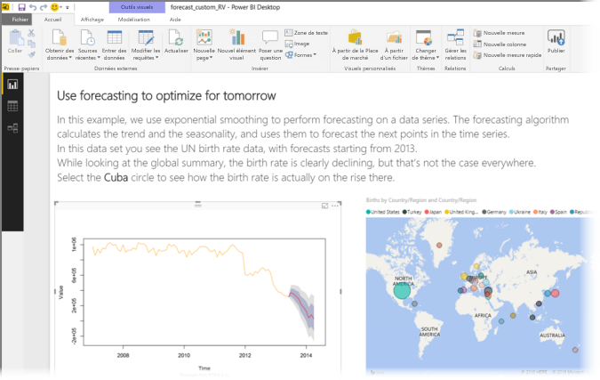
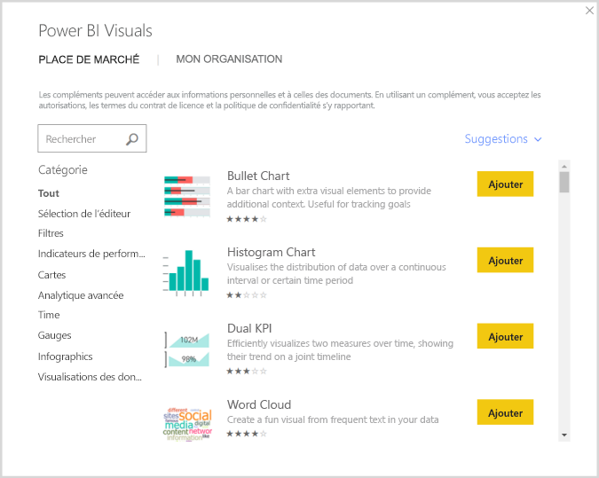

# <a name="use-r-powered-power-bi-visuals-in-power-bi"></a>Utiliser des visuels Power BI basés sur R dans Power BI

Dans **Power BI Desktop** et dans le **service Power BI**, vous pouvez utiliser des visuels Power BI basés sur R sans connaître R ni utiliser de scripts R. Cela vous permet d’exploiter la puissance d’analyse et visuelle des visuels R et des scripts R sans connaître R ni effectuer de programmation.

Pour utiliser les visuels Power BI basés sur R, vous commencez par sélectionner et télécharger le visuel personnalisé R qui vous intéresse à partir de la galerie [**AppSource**](https://appsource.microsoft.com/marketplace/apps?product=power-bi-visuals&page=1) de **visuels Power BI** pour Power BI.



Les sections suivantes expliquent comment sélectionner, charger et utiliser les visuels optimisés pour R dans **Power BI Desktop**.

## <a name="use-r-power-bi-visuals"></a>Utiliser des visuels Power BI R

Pour utiliser des visuels Power BI basés sur R, téléchargez chaque visuel depuis la bibliothèque de **visuels Power BI**, puis utilisez le visuel comme n’importe quel autre type de visuel dans **Power BI Desktop**. Il existe deux façons d’obtenir des visuels Power BI : vous pouvez les télécharger à partir du site **AppSource** en ligne, ou les parcourir et les obtenir à partir de **Power BI Desktop**. 

### <a name="get-power-bi-visuals-from-appsource"></a>Obtenir des visuels Power BI auprès d’AppSource

Voici les étapes pour parcourir et sélectionner des visuels à partir du site en ligne **AppSource** :

1. Accédez à la bibliothèque des visuels Power BI à l’adresse [https://appsource.microsoft.com](https://appsource.microsoft.com/). Sélectionnez la case à cocher *Applications Power BI* sous *Affiner par produit*, puis sélectionnez le lien **Afficher tout**.

   

2. Dans la page de la bibliothèque des [Visuels Power BI](https://appsource.microsoft.com/marketplace/apps?product=power-bi-visuals&page=1), sélectionnez **Visuels Power BI** dans la liste des Compléments, sur le volet de gauche.

   

3. Sélectionnez le **visuel** qui vous intéresse dans la galerie. La fenêtre qui s’affiche décrit le visuel. Sélectionnez le bouton **Obtenir maintenant** pour effectuer le téléchargement.

   > [!NOTE]
    > Pour créer des scripts dans **Power BI Desktop**, il est nécessaire que R soit installé sur votre ordinateur local. Mais, lorsque les utilisateurs souhaitent afficher un visuel optimisé pour R dans le **service Power BI**, il n’est pas nécessaire que R soit installé localement.

   

   Vous n’avez pas besoin d’installer R pour utiliser des visuels Power BI basés sur R dans le **service Power BI**. Cependant, si vous voulez utiliser des visuels Power BI basés sur R dans **Power BI Desktop**, vous *devez* installer R sur la machine locale. Vous pouvez télécharger R à partir des emplacements suivants :

   * [CRAN](https://cran.r-project.org/)
   * [MRO](https://mran.microsoft.com/)

4. Une fois le visuel téléchargé (comme n’importe quel fichier depuis le navigateur), accédez à **Power BI Desktop** et cliquez sur **Plus d’options** (...) dans le volet **Visualisations**, puis sélectionnez **Importer à partir du fichier**.

   
5. Un message vous met en garde sur l’importation d’un visuel personnalisé, comme dans l’image suivante :

   
6. Accédez à l’emplacement dans lequel le visuel a été enregistré, puis sélectionnez le fichier correspondant. Les visualisations **Power BI Desktop** personnalisées ont l’extension .pbiviz.

   
7. De retour dans Power BI Desktop, vous pouvez constater que le nouveau type de visuel figure dans le volet **Visualisations**.

   
8. Lorsque vous importez le nouveau visuel (ou que vous ouvrez un rapport qui contient un visuel personnalisé optimisé pour R), **Power BI Desktop** installe les packages R requis.

   

9. Vous pouvez alors ajouter des données au visuel comme vous le feriez pour n’importe quel autre visuel **Power BI Desktop**. Lorsque vous avez terminé, votre visuel généré s’affiche sur le canevas. Dans l’élément visuel suivant, le visuel **Prévision** optimisé pour R a été utilisé dans les projections de natalité des Nations Unies (visuel sur la gauche).

    

    Comme pour n’importe quel autre visuel **Power BI Desktop**, vous pouvez publier ce rapport avec ses visuels optimisés pour R dans le **service Power BI** et le partager avec d’autres utilisateurs.

    Visitez souvent la bibliothèque, car elle est continuellement mise à jour avec de nouveaux visuels.

### <a name="get-power-bi-visuals-from-within-power-bi-desktop"></a>Obtenir des visuels Power BI à partir de **Power BI Desktop**

1. Vous pouvez également obtenir des visuels Power BI à partir de **Power BI Desktop**. Dans **Power BI Desktop**, cliquez sur les points de suspension (...) dans le volet **Visualisations** et sélectionnez **Importer de la Place de marché**.

   

2. Quand vous procédez ainsi, la boîte de dialogue **Visuels Power BI** apparaît. Vous pouvez y faire défiler les visuels Power BI disponibles et sélectionner ceux qui vous intéressent. Vous pouvez effectuer une recherche par nom, sélectionner une catégorie ou simplement parcourir les visuels disponibles. Lorsque vous êtes prêt, sélectionnez simplement **ajouter** pour ajouter le visuel personnalisé à **Power BI Desktop**.

   

## <a name="contribute-r-powered-power-bi-visuals"></a>Contribuer aux visuels Power BI basés sur R

Si vous créez vos propres visuels R pour les utiliser dans vos rapports, vous pouvez les partager publiquement en les ajoutant à la **galerie de visuels Power BI**. Le processus de contribution réalisé par le biais de GitHub est décrit ici :

* [Contribution à la galerie des visuels Power BI basés sur R](https://github.com/Microsoft/PowerBI-visuals#building-r-powered-custom-visual-corrplot)

## <a name="troubleshoot-r-powered-power-bi-visuals"></a>Résoudre les problèmes des visuels Power BI basés sur R

Les visuels Power BI basés sur R ont certaines dépendances qui doivent être satisfaites pour qu’ils fonctionnent correctement. Quand les visuels Power BI basés sur R ne s’exécutent pas ou ne se chargent pas correctement, le problème est généralement un des suivants :

* Le moteur R est manquant.
* Il existe des erreurs dans les scripts R sur lesquels repose le visuel.
* Les packages R sont manquants ou obsolètes.

La section suivante décrit les étapes de dépannage possibles pour aider à répondre aux difficultés que vous rencontrez.

### <a name="missing-or-outdated-r-packages"></a>Packages R manquants ou obsolètes

Quand vous tentez d’installer un visuel personnalisé optimisé pour R, vous pouvez rencontrer des erreurs lorsque des packages R sont obsolètes ou manquants. Cela est dû à une des raisons suivantes :

* L’installation de R n’est pas compatible avec le package R
* Les paramètres de proxy, de logiciel antivirus ou de pare-feu empêchent R de se connecter à Internet
* La connexion Internet est lente ou il y a un problème de connexion

L’équipe Power BI travaille activement pour atténuer ces problèmes en amont. La prochaine version de Power BI Desktop intègrera des mises à jour qui permettront de les résoudre. En attendant, vous pouvez effectuer une ou plusieurs des étapes suivantes pour atténuer les problèmes :

1. Supprimez le visuel personnalisé, puis réinstallez-le. Cela lance une nouvelle installation des packages R.
2. Si votre installation de R n’est pas à jour, mettez-la à niveau, puis supprimez et réinstallez le visuel personnalisé comme décrit à l’étape précédente.

   Les versions prises en charge de R sont répertoriées dans la description de chaque visuel personnalisé optimisé pour R, comme illustré dans l’image suivante.

     
    > [!NOTE]
    > Vous pouvez conserver l’installation R d’origine et associer uniquement Power BI Desktop avec la version actuelle que vous installez. Accédez à **Fichier -> Options et paramètres -> Options > Script R**.

3. Installez les packages R manuellement à l’aide d’une console R. Les étapes de cette approche sont les suivantes :

   a. Téléchargez le script d’installation des visuels optimisés pour R et enregistrez ce fichier sur un lecteur local.

   b. Dans la console R, exécutez la commande suivante :

      ```console
      source("C:/Users/david/Downloads/ScriptInstallPackagesForForecastWithWorkarounds.R")
      ```

   Les emplacements d’installation par défaut sont les suivants :

   ```console
       c:\Program Files\R\R-3.3.x\bin\x64\Rterm.exe (for CRAN-R)
       c:\Program Files\R\R-3.3.x\bin\x64\Rgui.exe (for CRAN-R)
       c:\Program Files\R\R-3.3.x\bin\R.exe (for CRAN-R)
       c:\Program Files\Microsoft\MRO-3.3.x\bin\R.exe (for MRO)
       c:\Program Files\Microsoft\MRO-3.3.x\bin\x64\Rgui.exe (for MRO)
       c:\Program Files\RStudio\bin\rstudio.exe (for RStudio)
   ```

4. Si les étapes précédentes ne fonctionnent pas, essayez ce qui suit :

   a. Utilisez **R Studio** et suivez les étapes décrites dans la section 3.b. ci-dessus (exécuter la ligne de script à partir de la console R).

   b. Si l’étape précédente ne fonctionne pas, modifiez **Outils > Options globales > Packages** dans **R Studio**, activez la case à cocher **Utiliser la bibliothèque/le proxy Internet Explorer pour HTTP**, puis répétez l’étape 3.b. décrite ci-dessus.

## <a name="next-steps"></a>Étapes suivantes

Consultez les informations supplémentaires suivantes sur R dans Power BI.

* [Galerie de visuels Power BI](https://app.powerbi.com/visuals/)
* [Exécution de scripts R dans Power BI Desktop](../connect-data/desktop-r-scripts.md)
* [Créer des visuels Power BI Desktop avec R](desktop-r-visuals.md)
* [Utiliser un IDE R externe avec Power BI](../connect-data/desktop-r-ide.md)
