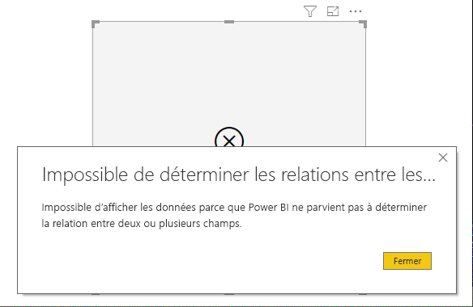
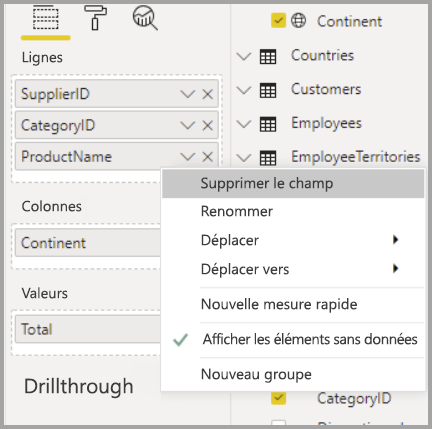

# Afficher les éléments sans données dans Power BI

Power BI permet de visualiser toutes sortes de données provenant de diverses sources. Lors de la création d’un visuel, Power BI n’affiche que les données pertinentes afin de gérer correctement la façon dont elles sont présentées et affichées. Le caractère pertinent des données est évalué en fonction de la configuration du visuel et du modèle de données sous-jacent. Cet article explique comment Power BI identifie les données pertinentes, en donnant des exemples pour illustrer ce processus.

## Déterminer quelles données sont pertinentes

Pour comprendre comment Power BI détermine quelles données il est pertinent d’afficher, prenons l’exemple simple d’une table. En utilisant le modèle représenté dans la section [exemple de modèle de données](#example-data-model) qui se trouve à la fin de cet article, envisagez de créer une table avec les paramètres suivants :

**1. Groupes issus de la même table :** *Product[Color] – Product[Size]*

|*Product[Color]*  |*Product[Size]*  |
|---------|---------|
|Blue     |Large         |
|Blue     |Medium         |
|Blue     |Small         |
|Red     |Large         |

Dans cet exemple, Power BI affiche les combinaisons *[Color-Size]* qui existent dans la table *[Product]* . 

Examinons maintenant une autre combinaison :

**2. Groupes issus de tables différentes mais directement liées, avec une mesure :** *ProductStyle[Finish] – Product[Color] – Sum(Sales[Quantity])*

|*ProductStyle[Finish]*  |*Product[Color]*  |*[SumQuantity]*  |
|---------|---------|---------|
|Gloss     |Blue         |10         |
|Matte     |Blue         |15         |

Dans cet exemple, Power BI affiche seulement les combinaisons présentes. Par exemple, il n’affichera pas (« None » + « Blue ») ou (« Matte » + « Red »), car ces combinaisons n’existent pas dans le modèle. La condition qui détermine l’absence ou la présence des combinaisons est la valeur de *Sum(Sales[Quantity])* (vide ou non).

Étudions un autre cas : 

**3. Groupes issus de tables différentes mais liées, sans mesure :** *ProductStyle[Finish] – Product[Color]*

|*ProductStyle[Finish]*  |*Product[Color]*  |
|---------|---------|
|Gloss     |Blue         |
|Gloss     |Red         |
|Matte     |Blue         |

Dans la mesure où il n’existe aucune mesure explicite et où les deux tables sont directement liées, Power BI tente d’injecter une mesure de façon à limiter les combinaisons qui en résultent : dans ce cas, il s’agit d’une mesure *CALCULATE(COUNTROWS('Product'))* , qui ne doit pas être vide, puisque *Product* est la table commune aux deux tables.

Par conséquent, Power BI affiche les combinaisons qui possèdent des entrées dans la table Product, ce qui exclut les combinaisons *(« None » + « Blue »)* et *(« Matte » + « Red »)* .

**4. Groupes issus de tables différentes et non liées**

L’exemple de modèle ne possède pas cette combinaison, mais, s’il y avait des groupes provenant de tables différentes et non liées, Power BI ne pourrait pas relier deux colonnes. Il en résulterait une jointure croisée de toutes les valeurs de chaque colonne. Dans cette situation, Power BI génère une erreur de type *jointure sans contrainte*, car de telles jointures croisées sont coûteuses à calculer dans la base de données et fournissent peu d’informations à l’utilisateur. 

## Afficher les éléments sans données

Dans la section précédente, nous avons expliqué comment Power BI détermine quelles données il est pertinent d’afficher. Mais il est parfois *intéressant* d’afficher les éléments sans données. 

C’est précisément ce que permet de faire la fonctionnalité **Afficher les éléments sans données** : inclure des lignes et des colonnes de données qui ne contiennent pas de données de mesure (valeurs de mesure vide).

Pour activer la fonctionnalité **Afficher les éléments sans données**, sélectionnez un visuel, puis, dans la zone **Champs**, cliquez avec le bouton droit sur le champ et sélectionnez **Afficher les éléments sans données** dans le menu qui s’affiche, comme l’illustre l’image suivante :

La fonctionnalité **Afficher les éléments sans données** n’a *pas* d’effet dans les circonstances suivantes :

* Aucune mesure n’a été ajoutée au visuel, et les colonnes de regroupement proviennent de la même table.
* Les groupes ne sont pas liés ; Power BI n’exécute pas de requêtes pour des visuels de groupes non liés.
* La mesure n’est liée à aucun des groupes ; en effet, elle ne sera jamais vide pour certaines combinaisons de groupes seulement.
* Un filtre de mesure défini par l’utilisateur exclut les mesures vides, par exemple : *SalesAmount > 0*.

### Fonctionnement de l’option Afficher les éléments sans données

Les cas d’usage les plus intéressants de la fonctionnalité **Afficher les éléments sans données** sont ceux qui mettent en jeu des mesures. Examinons ce qui se passe lorsque les groupes sont issus de la même table, ou peuvent être liés au moyen d’un chemin dans le modèle. Par exemple, *ProductStyle* est directement lié à *Product* et indirectement lié à *Sales*, *ProductStyle* et *ProductCategory* peuvent être liés par le biais de la table *Product* et ainsi de suite.

Nous allons examiner quelques cas intéressants et comparer la situation avec et sans la fonctionnalité **Afficher les éléments sans données**. 

**1. Colonnes de regroupement issues de la même table :** *Product[Color] – Product[Size] – Sum(Sales[Quantity])*

Sans la fonctionnalité **Afficher les éléments sans données** :

|*Product[Color]*  |*Product[Size]*  |*[SumQuantity]*  |
|---------|---------|---------|
|Blue     |Medium         |15         |
|Blue     |Small         |10         |

Avec la fonctionnalité **Afficher les éléments sans données** :

|*Product[Color]*  |*Product[Size]*  |*[SumQuantity]*  |
|---------|---------|---------|
|Blue     |Large         |         |
|Blue     |Medium         |15         |
|Blue     |Small         |10         |
|Red     |Large         |         |

Deux nouvelles combinaisons apparaissent lorsque la fonctionnalité est activée : *Blue-Large* et *Red-Large*. Ces deux entrées n’ont pas de *Quantity* associée dans la table *Sales*. Toutefois, elles apparaissent dans la table *Product*.

**2. Colonnes de regroupement issues de tables liées :** *ProductStyle[Finish] – Product[Color] – Sum(Sales[Quantity])*

Sans la fonctionnalité **Afficher les éléments sans données** :

|*ProductStyle[Finish]*  |*Product[Color]*  |*[SumQuantity]*  |
|---------|---------|---------|
|Gloss     |Blue         |10         |
|Matte     |Blue         |15         |

Avec la fonctionnalité **Afficher les éléments sans données** :

|*ProductStyle[Finish]*  |*Product[Color]*  |*[SumQuantity]*  |
|---------|---------|---------|
|Gloss     |Blue         |10         |
|Gloss     |Red         |         |
|Matte     |Blue         |15         |
|Aucune     |         |         |

Les combinaisons *(Gloss-Red)* et *(None, vide)* sont apparues. En voici la raison :
* Power BI a d’abord considéré ProductStyle[Finish] et sélectionné toutes les valeurs à afficher, ce qui a donné Gloss, Matte, None.
* À l’aide de chacune de ces valeurs, Power BI a sélectionné toutes les entrées *Product[Color]* correspondantes. 
* Dans la mesure où *None* ne correspond à aucun *Product[Color]* , une valeur vide s’affiche pour cette valeur.

Il est important de savoir que le mécanisme de sélection de valeurs pour les colonnes est dépendant de l’ordre. On peut le voir comme une opération de *jointure externe gauche* entre les tables. Si l’ordre des colonnes est modifié, les résultats changent également.

Examinons un exemple de modification de l’ordre, et son incidence sur les résultats. **2** de cette section en changeant l’ordre, et examinons l’incidence sur les résultats.

**Product[Color] – ProductStyle[Finish] – Sum(Sales[Quantity])**

Avec la fonctionnalité **Afficher les éléments sans données** :

|*Product[Color]* |*ProductStyle[Finish]*  |*[SumQuantity]*  |
|---------|---------|---------|
|Blue     |Gloss         |10         |
|Blue     |Matte         |15         |
|Red     |Gloss         |         |

Dans ce cas, *ProductStyle[Finish]=None* n’apparaît pas dans la table. En effet, Power BI a commencé par sélectionner toutes les valeurs *Color* de la table *Product*. Puis, pour chaque couleur, Power BI a sélectionné les valeurs *Finish* correspondantes qui contenaient des données. Comme *None* n’apparaît dans aucune combinaison de *Color*, il n’est pas sélectionné.

## Comportement visuel de Power BI

Quand l’option **Afficher les éléments sans données** est activée sur un champ de visuel, la fonctionnalité est activée automatiquement pour tous les autres champs qui se trouvent dans le même *compartiment* ou la même hiérarchie du visuel. Le compartiment ou la hiérarchie peut être l’**Axe** , la **Légende** , la **Catégorie**, les **Lignes** ou les **Colonnes** d’un visuel.

Par exemple, sur un visuel Matrice ayant quatre champs dans le compartiment **Lignes**, si l’option **Afficher les éléments sans données** est activée pour un champ, elle l’est pour tous les éléments de la matrice. Dans l’image suivante, l’option **Afficher les éléments sans données** est activée pour le premier champ du compartiment **Lignes**, à savoir le champ*SupplierID*. Elle est aussi activée automatiquement pour les autres champs du compartiment **Lignes**.

En revanche, l’option **Afficher les éléments sans données***n’est pas* activée automatiquement pour le champ *Continent* du compartiment **Colonnes**. 

Ce comportement visuel est souvent observé quand un visuel est converti dans un type différent, par exemple, du type Matrice au type Table. À l’occasion de ces conversions, l’option **Afficher les éléments sans données** est automatiquement activée pour les champs qui sont déplacés dans un compartiment où la fonctionnalité est activée pour un de ses champs. Dans l’exemple précédent, si la fonctionnalité **Afficher les éléments sans données** est activée pour *SupplierID* et que le visuel est converti en table, le champ *Continent* du compartiment **Colonnes** est déplacé (avec les champs du compartiment **Lignes**) dans le seul compartiment utilisé dans un visuel de table – le compartiment **Valeurs**. De ce fait, **Afficher les éléments sans données** est activé pour tous les champs du compartiment **Valeurs**.

### Exportation de données

Quand la fonctionnalité **Exporter des données récapitulatives** est utilisée, le comportement de la fonctionnalité **Afficher les éléments sans données** est le même que si l’exportation était convertie en visuel Table. Ainsi, quand un visuel de type Matrice graphique est exporté, une différence peut être notée entre les données exportées et le visuel affiché. Cela est dû au fait que la conversion en visuel Table active **Afficher les éléments sans données** pour tous les champs exportés pendant le processus d’exportation. 

## Exemple de modèle de données

Cette section montre l’exemple de modèle de données utilisé dans les exemples de cet article.

**Modèle** : 

**Données** :

|Product[ProductId]|    Product[ProductName]|   Product[Color]| Product[Size]|  Product[CategoryId]|    Product[StyleId]|
|---------|---------|---------|---------|---------|---------|
|1  |Prod1  |Blue   |Small  |1  |1 |
|2  |Prod2  |Blue   |Medium |2  |2 |
|3  |Prod3  |Red    |Large  |1  |1 |
|4  |Prod4  |Blue   |Large  |2  |2 |

|ProductCategory[CategoryId]|   ProductCategory[CategoryName]|
|---------|---------|
|1  |Mode   |
|2  |Caméra |
|3  |TV |

|ProductStyle[StyleId]| ProductStyle[Finish]|   ProductStyle[Polished]|
|---------|---------|---------|
|1  |Gloss  |Oui |
|2  |Matte  |Non |
|3  |Aucune   |Non |

|Sales[SaleId]| Sales[ProductId]|   Sales[Date]|    Sales[Quantity]|
|---------|---------|---------|---------|
|1  |1  |1/1/2012 0:00| 10 |
|2  |2  |1/1/2013 0:00| 15 |

## Étapes suivantes

L’objectif de cet article était d’expliquer comment activer la fonctionnalité **Afficher les éléments sans données** dans Power BI. Les articles suivants pourraient également vous intéresser : 

* [Membre par défaut dans des modèles multidimensionnels dans Power BI](../connect-data/desktop-default-member-multidimensional-models.md)
