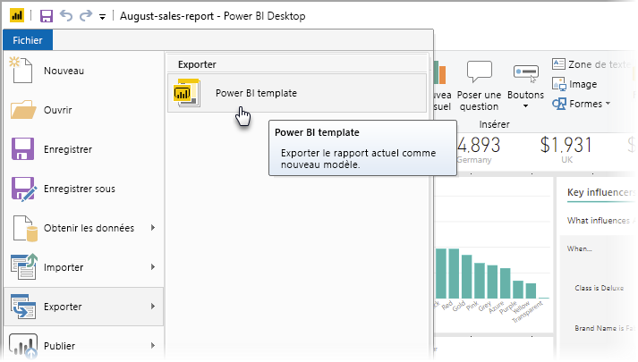
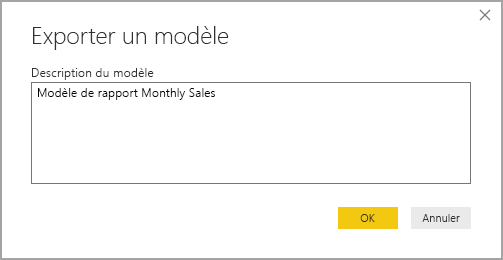
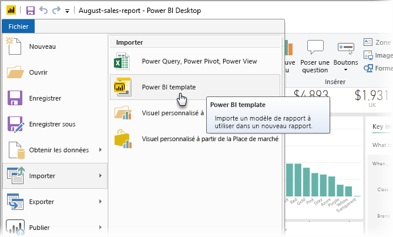
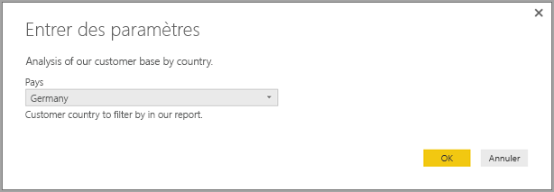

# Créer des modèles de rapport pour Power BI Desktop

Avec **Power BI Desktop,** vous pouvez créer des rapports attrayants qui partagent des insights dans toute votre organisation. Avec les **modèles** Power BI Desktop, vous pouvez simplifier votre travail en créant un modèle de rapport, basé sur un modèle existant, que vous ou d’autres utilisateurs de votre organisation pouvez utiliser comme point de départ pour la disposition, le modèle de données et les requêtes d’un nouveau rapport. Dans **Power BI Desktop**, les modèles vous aident à vous lancer et à normaliser la création de rapports.

## Création de modèles

Les modèles de rapport Power BI contiennent les informations suivantes provenant du rapport à partir duquel ils ont été générés :

* Les **pages** de rapport, les visuels et d’autres éléments visuels
* La **définition du modèle de données**, notamment le schéma, les relations, les mesures et d’autres artefacts de définition de modèle
* Toutes les **définitions de requête**, comme les requêtes, les paramètres de requête et d’autres éléments de requête

Les éléments qui ne sont *pas* inclus dans les modèles sont les données du rapport. 

Les modèles de rapports utilisent l’extension de fichier .PBIT (contrairement aux rapports Power BI Desktop, qui utilisent l’extension .PBIX). 

Pour créer un modèle de rapport, sélectionnez **Fichier > Exporter > Modèle Power BI** dans le menu. La fenêtre suivante s’affiche, vous invitant à fournir une description du modèle. Dans cet exemple, notre description du modèle est *Monthly sales report template.* (Modèle de rapport des ventes mensuelles.)

Sélectionnez **OK**. Vous êtes alors invité à indiquer un emplacement de fichier dans lequel stocker le fichier de modèle .PBIT.

C’est tout. Votre modèle de rapport Power BI est créé dans l’emplacement de fichier que vous avez spécifié, avec l’extension .PBIT.

> [!NOTE]
> Les fichiers de modèles de rapport Power BI sont généralement beaucoup plus petits qu’un rapport Power BI Desktop, car les modèles ne contiennent pas de données, mais uniquement les définitions de rapport proprement dites. 

## Utilisation de modèles

Pour utiliser un modèle de rapport Power BI, ouvrez-le simplement dans Power BI Desktop et commencez à l’utiliser. Vous pouvez ouvrir des modèles de rapport Power BI de deux façons :

* Double-cliquer sur un fichier .PBIT pour démarrer automatiquement Power BI Desktop et charger le modèle
* Sélectionner **Fichier > Importer > Modèle Power BI** dans Power BI Desktop

Quand vous ouvrez un modèle de rapport, une boîte de dialogue affiche les valeurs de tous les paramètres définis dans le rapport sur lequel le modèle est basé. Par exemple, si un rapport analyse les clients en fonction du pays ou de la région et qu’il a un paramètre *Country* (Paramètre) pour spécifier la base de clients, une invite s’affiche pour vous demander de sélectionner une valeur *Country* dans la liste des valeurs qui ont été spécifiées lors de la définition du paramètre. 

Une fois tous les paramètres obligatoires fournis, vous êtes invité à indiquer l’emplacement des données sous-jacentes associées au rapport. Le créateur du rapport actuel peut alors se connecter aux données en fonction de ses informations d’identification.

Une fois les paramètres et les données spécifiés, un rapport est créé, contenant l’ensemble des pages, visuels, artefacts de modèle de données et requêtes qui faisaient partie du rapport sur lequel est basé le modèle. 

Voilà. Il est simple de créer et d’utiliser des modèles de rapport dans Power BI Desktop. Vous pouvez ainsi reproduire facilement des dispositions attrayantes et d’autres aspects du rapport, et les partager avec d’autres utilisateurs.

## Étapes suivantes
La découverte des **paramètres de requête** pourrait également vous intéresser :
* [Utilisation des paramètres de requête dans Power BI Desktop](https://docs.microsoft.com/power-query/power-query-query-parameters)

En outre, Power BI Desktop vous permet d’effectuer des tâches très diverses. Pour plus d’informations sur ses fonctionnalités, passez en revue les ressources suivantes :

* [Qu’est-ce que Power BI Desktop ?](../fundamentals/desktop-what-is-desktop.md)
* [Présentation des requêtes dans Power BI Desktop](../transform-model/desktop-query-overview.md)
* [Types de données dans Power BI Desktop](../connect-data/desktop-data-types.md)
* [Mettre en forme et combiner des données dans Power BI Desktop](../connect-data/desktop-shape-and-combine-data.md)
* [Tâches courantes relatives aux requêtes dans Power BI Desktop](../transform-model/desktop-common-query-tasks.md)    
